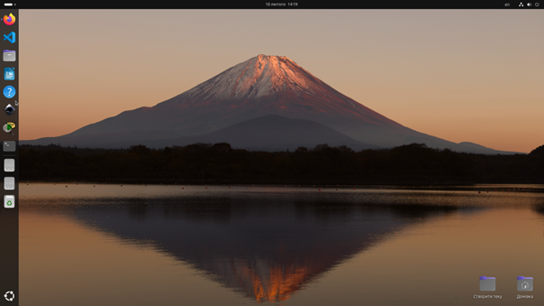
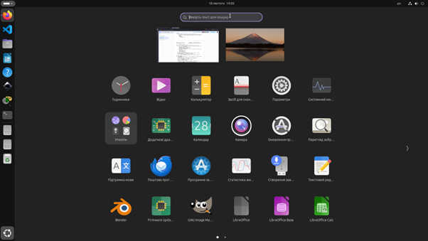
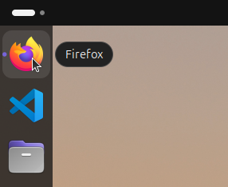
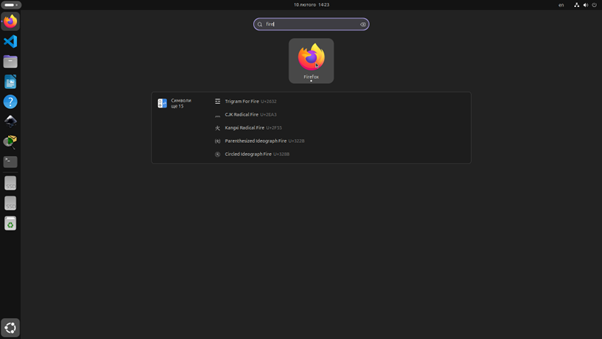
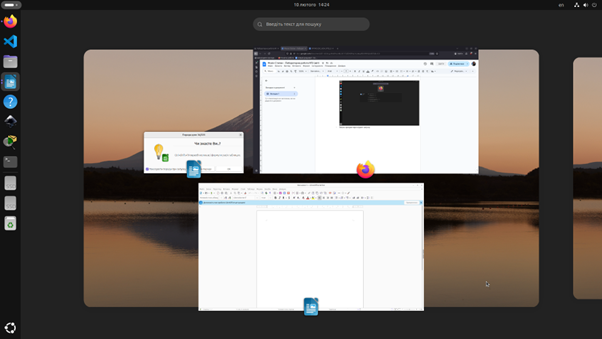
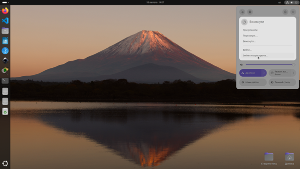

# Звіт з лабораторної роботи №2

**Дисципліна:** Операційні системи
**Тема:** Знайомство з інтерфейсом та можливостями ОС Linux
**Виконав:** студент групи РПЗ-33
**ПІБ:** Фокін Степан Володимирович
**Навчальний заклад:** Київський фаховий коледж Зв'язку

---

### Мета роботи:
1. Знайомство з інтерфейсами ОС Linux.
2. Отримання практичних навиків роботи в середовищах ОС Linux та мобільної ОС (графічна оболонка, вхід/вихід, структура робочого столу, налаштування).

---

### 1. Завдання для попередньої підготовки

#### 1.1. Словник базових англійських термінів
* **CLI (Command Line Interface)** — інтерфейс командного рядка, система введення текстових команд для керування комп'ютером.
* **GUI Terminal** — програма в графічному середовищі, що емулює вікно термінала.
* **Virtual Terminal** — консоль, що працює паралельно з GUI та потребує окремої реєстрації користувача.
* **Kernel (Ядро)** — центральна частина ОС, що керує ресурсами (CPU, пам'ять) та процесами.
* **Multitasking (Багатозадачність)** — процес швидкого перемикання ядра між різними завданнями.
* **API** — інтерфейс програмування додатків, через який програми взаємодіють з ядром.
* **Process (Процес)** — одне завдання, завантажене та відстежуване ядром.

#### 1.2. Визначення основних понять
* **CLI-режим:** Система введення тексту для виконання окремих команд або складних скриптів.
* **Термінал на основі GUI:** Вікно всередині графічного інтерфейсу (наприклад, x-term), що забезпечує доступ до командного рядка.
* **Віртуальний термінал:** Текстовий інтерфейс, який вимагає логіну користувача перед виконанням команд.

---

### 2. Хід роботи

#### 2.1. Робота в графічному режимі ОС Linux (GNOME)
Для роботи було обрано графічну оболонку **GNOME**. 

  
   
  <b>Рис. 1 Основне меню</b>

  
   
  <b>Рис. 2 Панелі швидкого доступу</b>

  
   
  <b>Рис. 3 Пошук і Доступ до нових робочих столів тощо</b>

#### 2.2. Запуск програм різними способами

1. **Через панель швидкого запуску:**

  
   
  <b>Рис. 4 Запуск програм через панель швидкого запуску</b>

2. **Через пошук в меню / глобальне меню:**

  
   
  <b>Рис. 5 Запуск програм через пошук в меню / глобальне меню</b>

3. **Через віджет запуску:**

  
   
  <b>Рис. 6 Запуск програм через віджет запуску</b>

#### 2.3. Вихід з системи та завершення роботи
Виконання дій з обліковим записом та живленням ПК здійснюється через системне меню.

  
   
  <b>Рис. 7 Зміна користувача на root, перезавантаження та вимкнення системи</b>

---

### 3. Робота в середовищі мобільної ОС
1. **Інтерфейс:** Смартфон працює на базі **HyperOS**.
2. **Налаштування:** Меню налаштувань дозволяє конфігурувати мережі, безпеку та дисплей.
3. **Спеціальні дії:** Використання жестів та комбінацій клавіш (наприклад, Power + Vol- для скріншотів).
4. **Живлення:** Окремий розділ для контролю стану батареї та режимів енергозбереження. Вхід у безпечний режим (Safe Mode) на пристрої виконується після появи логотипу HyperOS.

---

### 4. Відповіді на контрольні запитання

1. **Серверні додатки Linux:**
   * Бази даних: **MySQL**, **PostgreSQL**.
   * Розсилка: **Postfix**, **Exim**.
   * Файлообмінники: **Samba**, **Nextcloud**.
2. **Порівняння оболонок:**
   * **Bourne (sh):** Базова, найстаріша оболонка Unix.
   * **C shell (csh):** Синтаксис схожий на мову C.
   * **Bourne Again (Bash):** Стандарт для більшості Linux-систем.
   * **tcsh:** Покращена версія csh.
   * **Korn shell (ksh):** Об'єднує сумісність скриптів Bourne із можливостями інтерактивної роботи csh.
   * **zsh:** Сучасна оболонка з найкращим автодоповненням.
3. **Менеджер пакетів:** Інструмент для автоматичного встановлення та оновлення ПЗ (наприклад, `apt` для Debian/Ubuntu або `pacman` для Arch Linux).
4. **Засоби безпеки:** SELinux, AppArmor, фаєрвол iptables, а також розмежування прав доступу.
5. **Актуальність віртуалізації:** Дозволяє ефективно використовувати залізо, запускаючи кілька ізольованих систем на одному сервері.
6. **Контейнеризація:** Ізоляція додатків на рівні процесів ядра без запуску повноцінної віртуальної машини (Docker).
7. **ПЗ з відкритим кодом:** Переваги — безкоштовність та прозорість; недоліки — іноді складна підтримка.
8. **Віртуальні консолі:** За замовчуванням їх **6**. Перемикання: `Ctrl+Alt+F1...F6`.
9. **Графічна оболонка:** Зазвичай працює на віртуальній консолі **TTY1** або **TTY7**.
10. **Реєстрація декілька разів:** Так, Linux — багатокористувацька система. Це дозволяє декільком сесіям працювати одночасно під одним логіном.

---

### Висновки
Під час виконання роботи я ознайомився з інтерфейсом GNOME та мобільної ОС HyperOS. На практиці освоїв методи запуску програм, навігацію в системі та вивчив теоретичні основи взаємодії прикладного ПЗ з ядром системи через API.
