# Звіт з лабораторної роботи №4

**Дисципліна:** Операційні системи  
**Тема:** Команди Linux для управління процесами
**Виконав:** студент групи РПЗ-33 Фокін Степан Володимирович  
**Навчальний заклад:** Київський фаховий коледж Зв'язку  

---

## 1. Мета роботи
1. Отримання практичних навиків роботи з командною оболонкою Bash.
2. Знайомство з базовими командами для управління процесами.

---

## 2. Завдання попередньої підготовки

### 2.1. Словник базових англійських термінів (Dictionary) (*)
* **Process** – програма, яка виконується в системі.
* **PID (Process ID)** – унікальний ідентифікатор запущеного процесу.
* **Foreground job** – процес на передньому плані, який займає термінал до свого завершення.
* **Background job** – фоновий процес, що виконується непомітно (запускається символом `&`).
* **Suspended / Stopped job** – призупинений процес.
* **Signal** – повідомлення, що надсилається процесу для управління ним (наприклад, зупинки).
* **Zombie process** – процес, який завершив виконання, але ще присутній у таблиці процесів.
* **Kill** – команда для безумовного завершення процесу.

### 2.2. Відповіді на питання попередньої підготовки
**2.1. Які команди для моніторингу стану процесів ви знаєте. Як переглянути їх можливі параметри? (*)**
Основними командами є `ps` (статистичний знімок) та `top` (динамічний моніторинг). Параметри можна дізнатися через вбудований посібник: `man ps`, `man top`, або довідку: `ps --help`.

**2.2. Чи може команда ps у реальному часі відслідковувати стан процесів? (*)**
Ні, команда `ps` виводить інформацію лише на момент її запуску. Для реального часу використовується `top`.

**2.3. За якими параметрами можливе сортування процесів в команді top? Як переключатись між ними? (**)**
За замовчуванням процеси сортуються за використанням процесора (`%CPU`). Під час роботи `top` можна натиснути клавішу `f`, щоб вибрати інше поле (наприклад, використання пам'яті `%MEM`).

**2.4. Які команди для завершення роботи процесів ви знаєте? (**)**
Команди `kill` (завершує за PID) та `killall` (завершує всі процеси з указаним ім'ям).

---

## 3. Хід роботи: Відповіді на теоретичні питання

**3.1. Як вивести вміст директорії /proc? Де вона знаходиться та для чого призначена?**
Вміст виводиться командою `ls /proc`. Це віртуальна файлова система, яка знаходиться в оперативній пам'яті. Вона надає інформацію про системне обладнання, конфігурацію ядра та всі активні процеси (кожен процес має свою папку з назвою його PID).

**3.2. Як вивести інформацію про поточні сеанси користувачів.**
Це можна зробити командами `w`, `who` або `users`.

**3.3. Які дії можна зробити в терміналі за допомогою комбінацій Ctrl+C, Ctrl+D та Ctrl+Z?**
* **Ctrl+C**: Перериває (INT) та безумовно зупиняє поточну активну команду.
* **Ctrl+D**: Сигнал "кінець файлу" (EOF). Часто закриває поточну сесію або термінал.
* **Ctrl+Z**: Призупиняє (STOP) процес на передньому плані та переводить його у фон.

**3.4. Чим відрізняється фоновий процес від звичайного. Де вони використовуються? (*)**
Звичайний процес (foreground) блокує термінал, поки не завершиться. Фоновий (background) виконується паралельно, звільняючи термінал для нових команд. Вони використовуються для тривалих задач: компіляції коду, роботи веб-серверів тощо.

**3.5. Опишіть команди jobs, bg, fg. (*)**
* `jobs`: показує список фонових та призупинених процесів.
* `bg`: поновлює виконання призупиненого процесу у фоновому режимі.
* `fg`: переводить фоновий або призупинений процес на передній план.

**3.6. Якою командою можна переглянути інформацію про запущені фонові процеси? (**)**
Командою `jobs`.

**3.7. Як призупинити фоновий процес, як його потім відновити та перезапустити? (**)**
Для призупинення використовується `Ctrl+Z` (якщо процес на передньому плані). Відновити його у фоні можна командою `bg %номер_завдання`, а перенести на передній план — командою `fg %номер_завдання`.

---

## 4. Хід роботи: Практичне виконання команд у терміналі (Пункт 3)

**3.1 Запуск команди top**

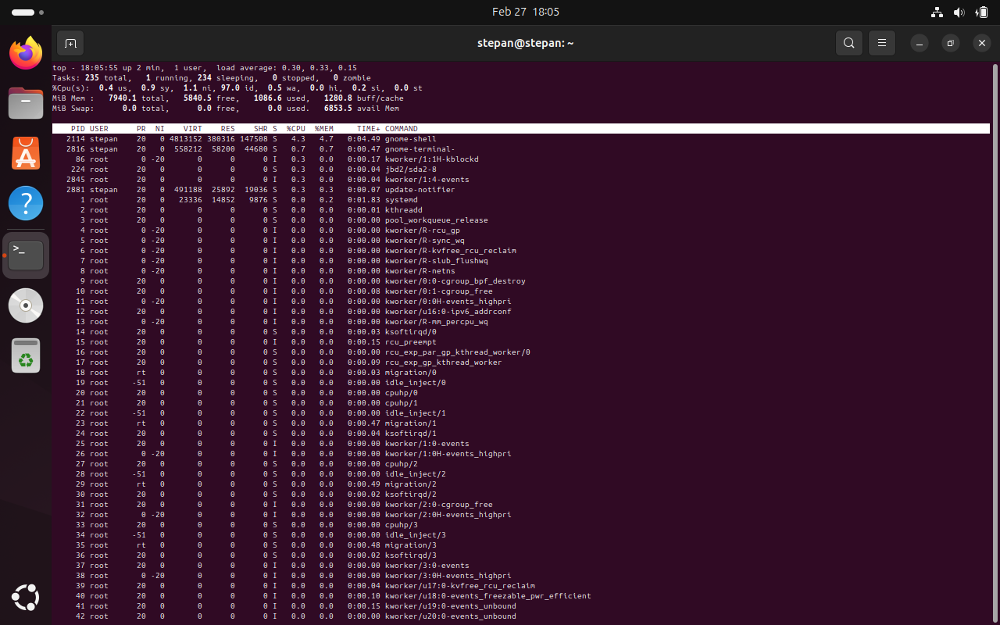

Аналіз: Найбільш активними процесами є системні служби та ядро, які постійно змінюють свої позиції у списку залежно від навантаження на процесор.
```bash
stepan@stepan:~$ top

```

**3.2 Призупинення виконання команди top**

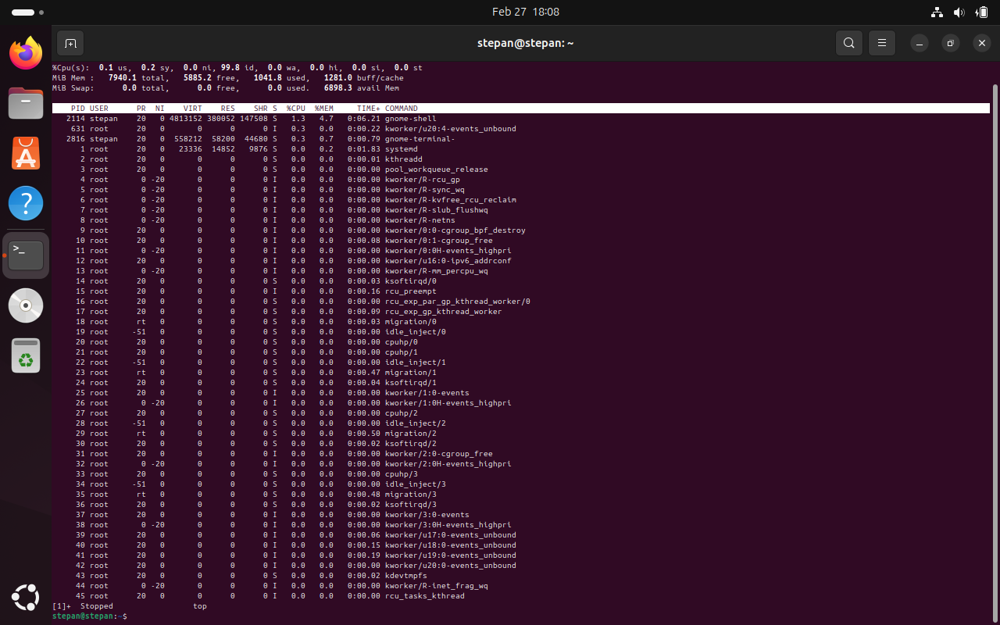

Призупинення здійснено за допомогою комбінації клавіш `Ctrl+Z`.

```bash
[1]+  Stopped                 top

```

**3.3 Виведення інформації про процеси за допомогою команди ps**

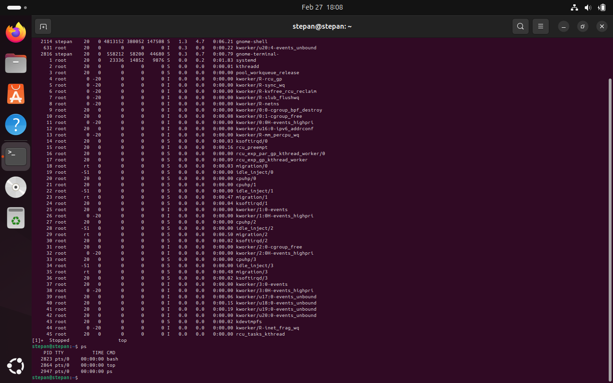


```bash
stepan@stepan:~$ ps
  PID TTY          TIME CMD
 3081 pts/0    00:00:00 bash
 3209 pts/0    00:00:00 ps

```

**3.4 П'ять прикладів з використанням різних параметрів команди ps (*)**


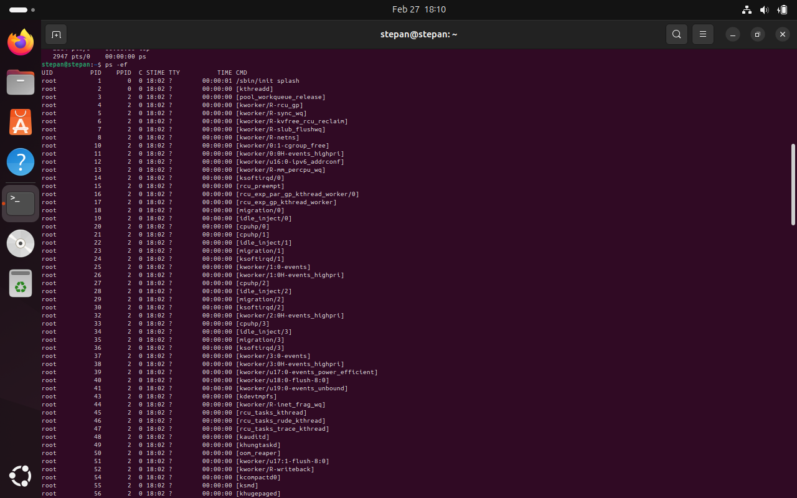

*Приклад 1: Виведення всіх процесів у повному форматі (-ef)*

```bash
stepan@stepan:~$ ps -ef

```

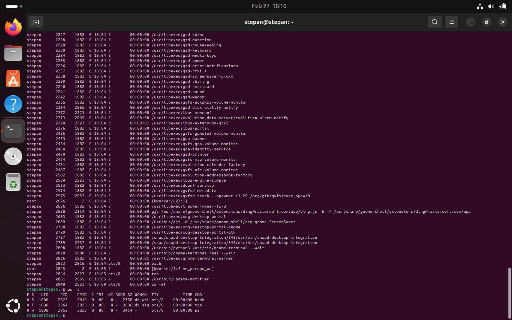

*Приклад 2: Виведення процесів у розширеному/довгому форматі (-l)*

```bash
stepan@stepan:~$ ps -l

```

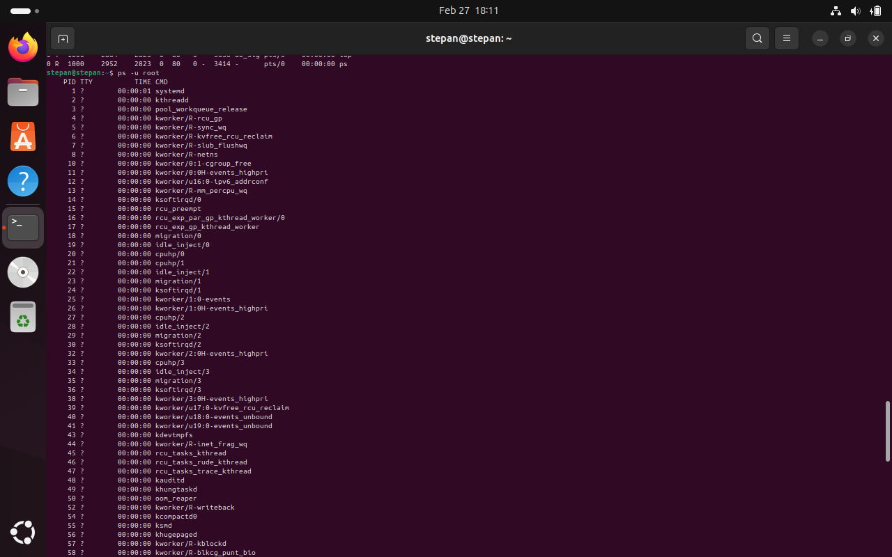

*Приклад 3: Виведення процесів конкретного користувача (наприклад, root)*

```bash
stepan@stepan:~$ ps -u root

```

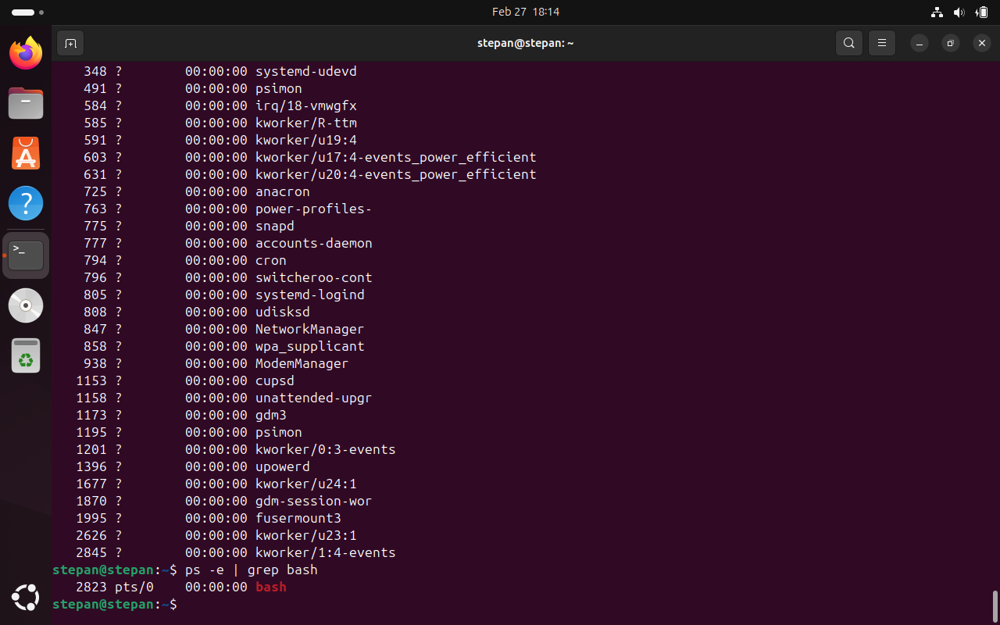

*Приклад 4: Пошук конкретного процесу (наприклад, оболонки bash)*

```bash
stepan@stepan:~$ ps -e | grep bash

```

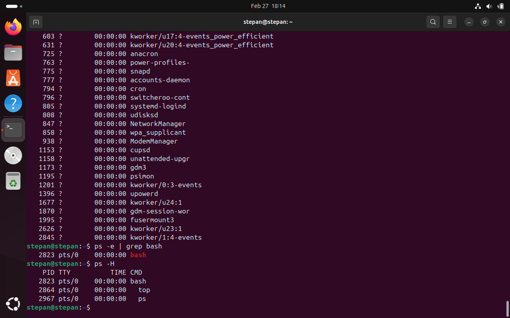

*Приклад 5: Виведення дерева процесів (ієрархія батьківських та дочірніх)*

```bash
stepan@stepan:~$ ps -H

```

**3.5 Перегляд запущених фонових процесів (**)**

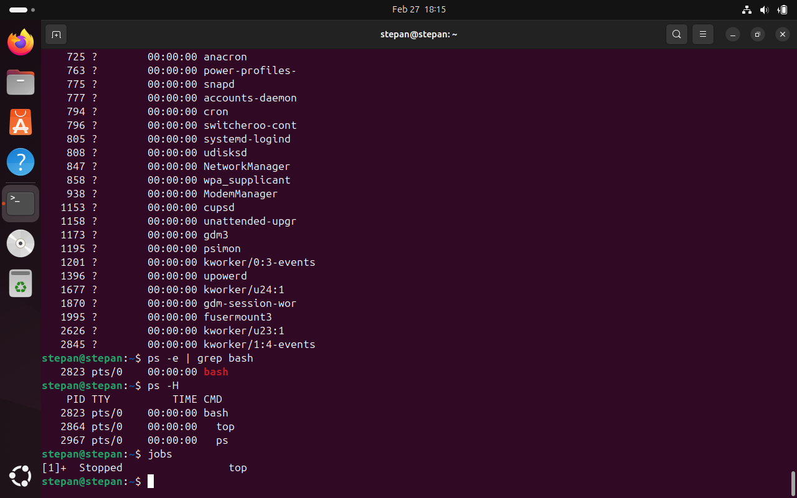

Команда `jobs` показує, що раніше запущена команда `top` зараз знаходиться у статусі "Stopped" під номером 1.

```bash
stepan@stepan:~$ jobs
[1]+  Stopped                 top

```

**3.6 Відновлення та призупинення фонового процесу (**)**


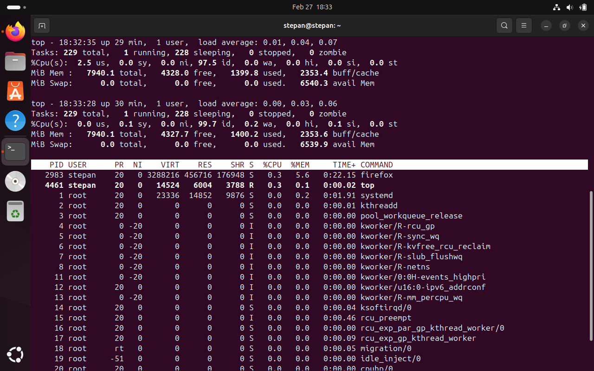


*Відновлення на передньому плані (foreground):*

```bash
stepan@stepan:~$ fg %1
# Термінал повертається до інтерфейсу top

```

*Повторне призупинення:*
Натискаємо `Ctrl+Z`.

```bash
[1]+  Stopped                 top

```

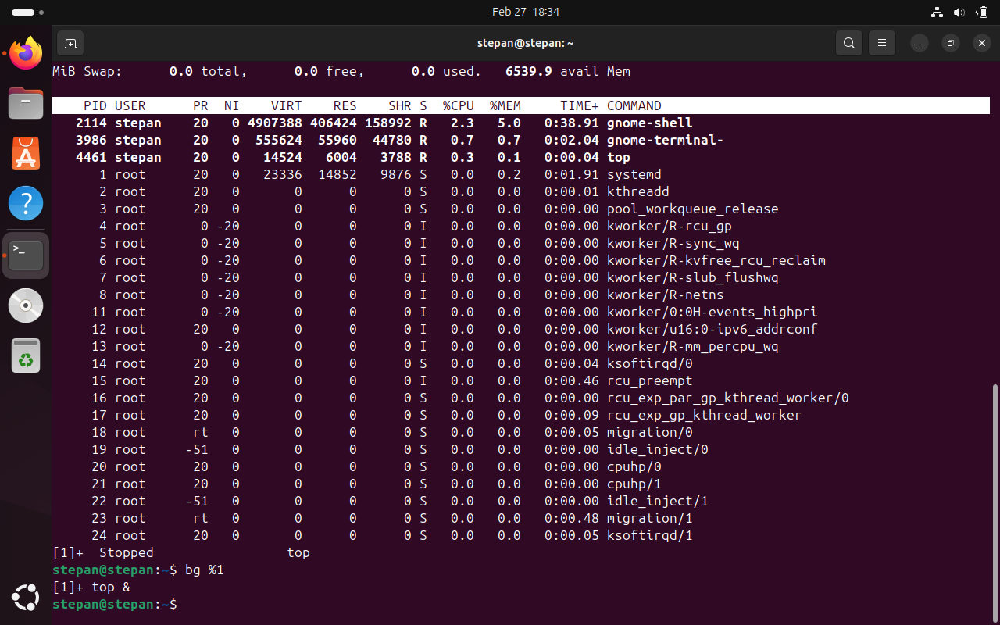

*Відновлення на задньому плані (background):*

```bash
stepan@stepan:~$ bg %1
[1]+ top &

```

**3.7 Завершення роботи даного фонового процесу (**)**


```bash
/ Мало бути так
stepan@stepan:~$ kill %1
stepan@stepan:~$ jobs
[1]+  Terminated              top

```

**Примітки**
-  **Проблема при виконанні:** При спробі виконати команди `fg %1` та `bg %1` отримано помилку `bash: fg: %1: no such job` та `bash: bg: %1: no such job`. Це сталося тому, що на момент виконання цих команд у терміналі не було активних фонових процесів з ID `%1`.
-  **Додаткова проблема:** При завершенні процесу `top` виникла ситуація, коли процес самостійно завершився зі статусом `Done` ще до виконання команди `kill %1`. Після цього повторна спроба `kill %1` призв…оректної демонстрації управління процесами у звіті рекомендується використовувати команду `sleep 100 &` замість `top`, оскільки цей процес не завершується самостійно і надає достатньо часу для виконання всіх необхідних команд (`fg %1`, `Ctrl+Z`, `bg %1`, `kill %1`).
-  **Висновок:** Команди керування фоновими процесами працюють коректно лише з активними задачами. Після завершення процесу (статус `Done` або `Terminated`) його ID видаляється зі списку завдань і більше не може бути використаний.


---

## 5. Відповіді на контрольні запитання

**1. Яке призначення директорії /proc в системах Linux? Яку інформацію вона зберігає?**
`/proc` — це псевдофайлова система, яка забезпечує інтерфейс до структур даних ядра. Вона зберігає інформацію про поточний стан системи, апаратне забезпечення (наприклад, `/proc/cpuinfo`, `/proc/meminfo`) та деталі всіх запущених процесів (папки з номерами PID).

**2. Як серед будь-яких трьох процесів динамічно визначати, який з них в поточний момент використовує найбільший обсяг пам'яті?**
Потрібно запустити `top`, натиснути `f`, вибрати сортування за відсотком використання пам'яті (`%MEM`) і підтвердити. Це дозволить в реальному часі спостерігати, хто з них споживає найбільше ресурсів.

**3. Як отримати ієрархію батьківських процесів в системах Linux? Наведіть її структуру та охарактеризуйте.**
Використовується команда `pstree` або `ps -H`. Дерево процесів завжди починається з процесу `init` (або `systemd` у сучасних ОС) з PID=1. Усі інші процеси є його нащадками. Коли програма запускає іншу програму, вона стає для неї "батьківським" (parent) процесом, а нова — "дочірнім" (child).

**4. Чим відрізняється команда top від ps? (*)**
`ps` робить одноразовий статичний знімок стану процесів на момент запуску команди. `top` працює динамічно, постійно оновлюючи екран і показуючи завантаження системи в режимі реального часу.

**5. Які додаткові можливості реалізує htop в порівнянні з top? (*)**
`htop` пропонує зручний кольоровий інтерфейс, підтримує керування мишею, має наочні шкали використання CPU/RAM та дозволяє здійснювати дії над процесами (наприклад, надсилати сигнали `kill`) без необхідності вручну вводити їхні ідентифікатори PID.

**6. Опишіть компоненти вашої мобільної ОС для здійснення моніторингу процесів? (**)**
Для мобільної ОС (у моєму випадку це HyperOS на Poco X6 Pro) системний моніторинг частково прихований. Проте в "Налаштуваннях розробника" доступний інструмент "Запущені служби" (Running services), де можна переглядати активні системні процеси, кешовані фонові додатки та стан оперативної пам'яті.

**7. Чи підтримує Ваша мобільна ОС термінальне керування роботою процесів? (**)**
Безпосередньо з коробки графічного термінала немає, але оскільки це Unix-подібна система, підтримується керування через інструмент ADB (`adb shell`), де доступні команди `ps`, `top` та `kill`. Також можна встановити емулятор термінала, наприклад, Termux.

**8. Чи можливо поставити сторонні програмні засоби для управління процесами у мобільному телефоні? (**)**
Так, існують додатки на кшталт DevCheck або Simple System Monitor. Вони забезпечують графічний інтерфейс для моніторингу частот процесора та завантаженості ОЗП. Для можливості примусового завершення системних процесів через такі утиліти, як правило, необхідні Root-права.

---

## 6. Висновок(Conclusions)  

Під час цієї лабораторної роботи я успішно оволодів командами для управління процесами. Практикуючись з утилітами на кшталт `top` та `ps`, я навчився відстежувати ресурси системи в реальному часі та отримувати детальні знімки запущених додатків. Крім того, я освоїв механізми управління завданнями—використовуючи `jobs`, `fg`, `bg` та комбінації клавіш (такі як `Ctrl+Z`) для призупинення та відновлення завдань. Нарешті, я застосував методи завершення процесів за допомогою команди `kill`. Ці навички забезпечують міцну основу для системного адміністрування та вирішення проблем продуктивності в середовищі Linux.

During this laboratory work, I successfully a…y practicing with utilities like `top` and `ps`, I learned how to monitor system resources dynamically and extract detailed snapshots of running applications. Furthermore, I mastered job control mechanisms—utilizing `jobs`, `fg`, `bg`, and keyboard shortcuts (such as `Ctrl+Z`) to suspend and resume tasks. Finally, I applied process termination methods using the `kill` command. These skills provide a solid foundation for system administration and performance troubleshooting in Linux environments.
