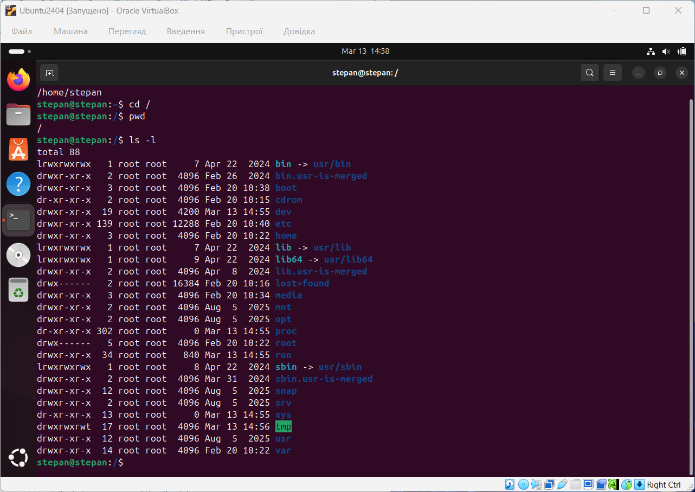
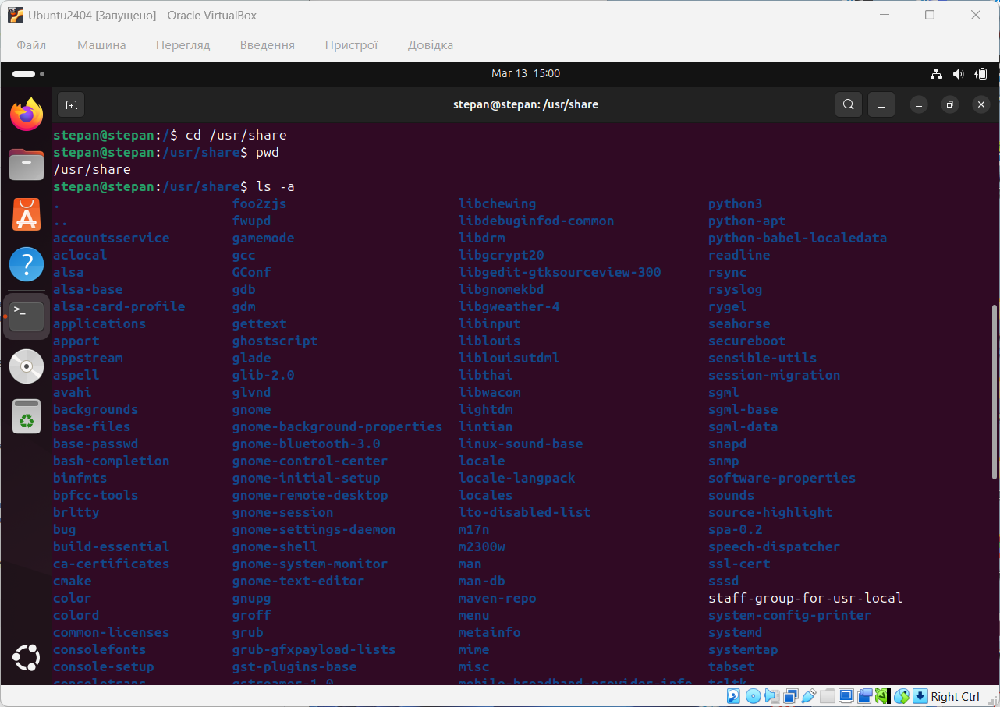
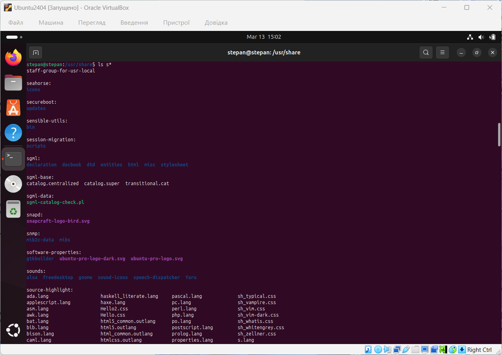
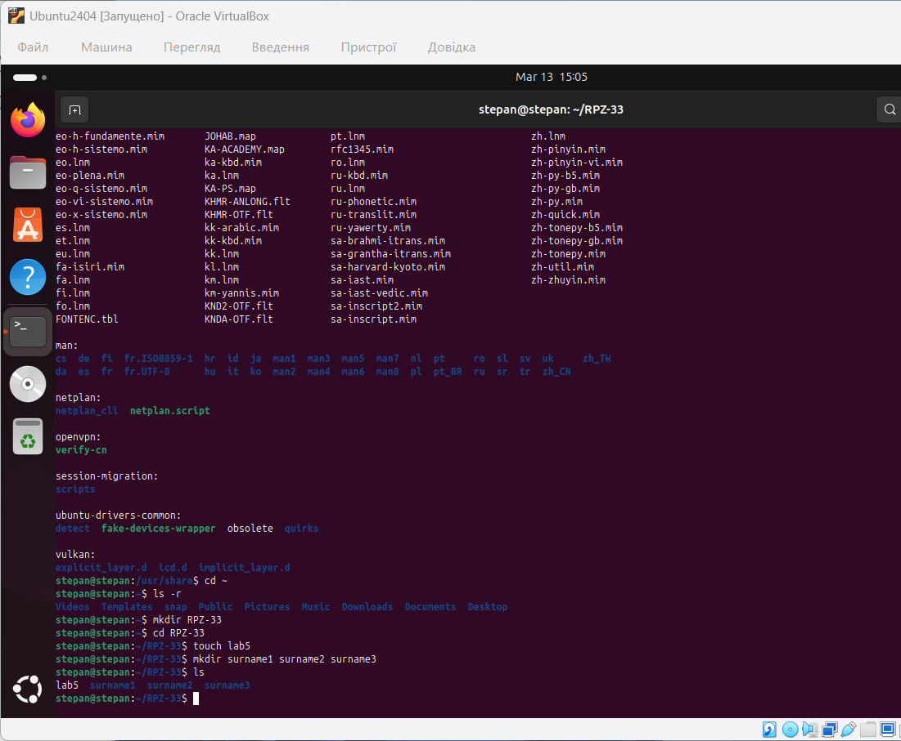
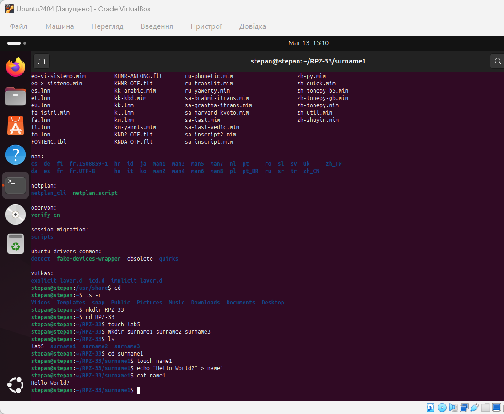
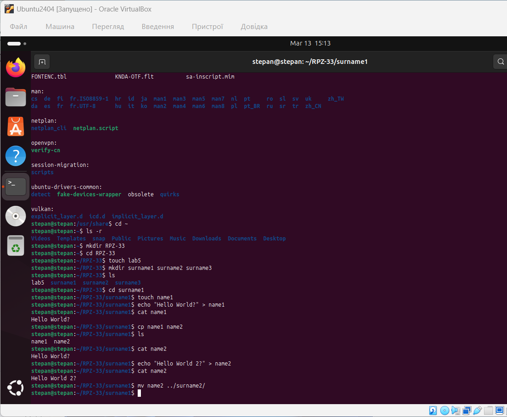
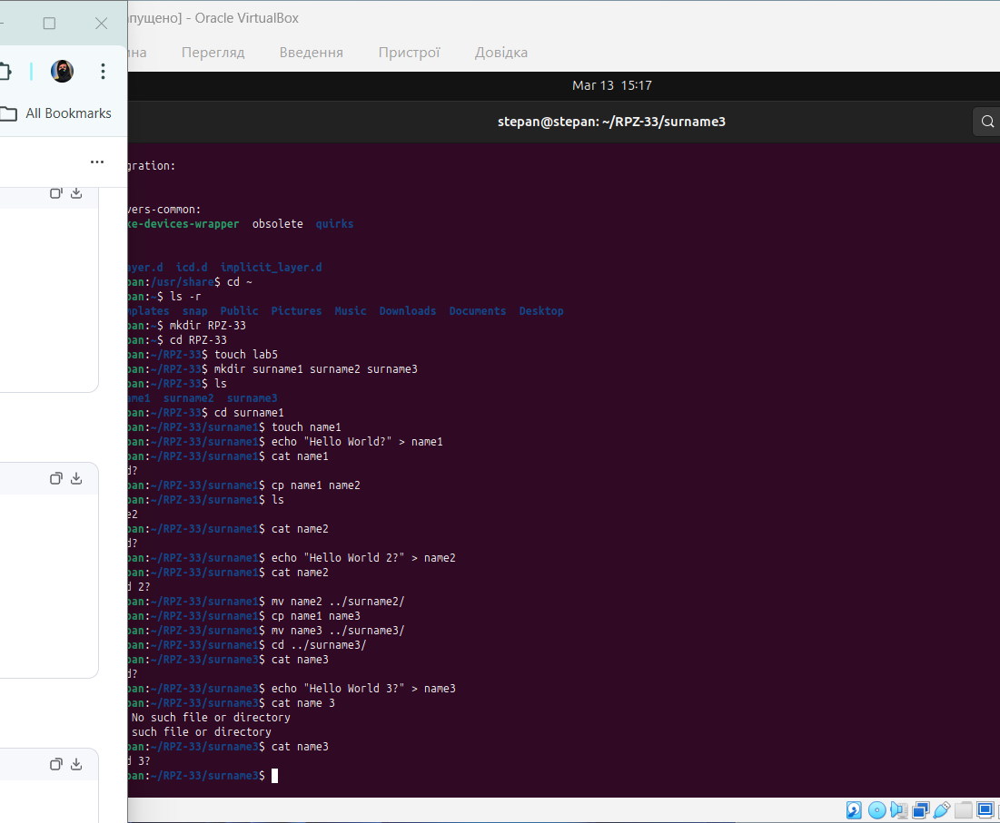
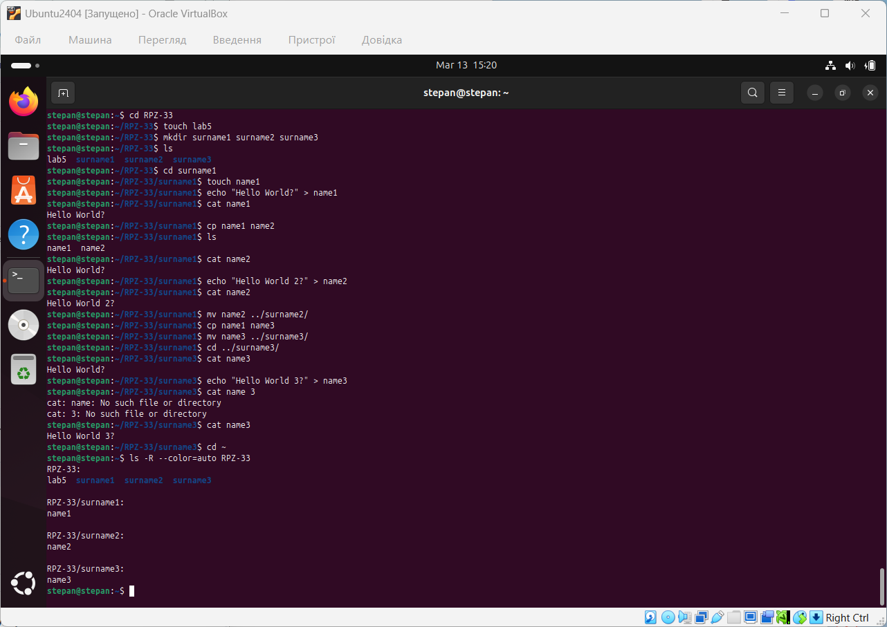

# Звіт з лабораторної роботи №5

**Дисципліна:** Операційні системи  
**Тема:** Знайомство з командами навігації по файловій системі та керування файлами та каталогами  
**Виконав:** студент групи РПЗ-33 Фокін Степан Володимирович  

---

## 1. Мета роботи

1. Отримання практичних навиків роботи з командною оболонкою Bash.
2. Знайомство з базовими командами навігації по файловій системі.
3. Знайомство з базовими командами для керування файлами та каталогами.

---

## 2. Завдання попередньої підготовки

### 2.1. Словник базових англійських термінів (Dictionary) (*)

- **Filesystem** – файлова система, ієрархічна структура організації файлів та каталогів.
- **Root directory (`/`)** – кореневий каталог, найвищий рівень файлової системи Linux.
- **Home directory (`~`)** – домашній каталог користувача, де він має повні права на керування файлами.
- **Glob characters (Wildcards)** – символи узагальнення (наприклад, `*`, `?`, `[]`), що використовуються для пошуку або масових операцій з файлами за певним шаблоном.
- **Verbose (`-v`)** – режим детального виведення інформації про процес виконання команди.
- **Recursive (`-r` або `-R`)** – рекурсивне виконання команди, що застосовується до каталогу та всього його вмісту (всіх підкаталогів і файлів).
- **Interactive (`-i`)** – інтерактивний режим, який запитує підтвердження користувача (наприклад, перед перезаписом чи видаленням).

### 2.2. Відповіді на питання попередньої підготовки

**2.1. Порівняйте файлові структури Windows-подібної та Linux-подібної системи.**

У Windows кожен фізичний або логічний диск має власну літеру (C:, D:) і є окремим коренем (наприклад, `C:\`). У Linux існує єдине дерево каталогів, яке починається з кореня `/` (root). Всі фізичні пристрої, диски чи флешки не отримують літер, а монтуються як звичайні каталоги всередині цієї єдиної ієрархії (наприклад, у `/media` або `/mnt`).

**2.2. Розкрийте поняття FHS. Як даний стандарт використовується в контексті файлових систем? (*)**

FHS (Filesystem Hierarchy Standard) — це стандарт ієрархії файлової системи, який визначає назви, розташування та призначення каталогів у Linux/Unix-системах. Завдяки FHS користувачі та програми завжди знають, де шукати певні файли: наприклад, конфігурації завжди у `/etc`, системні бінарні файли у `/bin` та `/sbin`, а змінні дані — у `/var`.

**2.3. Перерахуйте основні команди для роботи з файлами та каталогами в Linux: створення, переміщення, копіювання, видалення. (**)**

- Створення: `mkdir` (каталоги), `touch` (порожні файли).
- Переміщення та перейменування: `mv`.
- Копіювання: `cp` (для файлів), `cp -r` (для каталогів).
- Видалення: `rm` (для файлів), `rm -r` (для каталогів), `rmdir` (для порожніх каталогів).

---

## 3. Хід роботи: Опис команд навігації та керування

| Назва команди | Її призначення та функціональність |
| :--- | :--- |
| **`pwd`** | Визначає місце знаходження користувача у файловій системі, показує поточну робочу директорію (print working directory). |
| **`cd`** | Здійснює перехід до іншого каталогу (change directory). |
| **`ls`** | Виводить список файлів і підкаталогів у поточній або вказаній директорії. |
| **`mkdir`** | Створює новий каталог (make directory). |
| **`touch`** | Створює порожній файл або оновлює час його останньої модифікації. |
| **`cp`** | Копіює файли або каталоги (copy). |
| **`mv`** | Переміщує файли/каталоги в інше місце або перейменовує їх (move). |
| **`rm`** | Видаляє файли або каталоги (remove). |
| **`rmdir`** | Видаляє каталог, але лише за умови, що він порожній. |
| **`echo`** | Виводить вказаний текст на екран або, за допомогою перенаправлення `>`, записує його у файл. |
| **`cat`** | Виводить вміст файлу у термінал (concatenate). |

---

## 4. Хід роботи: Практичне виконання команд у терміналі

### 4.1. Навігація та перегляд вмісту каталогів

Визначення поточного каталогу, перехід до кореневого каталогу та перегляд у довгому форматі:



*Рисунок 1 — Визначення поточного каталогу та перегляд вмісту кореневої директорії*

```bash
stepan@stepan:~$ pwd
/home/stepan
stepan@stepan:~$ cd /
stepan@stepan:/$ pwd
/
stepan@stepan:/$ ls -l
```

Перехід до `/usr/share`, визначення каталогу та перегляд прихованих файлів:



*Рисунок 2 — Робота з каталогом /usr/share та перегляд прихованих файлів командою ls -a*

```bash
stepan@stepan:/$ cd /usr/share
stepan@stepan:/usr/share$ pwd
/usr/share
stepan@stepan:/usr/share$ ls -a
```

Робота з glob-шаблонами в каталозі `/etc` (* та **):



*Рисунок 3 — Використання шаблонів пошуку файлів (s*, ??????, *[n]) у каталозі /etc*

```bash
stepan@stepan:/usr/share$ cd /etc
# Файли, що починаються з літери "s" (від імені Stepan)
stepan@stepan:/etc$ ls s*
# Файли, назви яких складаються з 6 літер
stepan@stepan:/etc$ ls ??????
# Файли, що закінчуються на літеру "n" (остання літера імені Stepan)
stepan@stepan:/etc$ ls *[n]
```

### 4.2. Створення каталогів та файлів

Перехід до домашнього каталогу, перегляд у зворотному форматі та створення структури:



*Рисунок 4 — Створення основного каталогу групи RPZ-33 та підкаталогів для студентів*

```bash
stepan@stepan:/etc$ cd ~
# Перегляд у зворотному алфавітному порядку (-r)
stepan@stepan:~$ ls -r
# Створення каталогу групи
stepan@stepan:~$ mkdir RPZ-33
# Створення підкаталогів однією командою
stepan@stepan:~$ cd RPZ-33
stepan@stepan:~/RPZ-33$ touch lab5
stepan@stepan:~/RPZ-33$ mkdir surname1 surname2 surname3
```

### 4.3. Робота з вмістом файлів, копіювання та переміщення

Робота з першим студентом:



*Рисунок 5 — Створення файлу name1 та запис тексту за допомогою команди echo*

```bash
stepan@stepan:~/RPZ-33$ cd surname1
stepan@stepan:~/RPZ-33/surname1$ touch name1
stepan@stepan:~/RPZ-33/surname1$ echo "Hello, my name is Name1" > name1
stepan@stepan:~/RPZ-33/surname1$ cat name1
Hello, my name is Name1
```

Копіювання, редагування та переміщення другого файлу:



*Рисунок 6 — Копіювання файлу name1 у name2 та переміщення у папку surname2*

```bash
stepan@stepan:~/RPZ-33/surname1$ cp name1 name2
stepan@stepan:~/RPZ-33/surname1$ ls
name1  name2
stepan@stepan:~/RPZ-33/surname1$ cat name2
Hello, my name is Name1
stepan@stepan:~/RPZ-33/surname1$ echo "Hello, my name is Name2" > name2
stepan@stepan:~/RPZ-33/surname1$ cat name2
Hello, my name is Name2
stepan@stepan:~/RPZ-33/surname1$ mv name2 ../surname2/
```

Копіювання, переміщення та редагування третього файлу:



*Рисунок 7 — Копіювання файлу name1 у name3 та переміщення у папку surname3 з подальшим редагуванням*

```bash
stepan@stepan:~/RPZ-33/surname1$ cp name1 name3
stepan@stepan:~/RPZ-33/surname1$ mv name3 ../surname3/
stepan@stepan:~/RPZ-33/surname1$ cd ../surname3/
stepan@stepan:~/RPZ-33/surname3$ cat name3
Hello, my name is Name1
stepan@stepan:~/RPZ-33/surname3$ echo "Hello, my name is Name3" > name3
stepan@stepan:~/RPZ-33/surname3$ cat name3
Hello, my name is Name3
```

### 4.4. Фінальний перегляд структури (**)

Перегляд вмісту створеного каталогу рекурсивно:



*Рисунок 8 — Рекурсивний перегляд всієї структури каталогу RPZ-33 командою ls -R*

```bash
stepan@stepan:~/RPZ-33/surname3$ cd ~
stepan@stepan:~$ ls -R --color=auto RPZ-33
```

### 4.5. Опис команд для переміщення по системі каталогів

- **`cd /`** — Перехід у кореневий каталог системи.
- **`cd /home`** — Перехід за абсолютним шляхом до каталогу, де зберігаються папки користувачів.
- **`cd ~`** — Перехід до домашнього каталогу поточного користувача.
- **`cd` (без аргумента)** — Також виконує перехід до домашнього каталогу (еквівалент `cd ~`).
- **`cd ..`** — Перехід на один рівень вгору (у батьківський каталог).
- **`cd ../..`** — Перехід на два рівні вгору в ієрархії каталогів.
- **`cd -`** — Повернення до попереднього робочого каталогу, в якому знаходився користувач до останньої команди `cd`.

---

## 5. Відповіді на контрольні запитання

**1. Як можна переглянути шлях до домашньої директорії користувача за допомогою команди echo?**

Існує два основних способи:

1. За допомогою змінної середовища: `echo $HOME`
2. За допомогою символу тильди: `echo ~`

**2. Чи можна переглянути вміст кореневого каталогу, перебуваючи у домашньому каталозі користувача без переходу у кореневий каталог? (*)**

Так, це можна зробити, вказавши абсолютний шлях до каталогу як аргумент для команди `ls`.  
Приклад команди: `ls /`

**3. Яким чином в терміналі можна додати інформацію в порожній файл? (*)**

Можна скористатися командою `echo` разом з оператором перенаправлення `>`. Наприклад: `echo "Якийсь текст" > filename.txt`. Якщо файл вже містить дані і їх потрібно не перезаписати, а додати в кінець, використовується `>>` (наприклад: `echo "Новий рядок" >> filename.txt`).

**4. Як скопіювати та видалити існуючий каталог? Чи буде відмінність в командах, якщо каталог буде не порожній при цьому? (**)**

- **Копіювання:** Завжди потрібен рекурсивний ключ `-r`. Команда виглядає так: `cp -r ім'я_каталогу нове_місце/`.
- **Видалення:** Якщо каталог порожній, його можна видалити командою `rmdir ім'я_каталогу`. Якщо в каталозі є файли або підкаталоги, `rmdir` видасть помилку. У такому випадку потрібно використовувати команду `rm` з рекурсивним ключем: `rm -r ім'я_каталогу`.

**5. У якому з наведених нижче прикладів відбувається переміщення файлу? його перейменування? одночасно обидві дії? (**)**

- `mv /work/tech/comp.png /Desktop` — **Переміщення**. Файл переноситься в існуючий каталог `/Desktop` зі збереженням старої назви.
- `mv /work/tech/comp.png /work/tech/my_car.png` — **Перейменування**. Файл залишається в тій самій директорії, але змінює ім'я.
- `mv /work/tech/comp.png /Desktop/computer.png` — **Переміщення та перейменування**. Файл переноситься в нову директорію і водночас отримує нове ім'я.

---

## 6. Висновок (Conclusions)

Під час виконання цієї лабораторної роботи я ознайомився з базовими принципами організації файлової системи Linux (стандарт FHS) та засвоїв ключові команди для навігації в терміналі. Я практично відпрацював використання команд `pwd`, `cd` та `ls` з різними параметрами та ключами (зокрема з glob-шаблонами) для швидкого пошуку та переміщення по системі. Крім того, я отримав практичні навички керування файлами та каталогами, навчившись їх створювати (`mkdir`, `touch`), копіювати (`cp`), перейменовувати та переміщувати (`mv`), а також записувати та читати інформацію безпосередньо з командного рядка (`echo`, `cat`). Ці знання є фундаментальними для подальшої впевненої роботи в середовищі Linux.

*During this laboratory work, I became familiar with the basic principles of the Linux filesystem organization (FHS standard) and mastered key terminal navigation commands. I practically practiced using `pwd`, `cd`, and `ls` with various parameters and options (including glob patterns) for quick search and navigation. In addition, I gained practical skills in managing files and directories by learning how to create (`mkdir`, `touch`), copy (`cp`), rename, and move (`mv`) them, as well as how to write and read information directly from the command line (`echo`, `cat`). These skills are fundamental for confident future work in the Linux environment.*
