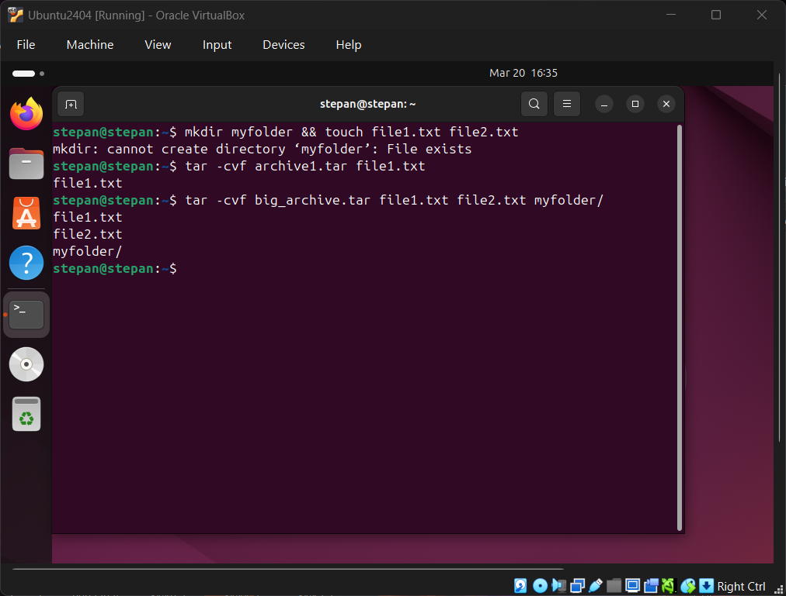
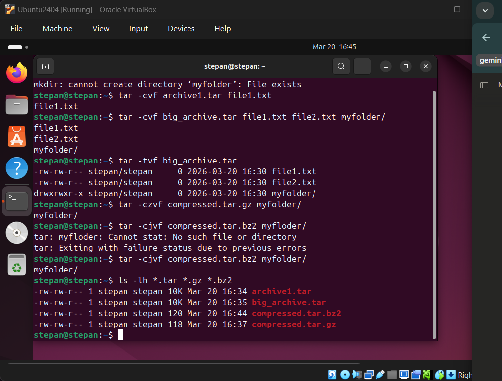
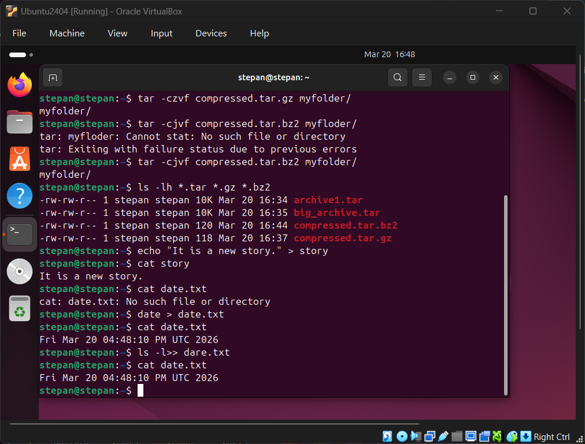
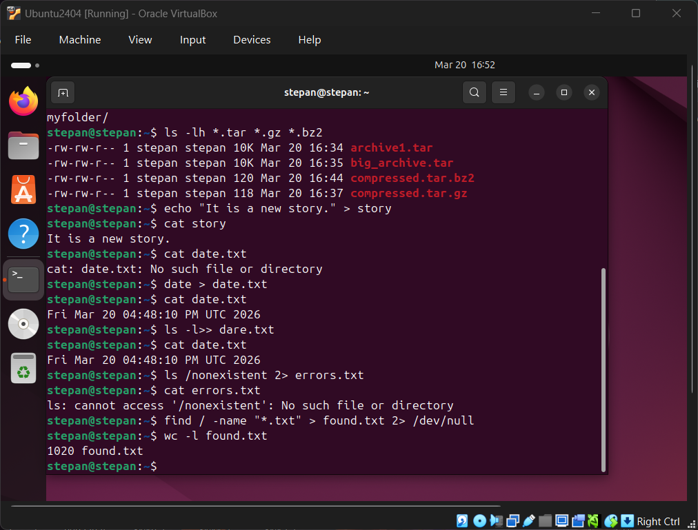
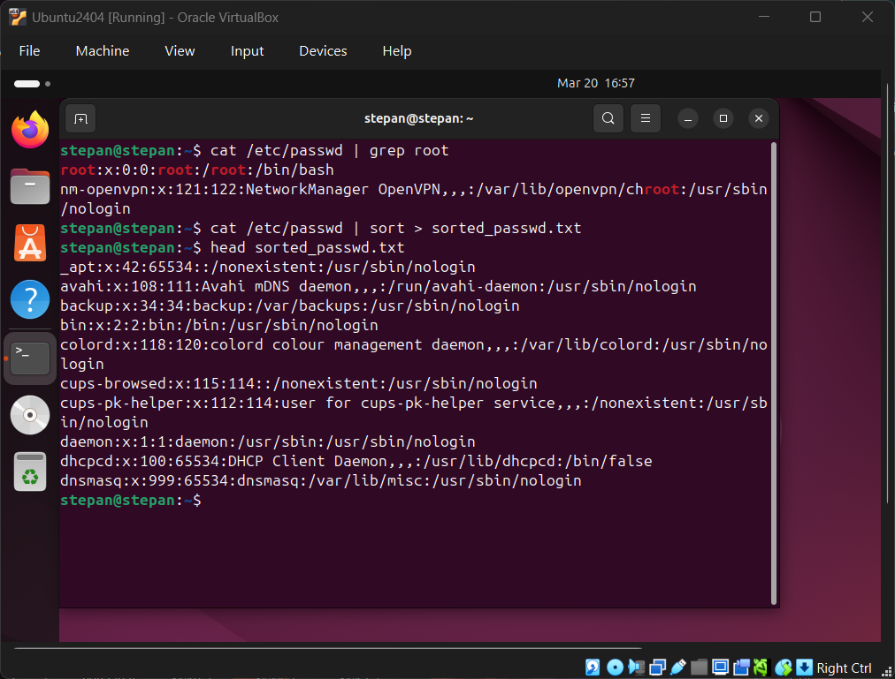
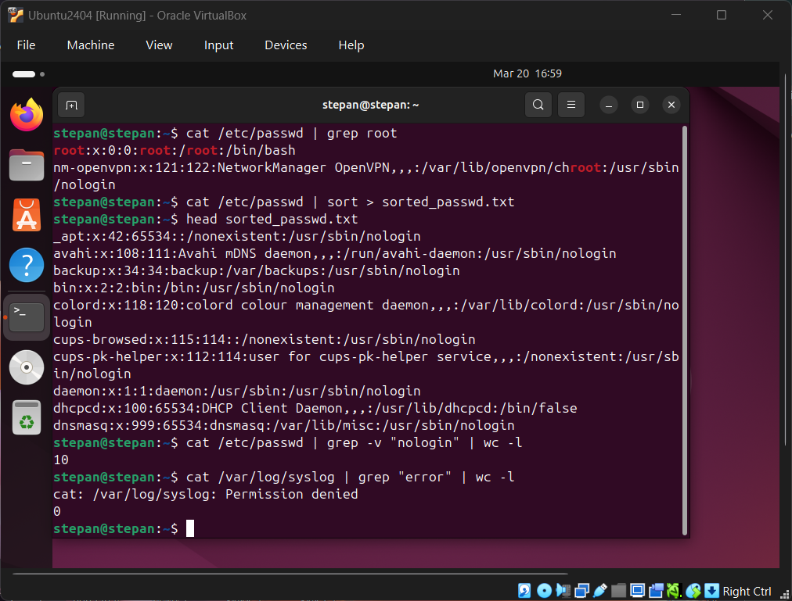

# Звіт з лабораторної роботи №6

**Дисципліна:** Операційні системи  
**Тема:** Команди Linux для архівування та стиснення даних. Робота з текстом  
**Виконав:** студент групи РПЗ-33 Фокін Степан Володимирович  

---

## 1. Мета роботи

1. Отримання практичних навиків роботи з командною оболонкою Bash.
2. Знайомство з базовими командами для архівування та стиснення даних.
3. Знайомство з базовими діями при роботі з текстом у терміналі.

---

## 2. Завдання попередньої підготовки

### 2.1. Словник базових англійських термінів (Dictionary) (*)

| Англійський термін | Визначення та переклад |
| :--- | :--- |
| **Compression** | Стиснення — процес зменшення розміру файлу за допомогою математичних алгоритмів. |
| **Archiving** | Архівування — процес об'єднання кількох файлів та каталогів у єдиний файл (архів) із збереженням структури та прав доступу. |
| **Lossless** | Без втрат — метод стиснення, при якому оригінальні дані можуть бути повністю відновлені без спотворень. |
| **Standard Output (stdout)** | Стандартний потік виведення — потік даних, куди програма за замовчуванням виводить свої результати (зазвичай на екран). |
| **Standard Error (stderr)** | Стандартний потік помилок — потік, куди програма виводить повідомлення про помилки та діагностичну інформацію. |
| **Pipeline (\|)** | Конвеєр (канал) — механізм передачі стандартного виводу однієї програми на стандартний ввід іншої. |
| **Verbose (`-v`)** | Детальний режим — параметр команди (наприклад, у `tar`), що змушує її виводити детальну інформацію про хід виконання процесу. |

### 2.2. Відповіді на питання попередньої підготовки

**2.1. Яке призначення команд tar, xz, zip, bzip, gzip? (*)**

* **`tar` (Tape Archive):** Використовується для створення архівів (об'єднання багатьох файлів у один) без власного стиснення. *Параметри:* `-c` (створити), `-x` (витягти), `-v` (детально), `-f` (вказати ім'я файлу).
* **`gzip`:** Класична та дуже швидка утиліта для стиснення файлів (алгоритм DEFLATE). *Параметри:* `-d` (декомпресія), `-1` (швидко) до `-9` (максимальне стиснення).
* **`bzip2`:** Утиліта, що забезпечує вищий ступінь стиснення порівняно з gzip, але працює повільніше (алгоритм Burrows-Wheeler). *Параметри:* `-d` (декомпресія), `-s` (менше використання пам'яті).
* **`xz`:** Сучасна утиліта з найвищим ступенем стиснення (алгоритм LZMA2), працює довго, але розпаковує швидко. *Параметри:* `-d` (декомпресія), `-e` (екстремальне стиснення).
* **`zip`:** Утиліта, яка одночасно архівує та стискає файли (дуже поширена у Windows). *Параметри:* `-r` (рекурсивно для каталогів).
* *Встановлення:* Більшість цих утиліт встановлено за замовчуванням. Якщо ні, в Ubuntu використовується команда: `sudo apt install tar xz-utils zip bzip2 gzip`.

**2.2. Наведіть три приклади реалізації архівування та стискання даних різними командами. (**)**

1. Архівування каталогу та швидке стиснення за допомогою **gzip**:
   `tar -czvf myarchive.tar.gz /home/stepan/myfolder`
2. Архівування каталогу та сильне стиснення за допомогою **bzip2**:
   `tar -cjvf backup.tar.bz2 /etc/ssh`
3. Створення архіву за допомогою **zip**:
   `zip -r project_files.zip /home/stepan/project`

**2.3. Яке призначення команд cat, less, more, head and tail? (*)**

* **`cat` (concatenate):** Виводить весь вміст файлу(ів) у термінал. Використовується для коротких файлів або об'єднання кількох файлів.
* **`less`:** Програма-пейджер для зручного перегляду довгих текстових файлів (дозволяє гортати текст вгору і вниз, здійснювати пошук).
* **`more`:** Старіший аналог `less`, дозволяє гортати текст лише вперед.
* **`head`:** Виводить перші 10 рядків файлу. *Параметр:* `-n` (вказати кількість рядків).
* **`tail`:** Виводить останні 10 рядків файлу. *Параметр:* `-f` (відслідковувати нові рядки в реальному часі, корисно для логів).
* *Встановлення:* Є базовими утилітами Linux (входять до пакету `coreutils` та `less`), встановлені за замовчуванням.

**2.4. Поясніть принципи роботи командної оболонки з каналами, потоками та фільтрами (**)**

* **Потоки:** У Linux кожний процес має три стандартні потоки: `stdin` (ввід, ідентифікатор 0), `stdout` (нормальний вивід, 1) та `stderr` (вивід помилок, 2). Їх можна перенаправляти за допомогою `>` та `<`.
* **Канали (Pipelines):** Позначаються символом `|`. Дозволяють передати `stdout` однієї програми безпосередньо як `stdin` для іншої програми (наприклад: `ls -l | less`).
* **Фільтри:** Це команди, які читають дані зі стандартного вводу, якось їх модифікують (фільтрують, сортують) і віддають у стандартний вивід. Приклади: `grep`, `sort`, `wc`.

**2.5. Яке призначення команди grep? (*)**

Команда **`grep`** (Global Regular Expression Print) використовується для пошуку рядків у текстових файлах або потоках даних, що відповідають заданому шаблону (або регулярному виразу). Вона виводить лише ті рядки, де знайдено збіг.

---

## 3. Хід роботи: Опис команд та їх функціональності

| Назва команди | Її призначення та функціональність |
| :--- | :--- |
| **`mkdir mybackups`** | Створення нової директорії mybackups у поточному каталозі. |
| **`tar -cvf mybackups/udev.tar /etc/udev`** | Створення архіву `udev.tar` у папці `mybackups`, що містить всі файли з `/etc/udev`. Опція `-v` показує процес на екрані. |
| **`gzip file.txt`** | Стискає файл `file.txt`, створюючи замість нього `file.txt.gz`. |
| **`bzip2 -k file.txt`** | Стискає файл алгоритмом bzip2, опція `-k` залишає оригінальний файл недоторканим. |
| **`cat file1.txt file2.txt`** | Виводить вміст обох файлів у термінал один за одним. |
| **`grep "error" syslog`** | Шукає та виводить всі рядки у файлі `syslog`, які містять слово "error". |

---

## 4. Хід роботи: Практичне виконання

### 4.1. Робота з архіватором tar

```bash
# 1. Створити файл з розширенням .tar
stepan@linux:~$ tar -cvf archive1.tar file1.txt

# 2. Створити файл з розширенням .tar з декількох файлів і каталогів
stepan@linux:~$ tar -cvf big_archive.tar file1.txt file2.txt myfolder/

# 3. Перегляд вмісту файлу tar
stepan@linux:~$ tar -tvf big_archive.tar

# 4. Витягти вміст файлу tar
stepan@linux:~$ tar -xvf big_archive.tar

# 5. Створити архівний файл tar, стиснений за допомогою bzip2
stepan@linux:~$ tar -cjvf compressed.tar.bz2 myfolder/

# 6. Витягти вміст файлу tar bzip2
stepan@linux:~$ tar -xjvf compressed.tar.bz2

# 7. Створити архівний tar файл, стиснений за допомогою gzip
stepan@linux:~$ tar -czvf compressed.tar.gz myfolder/

# 8. Витягти вміст файлу tar gzip
stepan@linux:~$ tar -xzvf compressed.tar.gz
```

<div align="center">



*Рисунок 1 — Створення архівів `archive1.tar` та `big_archive.tar` командами `tar -cvf`*

</div>


<div align="center">



*Рисунок 2 — Перегляд вмісту `big_archive.tar`, стиснення командами `tar -czvf` (gzip) та `tar -cjvf` (bzip2), порівняння розмірів файлів командою `ls -lh`*

</div>


### 4.2. Робота з перенаправленням потоків (*)

| Команда | Що виконує команда? |
| :--- | :--- |
| **`cmd 1> file`** | Перенаправляє стандартний вивід (stdout) у файл (перезаписуючи його). |
| **`cmd > file`** | Аналогічно до попереднього (1 мається на увазі за замовчуванням). |
| **`cmd 2> file`** | Перенаправляє вивід помилок (stderr) у файл. |
| **`cmd >> file`** | Додає стандартний вивід у кінець файлу (без перезапису). |
| **`cmd &> file`** | Перенаправляє **і** stdout, **і** stderr у файл. |
| **`cmd > file 2>&1`** | Спочатку направляє stdout у файл, а потім направляє stderr туди ж, куди й stdout (тобто у файл). |
| **`cmd >> file 2>&1`** | Аналогічно попередньому, але додає дані в кінець файлу. |
| **`cmd 2>&1 > /dev/null`** | Направляє stderr у поточний stdout (термінал), а потім направляє stdout у `/dev/null` (знищує його). Результат: на екрані будуть лише помилки. |
| **`cmd 2> /dev/null`** | Знищує всі повідомлення про помилки, виводячи на екран лише успішний результат роботи. |
| **`cmd1 \| cmd2`** | Передає stdout першої команди на ввід (stdin) другої команди. |
| **`cmd1 2>&1 \| cmd2`** | Передає і stdout, і stderr першої команди на ввід другої команди. |

<div align="center">



*Рисунок 3 — Перенаправлення стандартного виводу: запис тексту у файл `story`, дати у `date.txt`, та додавання виводу `ls -l` у файл командою `>>`*

</div>


<div align="center">



*Рисунок 4 — Перенаправлення потоку помилок (stderr) у файл `errors.txt` та приховування помилок командою `find` через `2> /dev/null`*

</div>

### 4.3. Аналіз типів перенаправлення (**)

| Команда | Що виконує команда? | Який потік перенаправлення? |
| :--- | :--- | :--- |
| `echo "It is a new story." > story` | Створює/перезаписує файл story вказаним текстом. | Стандартний вивід (stdout), перезапис. |
| `date > date.txt` | Записує поточну дату та час у файл. | Стандартний вивід (stdout), перезапис. |
| `cat file1 file2 file3 > bigfile` | Об'єднує 3 файли і записує результат у новий файл. | Стандартний вивід (stdout), перезапис. |
| `ls -l >> directory` | Додає детальний список файлів каталогу в кінець файлу directory. | Стандартний вивід (stdout), додавання. |
| `sort < file1_unsorted > file2_sorted` | Читає невідсортований файл, сортує його і записує в новий файл. | Ввід (stdin) та вивід (stdout). |
| `find -name '*.txt' > file.txt 2> /dev/null` | Шукає всі .txt файли, записує шляхи у файл, а всі помилки доступу приховує. | Окремо stdout у файл, окремо stderr в нікуди. |
| `cat file1 \| sort > file2_sorted` | Читає файл, передає по конвеєру на сортування, результат пише у файл. | Конвеєр (Pipeline) + stdout у файл. |
| `cat myfile \| grep student \| wc -l` | Читає файл, відфільтровує рядки зі словом student, рахує кількість цих рядків. | Подвійний конвеєр (Pipeline). |

<div align="center">



*Рисунок 5 — Використання конвеєрів: пошук користувача `root` у `/etc/passwd` командою `grep`, сортування файлу та перегляд результату командою `head`*

</div>


<div align="center">



*Рисунок 6 — Підрахунок кількості користувачів без `nologin` командою `wc -l` та спроба читання системного журналу `/var/log/syslog`*

</div>


---

## 5. Відповіді на контрольні запитання

**1. Надайте порівняльну характеристику процесам стискання та архівування.** Архівування — це об'єднання кількох файлів або цілої структури каталогів у один файл без обов'язкового зменшення їхнього фізичного розміру (зберігаються метадані, права тощо). Стиснення — це застосування математичних алгоритмів до одного файлу для зменшення його розміру на диску. У Linux ці процеси часто комбінують (наприклад, `tar` об'єднує, а потім `gzip` стискає).

**2. Які програми можуть використовуватись для стискання та архівування в Linux?** Окрім розглянутих, популярними є `7z` (пакет p7zip) — підтримує безліч форматів і має дуже високий ступінь стискання; `rar`/`unrar` — для роботи з популярними пропрієтарними архівами RAR; `zstd` — сучасний алгоритм від Facebook, що забезпечує неймовірно швидке стиснення та розпакування в реальному часі.

**3. Порівняйте алгоритми стискання. Які з них найшвидші та найефективніші? (*)** 

* **DEFLATE (gzip):** Найшвидший у стисненні та розпакуванні, споживає мало пам'яті, але дає найменший ступінь стискання.
* **Burrows-Wheeler (bzip2):** Золота середина, стискає краще за gzip, але працює довше.
* **LZMA2 (xz):** Найефективніший (створює найменші файли), але процес стиснення дуже повільний і вимагає багато оперативної пам'яті. Розпаковується відносно швидко.

**4. Програмні засоби у мобільному телефоні. (*)** На сучасних смартфонах (iOS/Android) базове створення і розпакування архівів ZIP вбудовано в стандартні системні файлові менеджери (Files). Для складніших форматів (RAR, 7Z, TAR) використовують сторонні додатки: RAR (від творців WinRAR), ZArchiver або Solid Explorer.

**5. Програмні засоби в ОС сімейства Windows. (*)** У Windows є вбудована утиліта для створення та розпакування ZIP-архівів (через Провідник). Найпопулярнішими сторонніми засобами є **7-Zip** (безкоштовна програма з відкритим кодом, дуже потужна, використовує формат .7z) та **WinRAR** (комерційна програма, популярна завдяки зручному інтерфейсу та власному формату .rar).

**6. Використання для резервування та задач адміністрування. (**)** Архівування та стиснення — основа бекапів. Адміністратори використовують `tar` + `gzip`/`xz` для регулярного резервного копіювання баз даних, конфігураційних файлів (`/etc`) або цілих веб-сайтів, пересилаючи стиснені архіви на віддалені сервери. Також це використовується для логування: утиліта `logrotate` стискає старі файли журналів (логів) у формат `.gz`, щоб вони не заповнювали весь дисковий простір.

**7. Яке призначення директорії файлу /dev/null? (**)** `/dev/null` — це спеціальний віртуальний пристрій у Linux, який працює як "чорна діра". Будь-які дані, що записуються в цей файл, безслідно зникають, а при спробі прочитати його система миттєво повертає кінець файлу (EOF). Його використовують для приховування непотрібного виводу програм (наприклад, ігнорування повідомлень про помилки за допомогою `2> /dev/null`).

---

## 6. Висновок (Conclusions)

Під час виконання лабораторної роботи я поглибив свої практичні навички роботи з командною оболонкою Bash. Я детально ознайомився з концепціями архівування та стиснення даних, вивчивши відмінності між утилітами `tar`, `gzip`, `bzip2` та `xz`. Також я здобув важливі навички управління потоками даних у Linux, навчившись перенаправляти стандартний вивід та помилки у файли, а також створювати конвеєри (`|`) для обробки тексту за допомогою утиліт `cat`, `less`, `sort` та `grep`.

*During this laboratory work, I deepened my practical skills in working with the Bash command shell. I familiarized myself in detail with the concepts of data archiving and compression, learning the differences between the `tar`, `gzip`, `bzip2`, and `xz` utilities. Additionally, I gained important skills in managing data streams in Linux, learning how to redirect standard output and errors to files, as well as how to create pipelines (`|`) for text processing using utilities like `cat`, `less`, `sort`, and `grep`.*