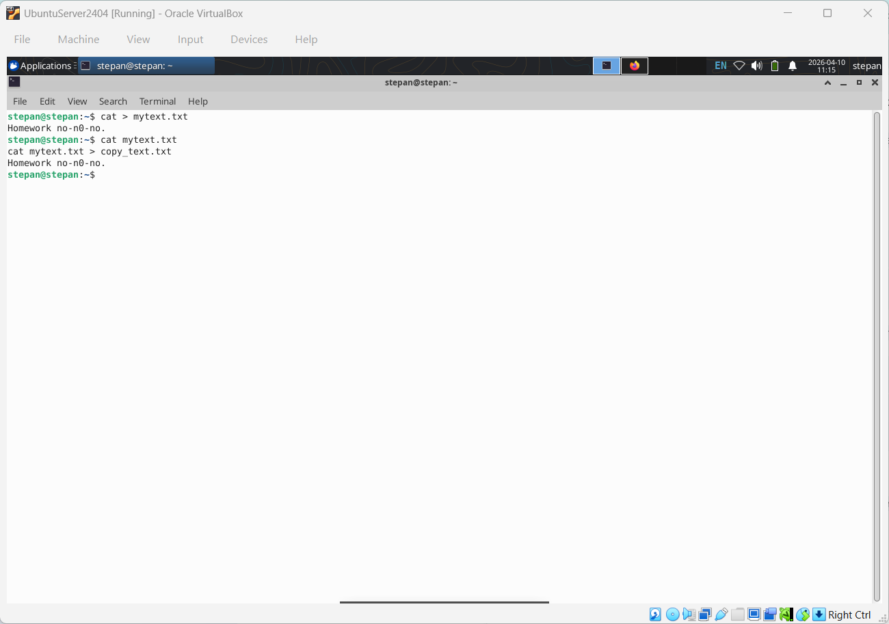
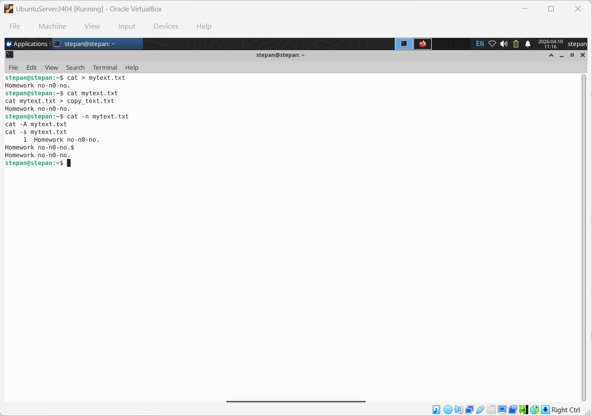
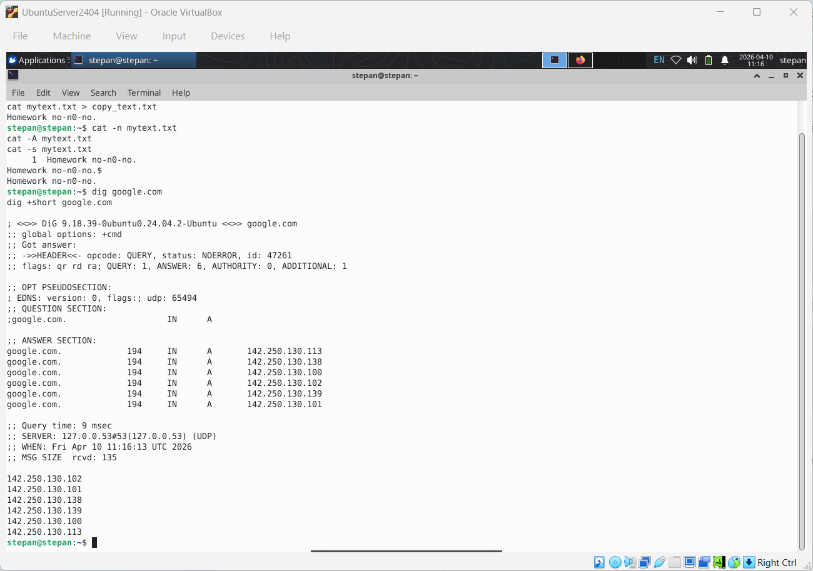
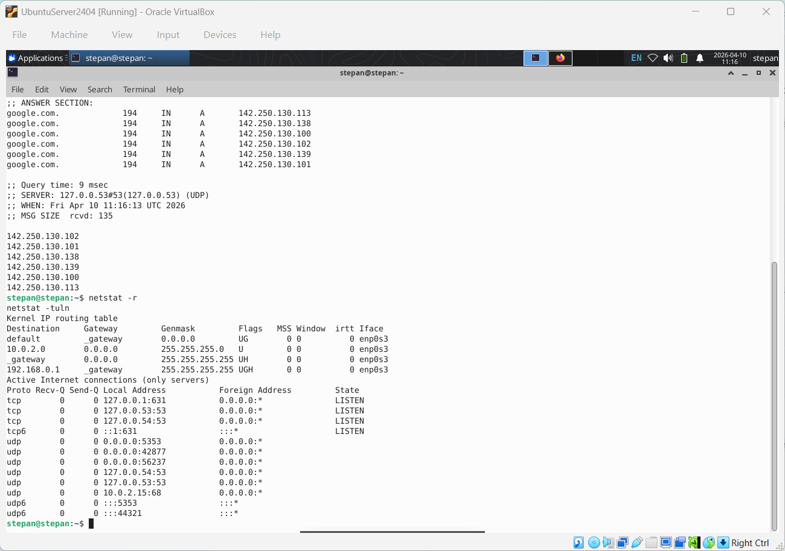
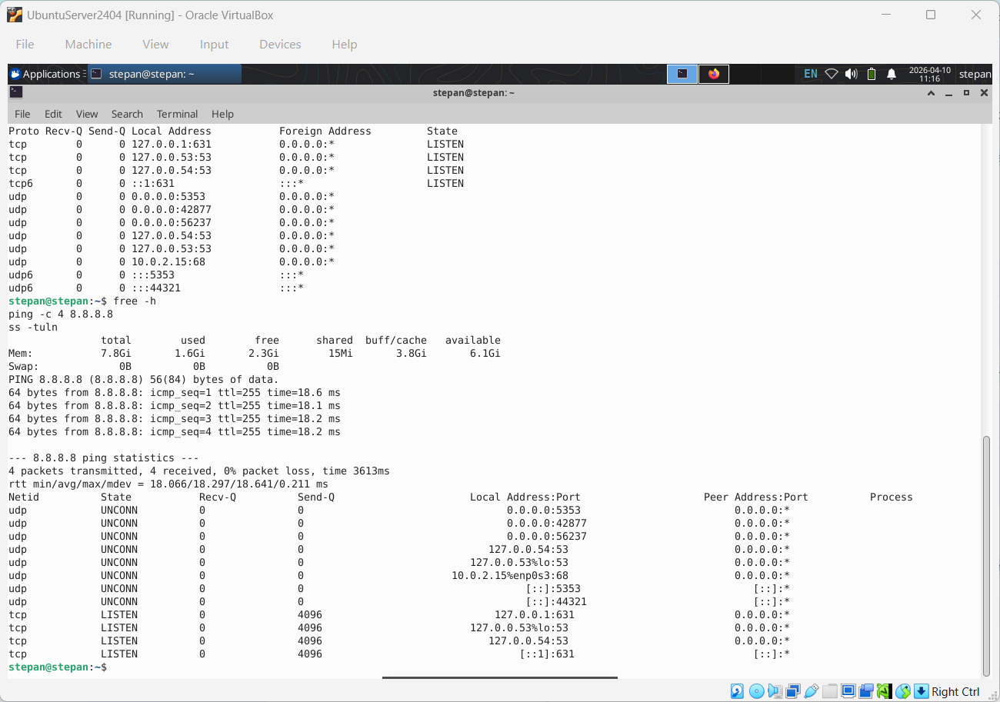

# Звіт з лабораторної роботи №8

**Дисципліна:** Операційні системи  
**Тема:** Збереження службових даних системи та її мережева конфігурація  
**Виконав:** студент групи РПЗ-33 Фокін Степан

-----

## 1\. Мета роботи

1.  Отримання практичних навиків роботи з командною оболонкою Bash.
2.  Знайомство з базовими структурами для збереження системних даних — процеси, пам'ять, лог-файли та повідомлення про стан ядра.
3.  Поглиблене вивчення стандарту FHS та класифікації даних.
4.  Знайомство з налаштуванням мережі та стеком протоколів TCP/IP.

-----

## 2\. Завдання попередньої підготовки

### 2.1. Словник термінів

| Термін | Визначення за лекційним матеріалом |
| :--- | :--- |
| **FHS** | Стандарт, що визначає розміщення файлів і каталогів з різним статусом (статичні/змінні, роздільні/нероздільні). |
| **Pseudo-FS** | Спеціальна файлова система (напр., `/proc`), яка не існує на диску, а є інтерфейсом до структур даних ядра. |
| **TCP/IP** | Стек протоколів, що забезпечує передачу даних між мережевими вузлами. Включає рівні: прикладний, транспортний, мережевий та рівень доступу. |
| **Default Gateway** | Маршрутизатор, на який надсилаються пакети, якщо адреса призначення не належить до поточної підмережі. |

### 2.2. Відповіді на питання

**2.7. Для чого розроблено FHS?**
FHS розроблено для забезпечення передбачуваного розташування файлів. Згідно з лекційним матеріалом, дані класифікуються за двома ознаками:

1.  **Роздільність:** Роздільні (shareable) — можуть бути доступні іншим вузлам (напр., `/usr`, `/var/mail`); нероздільні — локальні для одного вузла (напр., `/etc`, `/boot`).
2.  **Змінність:** Статичні (static) — не змінюються без втручання адміністратора (напр., `/bin`, `/opt`); змінні (variable) — змінюються автоматично (напр., `/var/log`, `/home`).

**2.8. Які основні команди Linux для мережі?**

  * `ip addr` / `ip route` — перегляд адрес та таблиць маршрутизації.
  * `nslookup` / `dig` — діагностика DNS.
  * `traceroute` — визначення маршруту прямування пакета.
  * `ssh` — безпечний віддалений доступ до командної оболонки іншого вузла.

-----

## 3\. Хід роботи

### 3.1. Початкова робота в CLI-режимі

Для виконання лабораторної роботи було запущено операційну систему сімейства Linux (Ubuntu) та відкрито вікно термінала для роботи в інтерфейсі командного рядка (CLI).

### 3.2. Опрацювання команд курсу NDG Linux Essentials

Під час роботи було опрацьовано приклади команд з лабораторних робіт Lab 13 (Where Data is Stored) та Lab 14 (Network Configuration). Результати опрацювання наведено в таблиці нижче.

| Назва команди | Її призначення та функціональність |
| :--- | :--- |
| `su` / `su -` | Зміна поточного користувача на root (суперкористувача) для отримання адміністративних привілеїв. |
| `ls /proc` | Перегляд вмісту системного каталогу `/proc` (віртуальної файлової системи), де міститься інформація про ядро та процеси. |
| `cat /proc/meminfo` | Зчитування інформації про використання оперативної пам'яті системою безпосередньо від ядра. |
| `free -m` | Виведення зручної статистики про обсяг вільної та використаної пам'яті (RAM та swap) у мегабайтах. |
| `dmesg` | Перегляд буфера повідомлень ядра, зокрема логів, згенерованих під час завантаження системи або підключення обладнання. |
| `journalctl` | Утиліта для перегляду та фільтрації системних журналів (логів), які збираються демоном `systemd-journald`. |
| `ip addr show` | Перегляд конфігурації мережевих інтерфейсів (IP-адреси, MAC-адреси, статус підключення). |
| `ip route show` | Відображення таблиці IP-маршрутизації (шляхи передачі мережевих пакетів). |
| `ping -c 4` | Відправлення визначеної кількості (4) ICMP-запитів до хоста для перевірки мережевої доступності. |
| `ss` | Перегляд статистики мережевих сокетів, активних з'єднань та відкритих портів (сучасний аналог netstat). |
| `host` | Проста утиліта для виконання запитів до DNS (перетворення доменного імені в IP-адресу і навпаки). |

>*Примітка: скріншоти не вимагаються.*

-----

### 3.3. Виконання практичних завдань у терміналі

#### 3.3.1. Дослідження можливостей команди `cat` (\*)

Команда `cat` (concatenate) є стандартною утилітою Unix, яка призначена для читання файлів, їх об'єднання та виведення вмісту на стандартний пристрій виведення (екран).

**Приклади використання `cat` для базових задач:**

1.  **Створення файлу:** (текст вводиться з клавіатури, завершення вводу — `Ctrl+D`)
    ```bash
    cat > mytext.txt
    ```
2.  **Перегляд вмісту файлу:**
    ```bash
    cat mytext.txt
    ```
3.  **Перенаправлення інформації у інший файл** (з перезаписом `>` або додаванням `>>`):
    ```bash
    cat mytext.txt > copy_text.txt
    cat mytext.txt >> copy_text.txt
    ```
4.  **Склеювання декількох файлів в один:**
    ```bash
    cat file1.txt file2.txt file3.txt > combined_files.txt
    ```


<div align="center"\>Рисунок 1 — Демонстрація створення файлів, їх перегляду та склеювання за допомогою команди cat</div>

</div>
<br>

**Параметри команди `cat` для спеціального форматування:**

  * **Пронумерувати рядки файлу:** параметр `-n` (number).
    ```bash
    cat -n mytext.txt
    ```
  * **Відобразити недруковані символи:** параметр `-v` (показує недруковані символи), `-E` (показує `$` в кінці рядка), `-T` (показує табуляції як `^I`). Часто використовують об'єднаний ключ `-A` (або `-vTE`).
    ```bash
    cat -A mytext.txt
    ```
  * **Видалити (стиснути) порожні рядки:** параметр `-s` (squeeze-blank). Замінює кілька послідовних порожніх рядків на один.
    ```bash
    cat -s mytext.txt
    ```


<div align="center"\>Рисунок 2 — Демонстрація можливостей команди cat: нумерація та показ прихованих символів</div>

</div>


#### 3.3.2. Дослідження можливостей команди `dig` (\*\*)

Команда `dig` (Domain Information Groper) — це інструмент мережевого адміністрування для виконання гнучких запитів до DNS-серверів. Вона дозволяє отримати детальну інформацію про доменні імена: IP-адреси (A-записи), поштові сервери (MX-записи), сервери імен (NS-записи) та швидко діагностувати проблеми з розділенням імен.

**Приклади:**

1.  Отримання базової інформації (IP-адреси) про доменне ім'я:
    ```bash
    dig google.com
    ```
2.  Виведення лише короткої інформації (безпосередньо самої IP-адреси без службових даних) за допомогою параметра `+short`:
    ```bash
    dig +short google.com
    ```
3.  Пошук поштових серверів, які обслуговують домен:
    ```bash
    dig google.com MX
    ```


<div align="center"\>Рисунок 3 — Виконання запитів до служби DNS за допомогою утиліти dig</div>

</div>

#### 3.3.3. Дослідження можливостей команди `netstat` (\*\*)

Команда `netstat` (Network Statistics) призначена для відображення повної інформації про мережеву підсистему Linux. Вона показує поточні мережеві з'єднання, відкриті порти (які прослуховуються службами), таблиці маршрутизації та статистику мережевих інтерфейсів.

**Приклади:**

1.  Перегляд таблиці IP-маршрутизації (аналог команди `route` або `ip route`):
    ```bash
    netstat -r
    ```
2.  Відображення всіх активних портів (TCP та UDP), які слухає система, у зручному числовому форматі:
    ```bash
    netstat -tuln
    ```
    *(де: `-t` — tcp, `-u` — udp, `-l` — listening, `-n` — numeric)*
3.  Виведення інформації про всі активні з'єднання:
    ```bash
    netstat -a
    ```


<div align="center"\>Рисунок 4 — Перегляд відкритих портів та активних мережевих з'єднань командою netstat</div>

</div>

-----

## 4\. Практичне виконання: Мережева діагностика

Відповідно до лекцій про адміністрування мереж, для перевірки з'єднання з вузлом та визначення затримок використовується команда `ping`:

```bash
ping -c 4 8.8.8.8
```

Для перегляду того, які порти зараз відкриті та очікують з'єднання, використовується сучасний аналог `netstat` — утиліта `ss`:

```bash
ss -tuln
```


<div align="center"\>Рисунок 5 — Перевірка мережевого з'єднання командою ping та перегляд відкритих портів утилітою ss</div>

</div>

-----

## 5\. Відповіді на контрольні запитання (уточнено за лекціями)

**4. У яких каталогах зберігаються налаштування системи? (\*)**
У каталозі `/etc`. Це нероздільні статичні дані, які визначають поведінку всієї системи та служб.

**5. У яких каталогах можна знайти програми, доступні користувачу? (\*)**
У каталогах `/bin`, `/usr/bin`, а також локальні програми у `/usr/local/bin`.

**8. Як називаються мережеві інтерфейси в Linux? (**)\*\*
Окрім `eth0` та `wlan0`, існують інтерфейси зворотного зв'язку `lo` (адреса 127.0.0.1), що використовуються для внутрішньої взаємодії системних служб. У сучасних дистрибутивах назви формуються автоматично від апаратного порту (наприклад, `enp3s0`).

-----

## 6\. Висновок

Виконуючи лабораторну роботу №8 я навчився структурі стандарту FHS, що дозволяє мені ефективно орієнтуватися у файловій системі Linux для пошуку конфігурацій, програм та журналів подій. Також я ознайомився з каталогом `/proc` як віртуальним вікном в роботу ядра ОС та навчився зчитувати з нього інформацію про стан оперативної пам'яті.

На практиці я опанував розширені можливості команди `cat` (створення, об'єднання файлів, нумерація рядків). Опрацювавши лекційний матеріал щодо мереж, я закріпив навички роботи з мережевою конфігурацією, навчившись використовувати такі інструменти як `ping`, `netstat`, `ss` та `dig` для перевірки доступності вузлів, перегляду відкритих портів та виконання запитів до служби DNS.