# Лабораторна робота №9

**Дисципліна:** Операційні системи  
**Тема:** Захист системи та користувачів у Linux. Створення користувачів та груп  
**Виконав:** студент групи РПЗ-33 Фокін Степан

---

## 1. Мета роботи

1. Отримання практичних навиків роботи з командною оболонкою Bash.
2. Знайомство з базовими діями при створенні нових користувачів та нових груп користувачів.
3. Ознайомлення з механізмами захисту системи та керування привілеями.

--- 

## 2. Завдання попередньої підготовки

### 2.1. Словник термінів

| Термін | Визначення |
| :--- | :--- |
| **root** | Обліковий запис суперкористувача (адміністратора), який має повний доступ до системи та унікальний ідентифікатор UID рівний 0. |
| **UID / GID** | User ID (ідентифікатор користувача) та Group ID (ідентифікатор групи). Системні числові значення, що присвоюються користувачам та групам для управління правами доступу. |
| **UPG** | User Private Group (Приватна група користувача). Група, яка створюється автоматично разом із новим користувачем, має таку ж назву і містить лише цього користувача. |
| **su** | Команда для перемикання користувачів та запуску нової оболонки (shell) від імені іншого користувача, за замовчуванням — root. |
| **sudo** | Команда для виконання однієї інструкції з привілеями адміністратора без необхідності знати пароль root. |
| **/etc/passwd** | Текстовий файл (база даних), що містить загальну інформацію про облікові записи користувачів та системи (UID, GID, домашній каталог, оболонка). |
| **/etc/shadow** | Файл, що містить зашифровані паролі користувачів та політики старіння паролів (доступний для читання лише користувачу root та групі shadow). |

### 2.2. Відповіді на питання

**Розкрийте поняття UPG, коли їх доцільно використовувати?**
UPG (User Private Group) — це підхід, при якому для кожного нового користувача автоматично створюється окрема група з таким самим іменем, де він є єдиним учасником. Це дозволяє безпечно використовувати права доступу на рівні груп для спільних директорій (наприклад, встановлюючи sgid), не ризикуючи випадково надати доступ іншим користувачам до приватних файлів.

**Якими командами можна створити групи користувачів? Наведіть приклади (\*)**
Для створення груп використовується команда `groupadd`.
*Приклад:* `sudo groupadd research` — створює групу з іменем "research".

**Якими командами можна змінити налаштування груп користувачів? Наведіть приклади (\*\*)**
Для зміни налаштувань використовується команда `groupmod`.
*Приклад:* `sudo groupmod -n clerks sales` — перейменовує групу "sales" на "clerks". `sudo groupmod -g 10003 clerks` — змінює ідентифікатор GID групи на 10003.

---

## 3. Хід роботи

### 3.1. Опрацювання команд курсу NDG Linux Essentials

Під час роботи було опрацьовано приклади команд з лабораторних робіт Lab 15 та Lab 16. Результати наведено в таблиці:

| Назва команди | Її призначення та функціональність |
| :--- | :--- |
| `su` | Використовується для зміни поточного користувача або запуску нової оболонки від імені root (потребує пароль root). |
| `sudo` | Дозволяє звичайному користувачу виконати команду з правами root, використовуючи власний пароль. |
| `id` | Виводить ідентифікатор користувача (UID), його основну групу (GID) та список усіх груп, до яких він належить. |
| `getent` | Витягує записи з адміністративних баз даних (наприклад, passwd або group), включаючи локальні та мережеві облікові записи. |
| `who` | Показує список користувачів, які наразі увійшли в систему, термінал, час входу та хост. |
| `w` | Надає більш детальну інформацію про активних користувачів, час роботи системи (uptime), навантаження та процеси, що виконуються. |
| `last` | Читає історію входів з файлу `/var/log/wtmp` та показує інформацію про сеанси користувачів і перезавантаження системи. |
| `groupadd` | Створює нову групу в системі. Можна задати GID за допомогою параметра `-g`. |
| `groupmod` | Змінює параметри існуючої групи (ім'я `-n` або GID `-g`). |
| `groupdel` | Видаляє групу. Файли, що належали групі, стають "сиротами" (orphaned). |
| `useradd` | Створює нового користувача. Параметр `-G` додає до додаткових груп, `-c` додає коментар, `-m` створює домашній каталог. |
| `usermod` | Змінює параметри існуючого користувача. Параметр `-aG` додає користувача до існуючої групи. |
| `passwd` | Встановлює або змінює пароль користувача. Зашифрований пароль зберігається в `/etc/shadow`. |
| `userdel` | Видаляє обліковий запис. З параметром `-r` видаляє також домашній каталог та поштову скриньку. |

---

### 3.2. Виконання практичних завдань у терміналі

**1. Виведення інформації про поточного користувача:**

```bash
$ id
$ uid=1001(sysadmin) gid=1001(sysadmin) groups=1001(sysadmin),4(adm),27(sudo)
$ grep sysadmin /etc/passwd
$ sysadmin:x:1001:1001:System Administrator:/home/sysadmin:/bin/bash
```

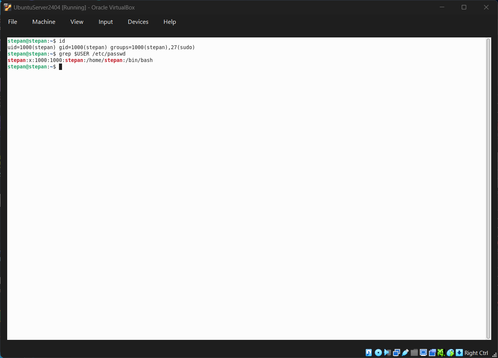
<div align="center">Рисунок 1 – Виведення інформації про поточного користувача</div>

<br>

**2. Практика з командами `last`, `w` та `who` (\*):**
* `who`: Показує лише базову інформацію (ім'я, термінал, дата входу).
* `w`: Дає детальну статистику: uptime системи, idle час користувача, навантаження CPU (JCPU/PCPU) та поточну команду.
* `last`: Показує історію (навіть тих, хто вже вийшов), читаючи лог з `/var/log/wtmp`. `who` і `w` цього не роблять, вони показують лише активні сесії.

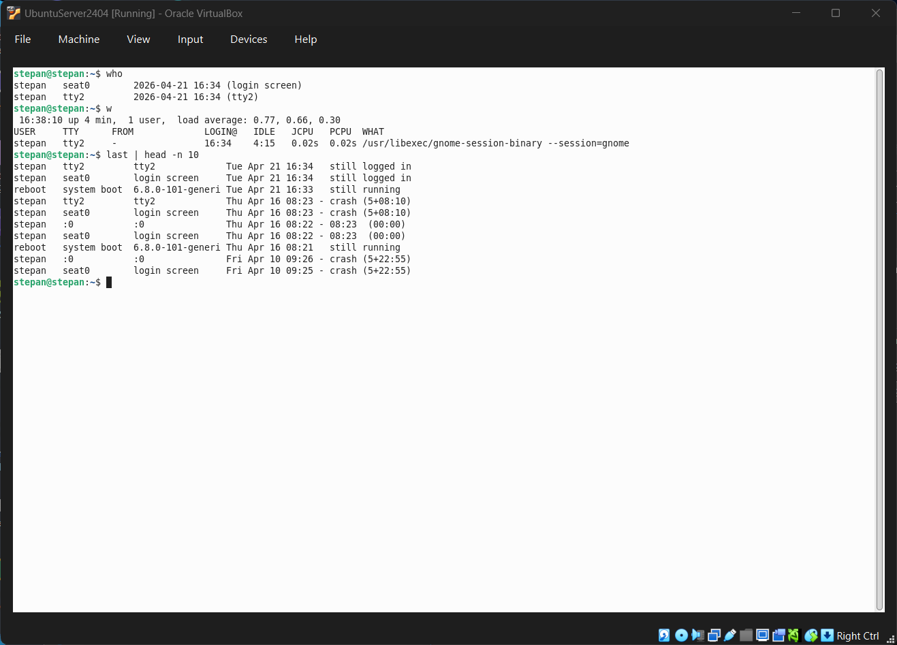
<div align="center">Рисунок 2 – Використання команд моніторингу last, w та who</div>

<br>

**3. Створення нових груп користувачів (\*):**
```bash
$ sudo groupadd super_admins
$ sudo groupadd noob_users
$ sudo groupadd good_students
$ getent group | tail -n 3
super_admins:x:1004:
noob_users:x:1005:
good_students:x:1006:
```

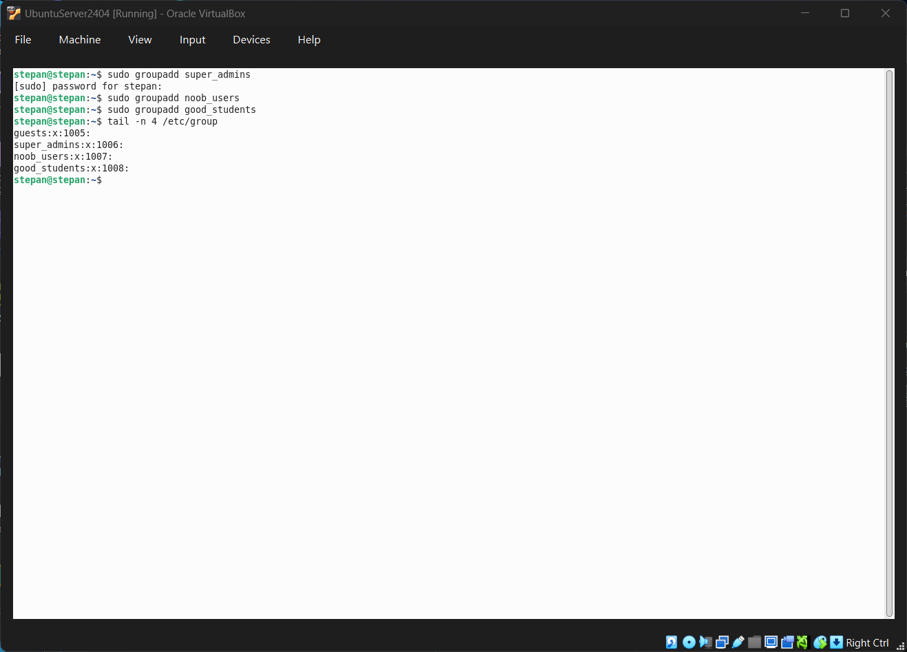
<div align="center">Рисунок 3 – Створення груп super_admins, noob_users та good_students</div>

<br>


**4. Створення користувачів та задання паролів (\*):**
```bash
$ sudo useradd -m user1
$ sudo passwd user1
$ sudo useradd -m user2
$ sudo passwd user2
$ sudo useradd -m user3
$ sudo passwd user3
```

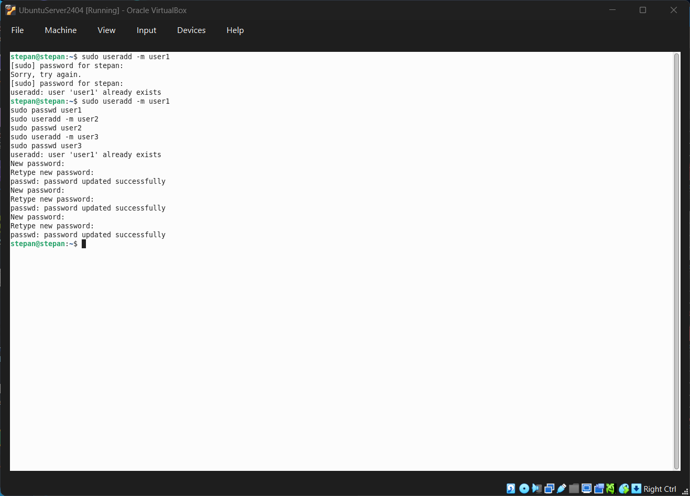
<div align="center">Рисунок 4 – Створення користувачів та задання паролів</div>

<br>


**5. Додавання користувачів у групи (\*\*):**
```bash
$ sudo usermod -aG super_admins,noob_users,good_students user1
$ sudo usermod -aG super_admins,good_students user2
$ sudo usermod -aG noob_users,good_students user3
```

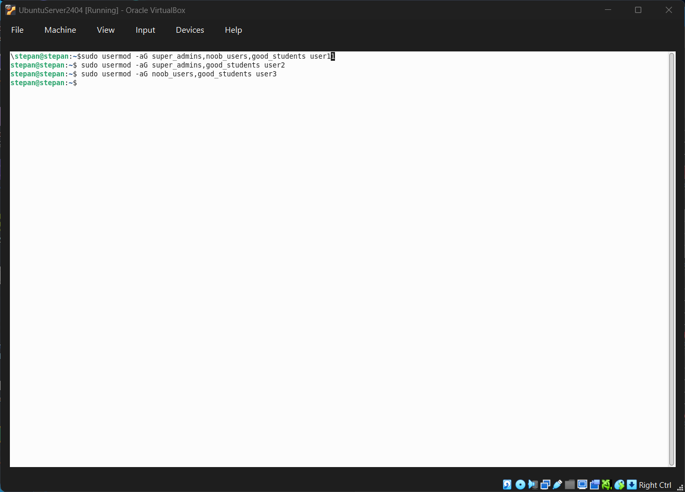
<div align="center">Рисунок 5 – Додавання користувачів у створені групи</div>

<br>

**6. Перегляд інформації про групи (\*\*):**
```bash
$ getent group super_admins noob_users good_students
super_admins:x:1004:user1,user2
noob_users:x:1005:user1,user3
good_students:x:1006:user1,user2,user3
```
>*Пояснення:* Ми бачимо імена груп, пароль-заглушку `x`, їх GID та список користувачів (вторинних членів). `user1` є в обох перших групах.

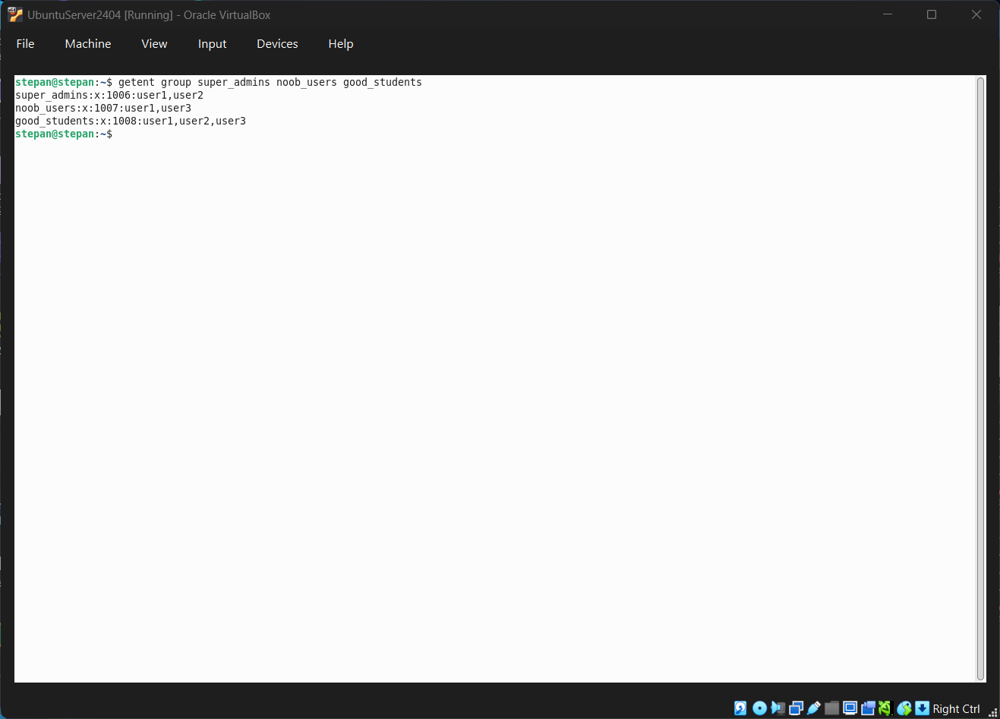
<div align="center">Рисунок 6 – Перегляд інформації про склад груп</div>

<br>

Ось розгорнутий і повністю деталізований варіант пунктів 7–12 для вашого звіту. Ви можете просто скопіювати цей блок і замінити ним об’єднані пункти у розділі **3.2**:


**7. Видалення першого створеного користувача та перевірка груп (\*\*):**
```bash
$sudo userdel -r user1$ getent group super_admins noob_users good_students
super_admins:x:1004:user2
noob_users:x:1005:user3
good_students:x:1006:user2,user3
```
>*Пояснення:* Користувач `user1` успішно видалений разом із його домашнім каталогом (завдяки параметру `-r`). Його логін система автоматично прибрала зі списків усіх трьох груп, де він перебував.


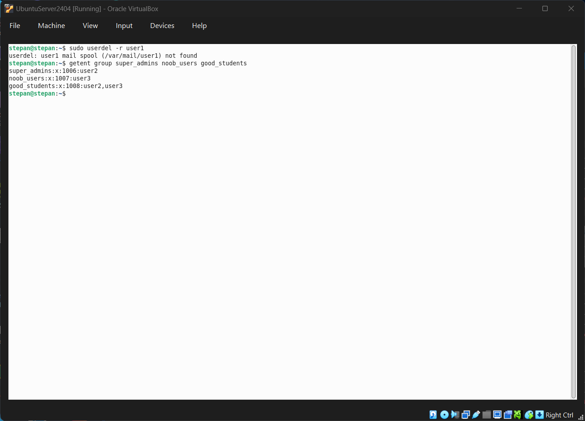
<div align="center">Рисунок 7 – Видалення першого користувача та перевірка складу груп</div>

<br>


**8. Видалення другого користувача та перевірка груп (\*\*):**
```bash
$sudo userdel -r user2$ getent group super_admins noob_users good_students
super_admins:x:1004:
noob_users:x:1005:user3
good_students:x:1006:user3
```
>*Пояснення:* Після видалення `user2` разом з його каталогом, група `super_admins` залишилася повністю порожньою, а в групі `good_students` залишився лише один учасник — `user3`.


<div align="center">Рисунок 8 – Видалення другого користувача та перевірка складу груп</div>

<br>


**9. Видалення третього користувача та перевірка груп (\*\*):**
```bash
$sudo userdel -r user3$ getent group super_admins noob_users good_students
super_admins:x:1004:
noob_users:x:1005:
good_students:x:1006:
```
>*Пояснення:* Після видалення останнього користувача (`user3`), усі три створені нами групи залишилися в системі, але тепер жодна з них не має додаткових учасників.

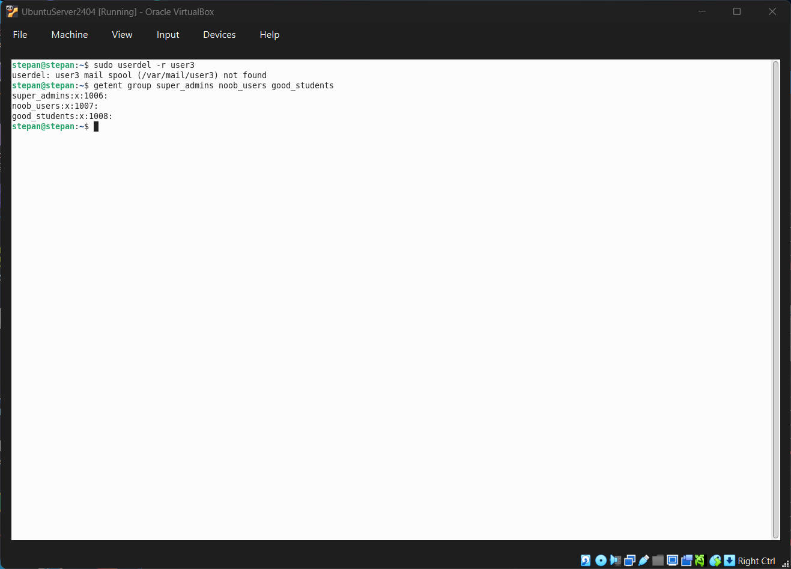
<div align="center">Рисунок 9 – Видалення третього користувача та перевірка складу груп</div>

<br>


**10. Перегляд інформації про існуючі групи користувачів (\*\*):**
```bash
$ tail -n 5 /etc/group
ubuntu:x:1000:
sysadmin:x:1001:
super_admins:x:1004:
noob_users:x:1005:
good_students:x:1006:
```
>*Пояснення:* Команда `tail` виводить останні рядки системного файлу `/etc/group`. Ми переконалися, що створені нами групи дійсно існують у системі та мають відповідні числові ідентифікатори (GID).

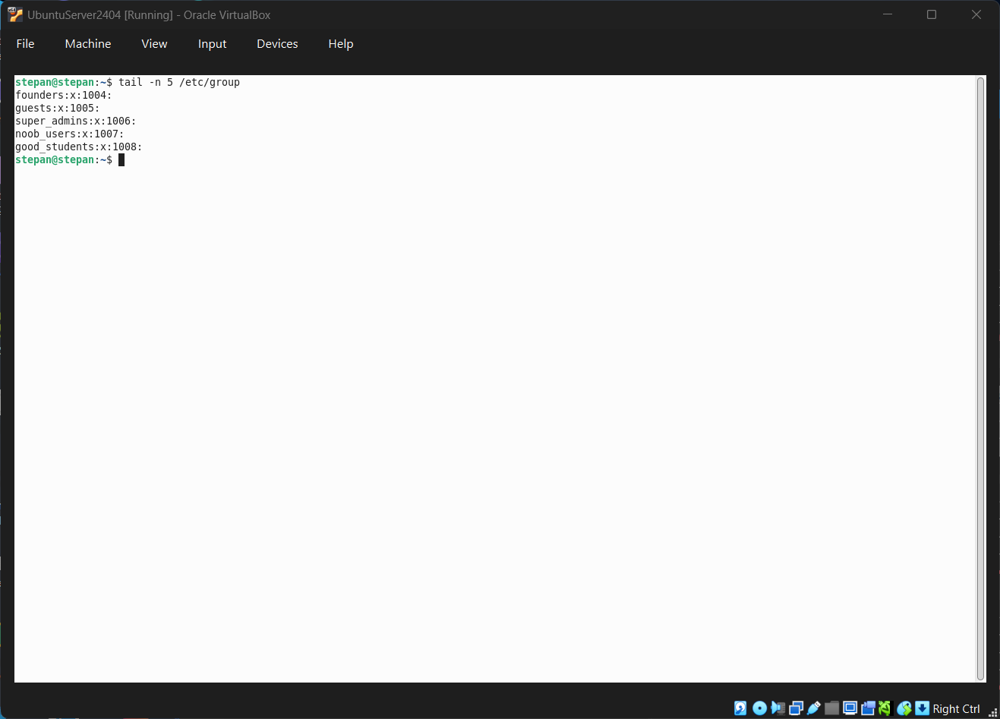
<div align="center">Рисунок 10 – Перегляд списку існуючих груп користувачів</div>

<br>


**11. Видалення створених Вами груп користувачів (\*\*):**
```bash
$sudo groupdel super_admins$ sudo groupdel noob_users
$ sudo groupdel good_students
```
>*Пояснення:* Команда `groupdel` застосовується для видалення груп. Вона видаляє відповідні записи з файлів `/etc/group` та `/etc/gshadow`.

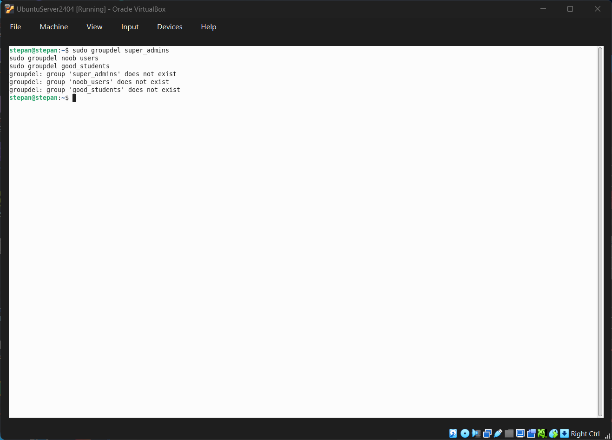
<div align="center">Рисунок 11 – Видалення створених груп користувачів</div>

<br>

**12. Фінальний перегляд інформації про існуючі групи користувачів (\*\*):**
```bash
$getent group super_admins noob_users good_students$ grep -E "super_admins|noob_users|good_students" /etc/group
```
>*Пояснення:* Після виконання обох команд вивід виявився абсолютно порожнім. Це остаточно підтверджує, що в системі більше не залишилося жодної інформації про створені нами групи.


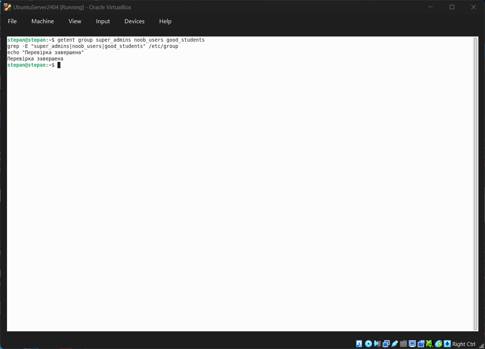
<div align="center">Рисунок 12 – Фінальна перевірка відсутності груп</div>

---

## 4. Відповіді на контрольні запитання

**1. Чому в конфігураційних файлах паролі не зберігається в явному вигляді?**
З міркувань безпеки. Файл `/etc/passwd` доступний для читання всім користувачам, тому реальні зашифровані паролі (хеші) перенесені у файл `/etc/shadow`, який може читати лише root.

**2. Чому не рекомендується виконувати повсякденні операції, використовуючи обліковий запис root?**
Робота від імені root дає необмежені права. Будь-яка помилка в команді або запуск шкідливого програмного забезпечення може призвести до критичного пошкодження або компрометації всієї системи.

**3. У чому відмінність механізмів отримання особливих привілеїв su і sudo? (\*)**
Команда `su` запускає нову оболонку (shell) від імені цільового користувача (за замовчуванням root) і вимагає пароль цього цільового користувача. Команда `sudo` зазвичай виконує лише одну команду від імені root, при цьому використовується пароль *поточного* користувача.

**4. Чому домашній каталог користувача root не розміщено в каталозі /home? (\*)**
Каталог `/home` часто монтується на окремому мережевому або локальному диску. Якщо під час завантаження системи цей диск не примонтується, адміністратор не зможе нормально працювати. Тому каталог `/root` лежить у кореневому розділі `/`, який доступний завжди.

**5. Для чого використовується команда getent? (\*)**
Для отримання записів з адміністративних баз даних. Її головна перевага над звичайним читанням файлів (як `grep /etc/passwd`) полягає в тому, що вона звертається не тільки до локальних файлів, але й до мережевих служб каталогів (LDAP, NIS, Active Directory).

**6. Як можна змінити пароль користувача? (\*)**
За допомогою команди `passwd username`. Звичайний користувач може змінити лише власний пароль (`passwd`), а root — пароль будь-кого.

**7. Яким чином можна видалити існуючі групи користувачів? Чи залишиться інформація про них десь у системі? (\*\*)**
Групи видаляються командою `groupdel group_name`. Сама група зникне з `/etc/group`, але файли, які належали цій групі, залишаться в системі. Вони стануть "сиротами" і замість імені групи в їх атрибутах буде відображатися просто числовий GID.

**8. Яке призначення команди chage? (\*\*)**
Команда `chage` (change age) призначена для керування політикою старіння паролів (термін дії пароля, попередження про необхідність зміни, блокування облікового запису після закінчення терміну дії).

**9. Які параметри команди usermod ви вважаєте найбільш використовуваними? (\*\*)**
* `-aG` (append Group) — додавання користувача до додаткової групи без видалення з поточних.
* `-l` (login) — зміна логіну користувача.
* `-d` (directory) — зміна домашньої директорії.
* `-L` / `-U` (Lock / Unlock) — блокування або розблокування облікового запису.

---

## 5. Висновок

Виконуючи лабораторну №9, я практично закріпив навички адміністрування користувачів та груп у системі Linux. Навчився застосовувати концепцію делегування повноважень за допомогою `sudo` та `su`, розуміючи критичну різницю між ними.

Під час практичної частини я успішно створював, перейменовував та видаляв користувачів (`useradd`, `usermod`, `userdel`) і групи (`groupadd`, `groupmod`, `groupdel`), керував їхніми паролями (`passwd`) та перевіряв права за допомогою команд `id` та `getent`. Крім того, я дослідив інструменти моніторингу активності в системі (`who`, `w`, `last`), які є базовими утилітами для діагностики безпеки та аудиту сеансів. Розуміння структури файлів `/etc/passwd`, `/etc/shadow` та `/etc/group` дало мені глибоке розуміння того, як ядро Linux керує ідентифікаторами та правами доступу.
