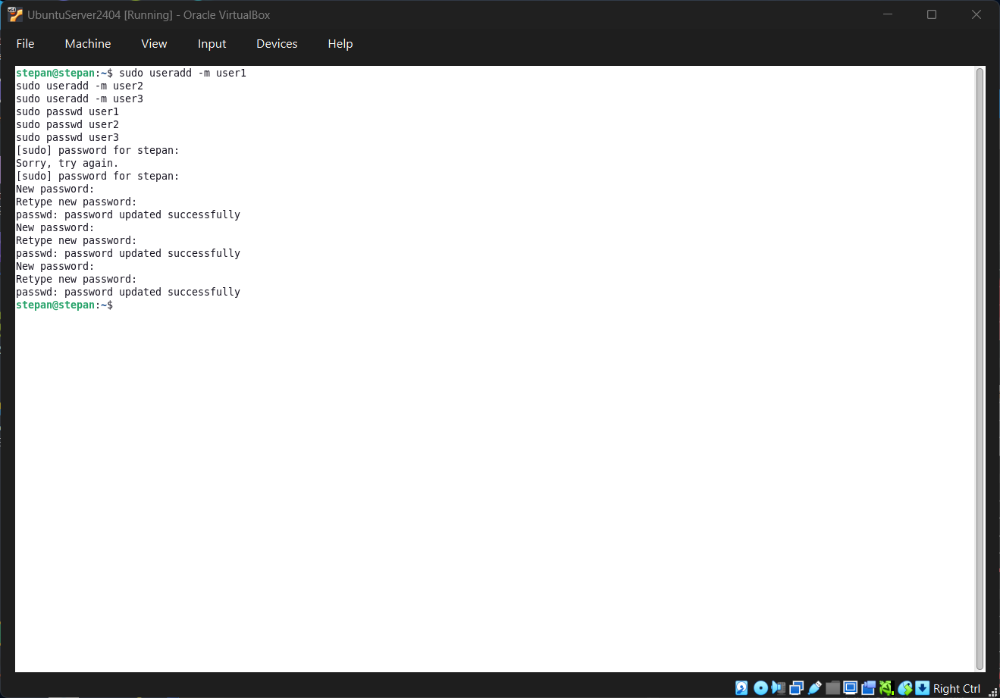
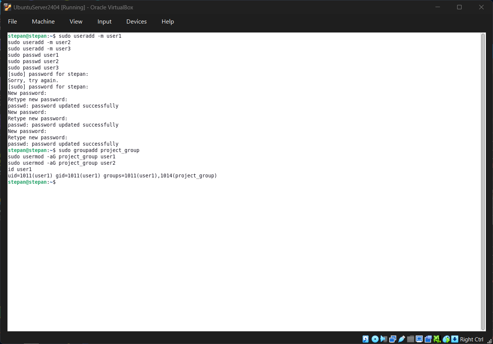
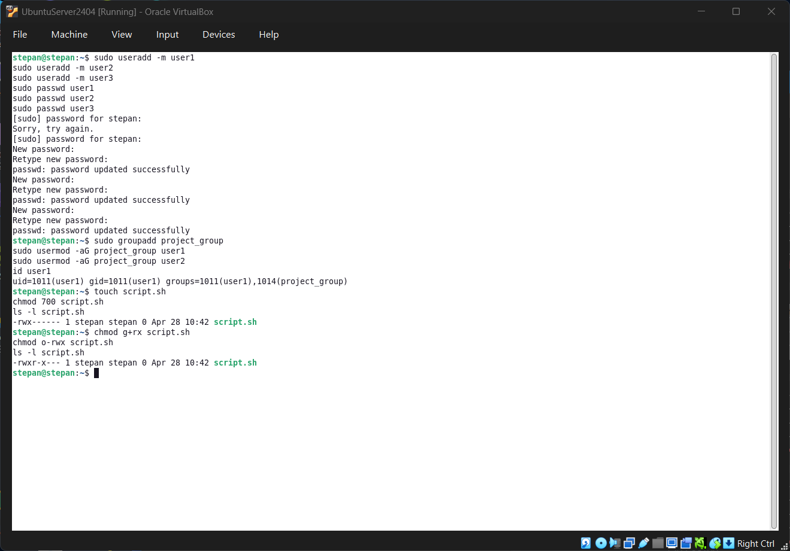
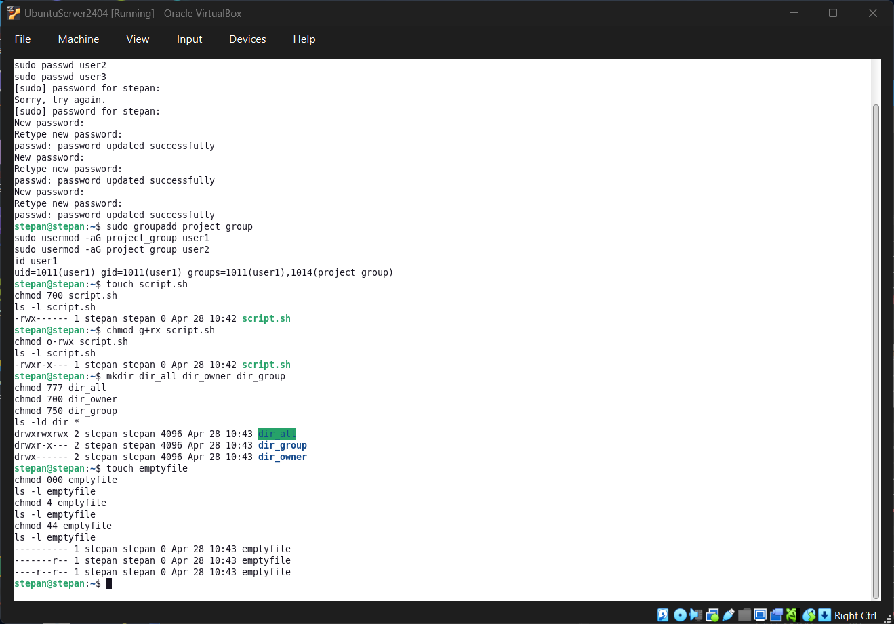
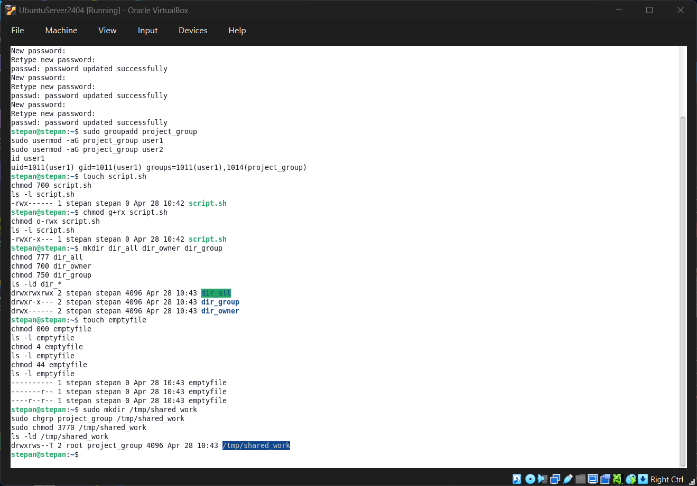
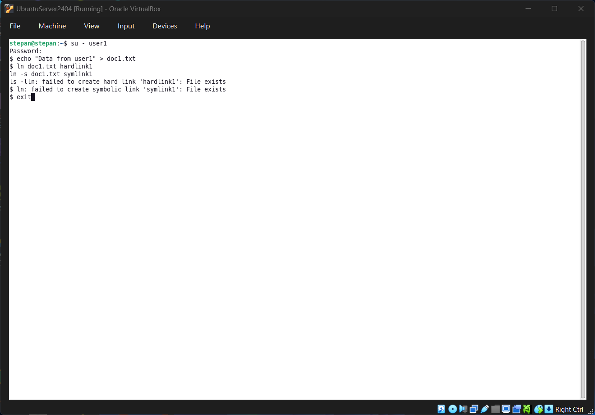
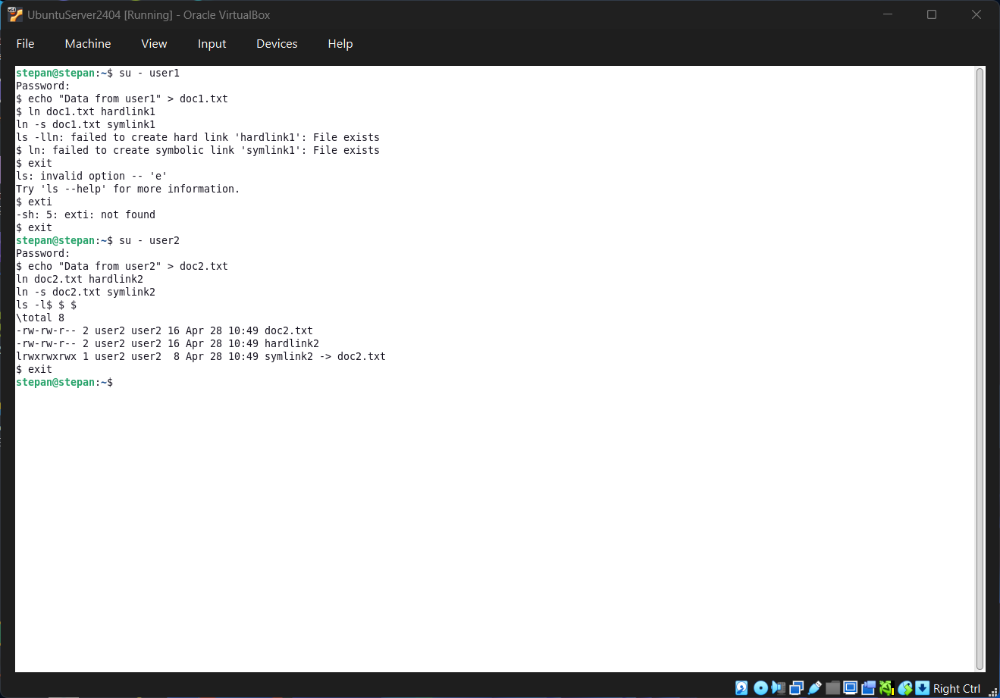
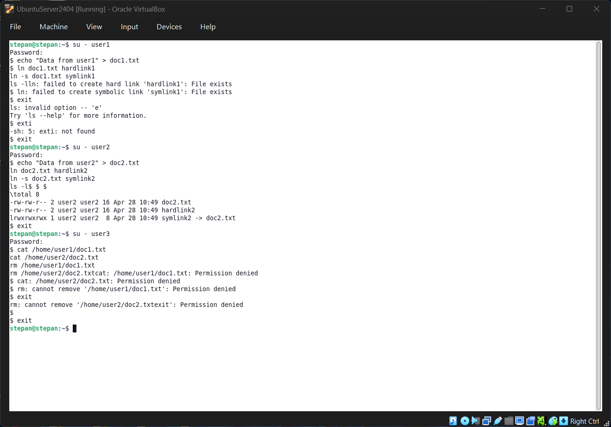

# Лабораторна робота №10

**Дисципліна:** Операційні системи 
**Тема:** Зміна власників і прав доступу до файлів в Linux. Спеціальні каталоги та файли в Linux 
**Виконав:** студент групи РПЗ-33 Фокін Степан

---

## 1. Мета роботи

1. Отримання практичних навиків роботи з командною оболонкою Bash.
2. Знайомство з базовими діями при зміні власників файлів, прав доступу до файлів.
3. Знайомство з спеціальними каталогами та файлами в Linux.

---

## 2. Завдання попередньої підготовки

### 2.1. Словник термінів

| Термін | Визначення |
| :--- | :--- |
| **chmod** | Команда для зміни прав доступу (читання, запис, виконання) до файлів та каталогів. |
| **chown** | Команда для зміни власника файлу або каталогу. |
| **chgrp** | Команда для зміни групи-власника файлу. |
| **id** | Команда для виведення інформації про користувача (UID, GID та приналежність до груп). |
| **newgrp** | Команда для перемикання поточної первинної групи користувача в межах сесії. |
| **umask** | Маска, що визначає типові права доступу, які автоматично встановлюються при створенні нових файлів та каталогів. |
| **setuid** | Спеціальний біт доступу на виконуваному файлі, який дозволяє користувачу запускати програму з правами власника цього файлу. |
| **setgid** | Спеціальний біт доступу. Для файлів працює як setuid. Для каталогів змушує нові файли успадковувати групу каталогу. |
| **sticky bit** | Спеціальний дозвіл для каталогів (наприклад, `/tmp`), який дозволяє видаляти файл лише його власнику або суперкористувачу. |

### 2.2. Відповіді на питання

**1. Яке призначення команди id?**
Виводить детальну інформацію про поточного користувача: ідентифікатор користувача (UID), ідентифікатор первинної групи (GID) та список усіх груп, до яких належить користувач.

**2. Як переглянути які права доступу має власник файлу?**
За допомогою команди `ls -l`. У виводі перші три символи після типу файлу позначають права власника (наприклад, `rwx` або `rw-`).

**3. Як змінити власника групи?**
Використовуючи команду `chgrp назва_групи ім'я_файлу` або `chown :назва_групи ім'я_файлу`. Ця дія потребує прав власника файлу або суперкористувача (root).

**4. Як можна переглянути у терміналі який тип поточного файлу? Наведіть приклади.**
Командою `file ім'я_файлу`. Також перший символ у виводі команди `ls -l` вказує на тип: `-` (звичайний файл), `d` (каталог), `l` (символічне посилання), `c` (символьний пристрій), `b` (блоковий пристрій).

**5. Для чого використовуються дозволи Setuid та Setgid? (\*\*)**
Вони дозволяють підвищувати привілеї під час виконання програм. `Setuid` дає змогу виконати процес із правами власника файлу (наприклад, команда `passwd` дозволяє звичайним користувачам змінювати `/etc/shadow`). `Setgid` для каталогів забезпечує спільну роботу: нові файли автоматично отримують групу каталогу, що дозволяє членам групи спільно редагувати їх.

**6. Для чого в системі потрібен "липкий біт" (Sticky Bit)? Наведіть приклади. (\*\*)**
Він потрібен для захисту файлів у спільних каталогах від видалення іншими користувачами. Доцільно використовувати для директорій на зразок `/tmp` або спільної теки розробників, де кожен може створювати файли, але не може видалити чужі.

---

## 3. Хід роботи

### 3.1. Таблиця вивчених команд

| Назва команди | Її призначення та функціональність |
| :--- | :--- |
| `id` | Виведення ідентифікаторів користувача та його груп. |
| `groups` | Виведення списку лише назв груп, до яких належить користувач. |
| `ls -la` | Детальний перегляд списку файлів, включаючи приховані, з правами доступу. |
| `touch` | Створення порожнього файлу або оновлення часу доступу/модифікації існуючого. |
| `newgrp` | Відкриття нової оболонки зі зміненою первинною групою. |
| `chmod` | Зміна прав доступу до файлів та каталогів (читання, запис, виконання). |
| `chown` | Зміна власника файлу та/або його групи (потребує прав адміністратора). |
| `chgrp` | Зміна групи-власника файлу або каталогу. |
| `file` | Визначення типу файлу шляхом аналізу його вмісту. |
| `passwd` | Зміна пароля користувача. Файл команди має встановлений біт `setuid`. |

### 3.2. Практичні завдання

**1. Створення трьох нових користувачів:**
```bash
sudo useradd -m user1
sudo useradd -m user2
sudo useradd -m user3
sudo passwd user1
sudo passwd user2
sudo passwd user3
```



<div align="center">Рисунок 1 – Результат створення користувачів</div>

**2. Створення нової групи та додавання користувачів:**
```bash
sudo groupadd project_group
sudo usermod -aG project_group user1
sudo usermod -aG project_group user2
```



<div align="center">Рисунок 2 – Результат створення групи та додавання користувачів</div>

**3. Створення скриптового файлу та налаштування прав:**
```bash
touch script.sh
chmod 700 script.sh
```



<div align="center">Рисунок 3 – Результат створення файлу script.sh та надання прав власнику</div>

**4. Надання прав для групи (перегляд і виконання):**
```bash
chmod g+rx script.sh
```



<div align="center">Рисунок 4 – Надання прав доступу групі</div>

**5. Заборона доступу для інших користувачів:**
```bash
chmod o-rwx script.sh
ls -l script.sh
```



<div align="center">Рисунок 5 – Зміна прав для інших користувачів та перевірка</div>

**6. Подібні дії для директорій (\*):**
```bash
mkdir dir_all dir_owner dir_group
chmod 777 dir_all
chmod 700 dir_owner
chmod 750 dir_group
```



<div align="center">Рисунок 6 – Налаштування прав доступу для директорій</div>

**7. Експерименти з числовими значеннями `chmod` (\*):**
```bash
touch emptyfile
chmod 000 emptyfile
chmod 4 emptyfile
ls -l emptyfile # Покаже -------r-- (004)
chmod 44 emptyfile
ls -l emptyfile # Покаже ----r--r-- (044)
```
*Пояснення:* Утиліта `chmod` при використанні менше трьох цифр зчитує значення справа наліво. `4` інтерпретується як `004` (права лише для others), а `44` як `044` (права для group та others).


<div align="center">Рисунок 7 – Експерименти з числовими значеннями chmod</div>

**8. Створення спеціального каталогу з setgid та sticky bit (\*\*):**
```bash
sudo mkdir /tmp/shared_work
sudo chgrp project_group /tmp/shared_work
sudo chmod 3770 /tmp/shared_work
```


<div align="center">Рисунок 8 – Створення спеціального каталогу</div>

**9. Створення файлів та посилань під кожним користувачем (\*\*):**
```bash
su - user1
echo "Data from user1" > doc1.txt
ln doc1.txt hardlink1
ln -s doc1.txt symlink1
exit

su - user2
echo "Data from user2" > doc2.txt
ln doc2.txt hardlink2
ln -s doc2.txt symlink2
exit

su - user3
echo "Data from user3" > doc3.txt
ln doc3.txt hardlink3
ln -s doc3.txt symlink3
exit
```



<div align="center">Рисунок 9 – Створення файлів та посилань користувачами</div>

**10. Спроба доступу та видалення іншими користувачами (\*\*):**
```bash
su - user3
cat /home/user1/doc1.txt
cat /home/user2/doc2.txt
rm /home/user1/doc1.txt
rm /home/user2/doc2.txt
exit
```
*Висновки:* Відбувається помилка "Permission denied". Видалення файлу означає модифікацію каталогу, в якому він знаходиться. Оскільки `user3` не має прав на запис (`w`) до `/home/user1` або `/home/user2`, він не може видалити файл, навіть якщо має повний доступ до самого файлу.



<div align="center">Рисунок 10 – Спроба доступу та видалення файлів іншим користувачем</div>

---

## 4. Контрольні запитання

**1. Наведіть приклади зміни прав доступу символічним методом?**
* `chmod u+x file.txt` (додати власнику право на виконання)
* `chmod g-w file.txt` (забрати у групи право на запис)
* `chmod o=r file.txt` (встановити для інших лише читання)

**2. Наведіть приклади зміни прав доступу числовим методом?**
* `chmod 755 script.sh` (`rwxr-xr-x`)
* `chmod 644 doc.txt` (`rw-r--r--`)
* `chmod 777 dir` (`rwxrwxrwx`)

**3. Яке призначення команди umask?**
Визначає набір прав доступу за замовчуванням, які автоматично віднімаються від максимальних прав (666 для файлів, 777 для каталогів) під час створення нових файлів/каталогів у поточній сесії.

**4. Порівняйте жорсткі та символічні посилання?**
Жорстке посилання — це ще одне ім'я для одного й того ж індексного дескриптора (inode), не працює між різними дисковими розділами та для каталогів. Символічне посилання — це окремий файл-ярлик, який містить текстовий шлях до іншого файлу, може вказувати на каталоги та працювати між різними розділами.

**5. Чи можна виконати файл, для якого є права на виконання, але не встановлені права на читання (--x)? (\*)**
Так, якщо це бінарний компільований файл (наприклад, програма на C++). Однак, якщо це скрипт (Bash, Python), його неможливо виконати без права на читання, оскільки командний інтерпретатор має спочатку прочитати код файлу.

**6. Якщо ми змінюємо права доступу та дозволи в поточній сесії чи будуть вони збережені в наступній? (\*)**
Так. Права доступу є атрибутами файлової системи (зберігаються в inode) і залишаються незмінними між сесіями або після перезавантаження.

**7. Чи є якийсь шаблон щодо прав при створенні нових файлів? Як можна змінити права за замовчуванням? (\*)**
Так, це значення `umask`. Змінити його можна виконавши команду `umask <нове_значення>` (наприклад, `umask 0022`).

**8. Яким чином можна створити жорстке посилання? В яких ситуаціях їх доцільно використовувати? (\*)**
Команда `ln source_file link_name`. Їх використовують для надійного збереження даних, оскільки видалення оригінального файлу не знищує дані, поки існує хоча б одне жорстке посилання (корисно для створення бекапів).

**9. Яким чином можна створити символічне посилання? В яких ситуаціях їх доцільно використовувати? (\*)**
Команда `ln -s source_file link_name`. Використовують для створення зручних коротких "ярликів" на конфігураційні файли чи каталоги, які розташовані глибоко у структурі файлової системи.

**10. Уявіть, що програмі потрібно створити одноразовий тимчасовий файл. Який правильний каталог для створення цього файлу? (\*\*)**
Каталог `/tmp`. За замовчуванням багато дистрибутивів Linux очищають його під час кожного перезавантаження системи або використовують віртуальну файлову систему (tmpfs) у оперативній пам'яті.

**11. Є файл оригінал та для нього створено два посилання - символічне та жорстке. Що відбудеться з іншими файлами, якщо видалити: (\*\*)**
* **файл оригінал:** символічне посилання стане "битим" (повертатиме помилку), але дані залишаться доступними через жорстке посилання.
* **символічне посилання:** нічого, оригінал та жорстке посилання не зміняться.
* **жорстке посилання:** нічого, лічильник посилань на inode зменшиться на одиницю, оригінал та символічне посилання працюватимуть як і раніше.

---

## 5. Висновок

Під час виконання лабораторної роботи №10 було успішно застосовано теоретичні знання з логічної організації файлових систем Linux на практиці. За допомогою командної оболонки Bash було відпрацьовано механізми створення користувачів та призначення прав доступу за допомогою утиліт `chmod`, `chown` та `chgrp`. Було перевірено роботу символічного та числового (octal) методів призначення прав, а також досліджено вплив спеціальних дозволів (`setuid`, `setgid`, `sticky bit`) на спільну роботу користувачів з файлами і директоріями. Додатково було проаналізовано різницю між жорсткими та символічними посиланнями, що підтвердило розуміння роботи inode на рівні фізичної організації файлової системи. Всі завдання виконано згідно з вимогами.