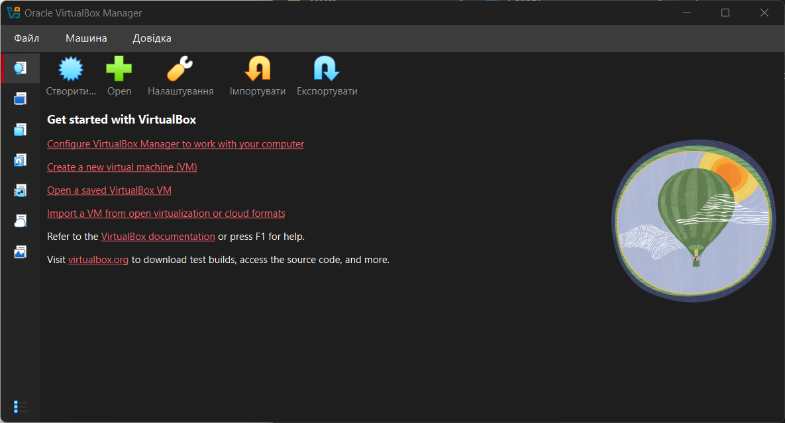
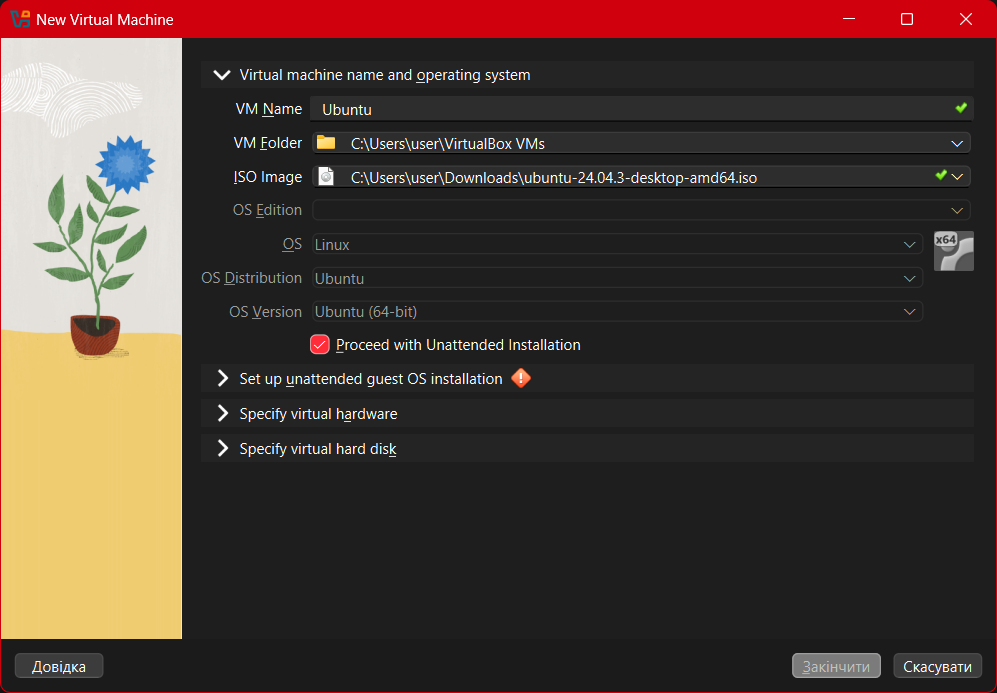
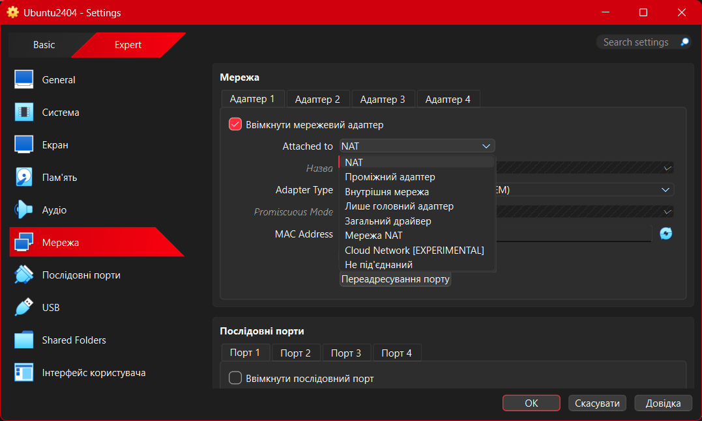
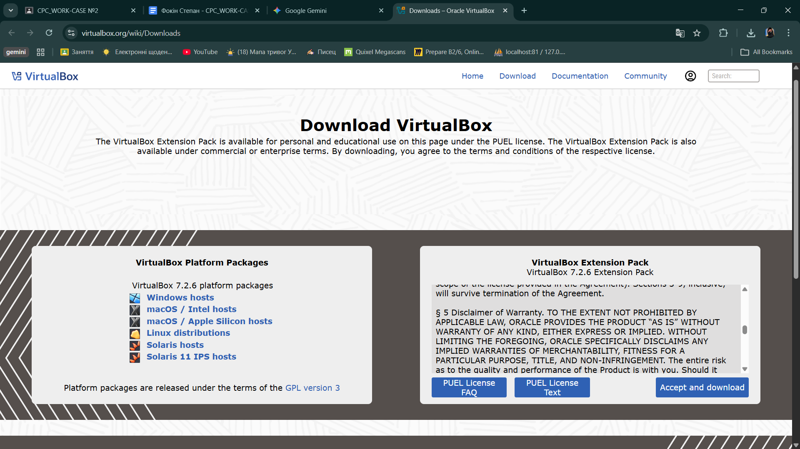
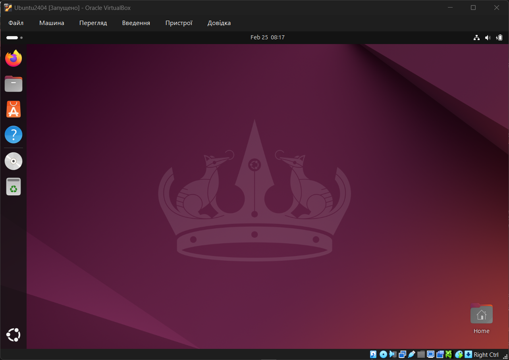
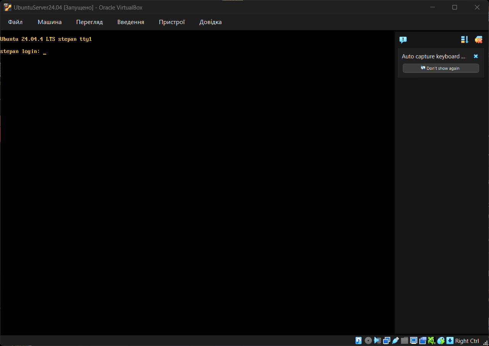
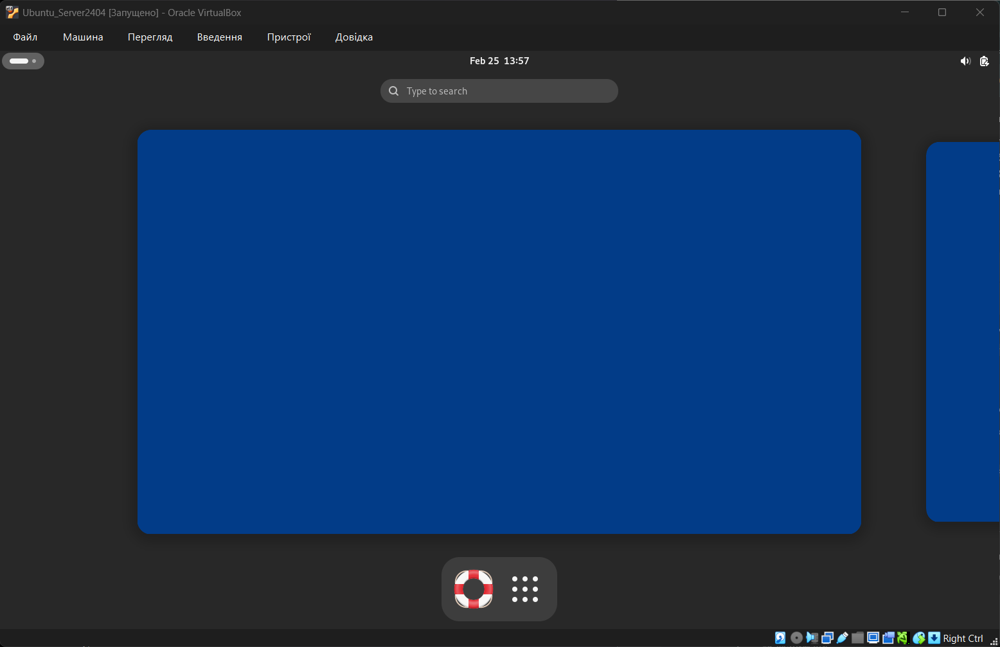
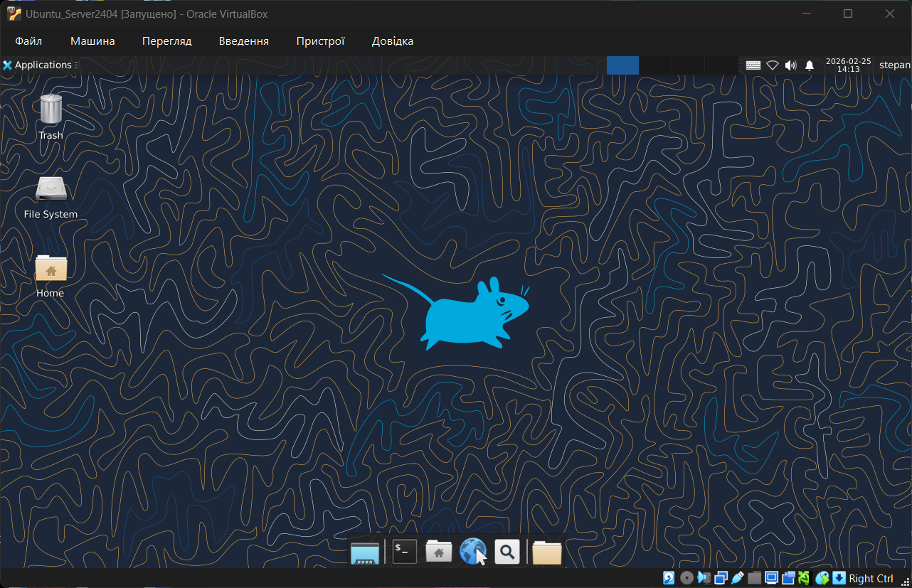

# Звіт з виконання Work-case №2
**Дисципліна:** ОС  
**Студент:** Фокін Степан Володимирович  
**Група:** РПЗ-33  
**Роль:** Technical Support / Reporter

---

## 1. Встановлення гіпервізора (Завдання 1)
**Мета:** Встановити на робочій станції гіпервізор ІІ типу.

Для виконання лабораторної роботи я обрав **Oracle VirtualBox**, оскільки це безкоштовне програмне забезпечення з відкритим вихідним кодом, яке ідеально підходить для навчальних цілей та підтримує широкий спектр гостьових ОС.

  

* **Версія ПЗ:** VirtualBox 7.2.6 
* **Хост-система:** Windows 11
* **Статус:** Встановлено успішно.

---

## 2. Базові налаштування гіпервізора (Завдання 2)

### 2.1. Створення нової віртуальної машини
Мною було створено нову віртуальну машину (ВМ) з назвою "Ubuntu24.04
* **Тип:** Linux
* **Версія:** Ubuntu (64-bit)

  

### 2.2. Налаштування обладнання
Для стабільної роботи гостьової ОС я виділив наступні ресурси:
* **Оперативна пам'ять (RAM):** 8192
* **Процесор:** 4 ядра

### 2.3. Налаштування мережі та Wi-Fi
Щоб віртуальна машина мала прямий доступ до мережі Інтернет як окремий пристрій:
* У налаштуваннях мережі я змінив тип підключення з **NAT** на **Проміжний адаптер** (Bridged Adapter).
* У полі "Назва" обрав свій фізичний Wi-Fi адаптер, щоб віртуальна машина використовувала бездротове з'єднання хоста.
* Це дозволяє ВМ отримувати власну IP-адресу від роутера та бути повноцінним учасником локальної мережі.

  

### 2.4. Робота із зовнішніми носіями (USB)
Для повноцінної роботи з USB-накопичувачами (флешками) у віртуальному середовищі необхідно активувати підтримку контролерів USB 2.0/3.0.

**Алгоритм налаштування (Host OS: Windows):**

1.  **Встановлення VirtualBox Extension Pack:**
    * Завантажив необхідний пакет розширень (`.vbox-extpack`) з офіційного сайту Oracle: [https://www.virtualbox.org/wiki/Downloads](https://www.virtualbox.org/wiki/Downloads).
    * Встановив його подвійним кліком по файлу, підтвердивши дію в інтерфейсі VirtualBox та погодившись із ліцензійною угодою (License Agreement).

  

2.  **Активація контролера:**
    * У налаштуваннях віртуальної машини перейшов у розділ "USB".
    * Активував опцію **USB 3.0 (xHCI) Controller**.

3.  **Додавання пристрою:**
    * Створив фільтр для свого фізичного накопичувача (натиснувши на іконку "USB із зеленим плюсом").
    * Це дозволило "прокинути" флешку всередину віртуальної машини, від'єднавши її від основної системи Windows.
---

## 3. Встановлення ОС з графічною оболонкою (Завдання 3)
**Мета:** Встановити GNU/Linux у базовій конфігурації (GUI).

На першій віртуальній машині я встановив **Ubuntu 24.04 LTS**. Інсталяція проходила у штатному режимі, після завершення я отримав готовий робочий стіл GNOME.

  

---

## 4. Робота з другою ВМ: CLI та графічні оболонки (Завдання 4)

### 4.1. Встановлення у мінімальній конфігурації
Створив другу ВМ та встановив **Ubuntu Server 24.04**.
* **Особливість:** Система не має графічного інтерфейсу, керування відбувається виключно через командний рядок (CLI).

  

### 4.2. Встановлення оболонки GNOME
Для додавання графічного інтерфейсу я вирішив не встановлювати "важкий" стандартний пакет, а використав мінімальний набір компонентів (Vanilla GNOME).
Команда:
`sudo apt install gnome-session gnome-terminal`

**Важливі нюанси під час налаштування:**
1. Після інсталяції графічна оболонка не запускається автоматично, тому обов'язково потрібно виконати примусове перезавантаження командою `sudo reboot`.
2. З досвіду виконання роботи: якщо виникають критичні помилки з драйверами або чорний екран, часто швидше і ефективніше видалити та перестворити віртуальну машину, ніж намагатися виправити конфігураційні файли вручну.

  

### 4.3. Встановлення другої оболонки (XFCE) та вирішення проблем (Troubleshooting)
Для порівняння я обрав легковагове середовище XFCE. Однак під час виконання завдання я зіткнувся з проблемою.

**Опис проблеми:**
При спробі виконати команду `sudo apt install xubuntu-desktop`, система видала помилку:
> `E: Unable to locate package xubuntu-desktop`

**Аналіз та вирішення:**
Я з'ясував, що **Ubuntu Server**, на відміну від десктопної версії, за замовчуванням не має підключеного репозиторію **Universe** (де зберігається ПЗ, підтримуване спільнотою).
Для виправлення ситуації я виконав наступні дії:
1.  Увімкнув необхідний репозиторій командою:
    `sudo add-apt-repository universe`
2.  Оновив кеш пакетів:
    `sudo apt update`
3.  Повторно запустив встановлення XFCE, яке цього разу пройшло успішно.

**Порівняльна таблиця:**

| Характеристика | GNOME (Ubuntu Default) | XFCE (Xubuntu) |
| :--- | :--- | :--- |
| **Парадигма інтерфейсу** | Сучасна, мобільна. Відсутня панель завдань і робочий стіл у класичному розумінні. Акцент на огляді "Activities". | Класична (Desktop Metaphor). Панель завдань, системний трей, меню "Пуск" (Whisker Menu). Схоже на Windows 7/XP. |
| **Споживання ОЗП (Idle)** | **Високе (~900 МБ - 1.2 ГБ).** Потребує значних ресурсів навіть у стані спокою. | **Низьке (~400 МБ - 600 МБ).** Ідеально підходить для обмежених ресурсів. |
| **Графічна бібліотека** | GTK4 / Libadwaita (сучасні анімації, закруглені кути). | GTK3 (простий, "плаский" дизайн без зайвих ефектів). |
| **Вимоги до GPU** | Потребує 3D-прискорення для плавної роботи анімацій. У VirtualBox може працювати повільно без 3D Acceleration. | Не вимоглива до відеокарти. Працює швидко навіть на програмному рендерингу (software rendering). |
| **Кастомізація** | Обмежена "з коробки". Потребує встановлення `gnome-tweaks` та розширень (Extensions). | Висока. Панелі можна переміщувати, створювати нові та змінювати віджети штатними засобами. |

  

---

## 5. Glossary (English Terminology)

| Ukrainian Term | English Term | Definition (UA / EN) |
| :--- | :--- | :--- |
| **Гіпервізор (Типу 2)** | **Hypervisor (Type 2)** | Програмне забезпечення, що створює та запускає віртуальні машини на фізичному хості (наприклад, VirtualBox). *Software that creates and runs virtual machines on a physical host machine (e.g., Oracle VirtualBox).* |
| **Інтерфейс командного рядка** | **CLI (Command Line Interface)** | Текстовий інтерфейс для керування комп'ютером шляхом введення команд. *A text-based user interface used to view and manage computer files and system operations.* |
| **Графічний інтерфейс** | **GUI (Graphical User Interface)** | Інтерфейс, що дозволяє користувачам взаємодіяти з електронними пристроями через графічні іконки та візуальні індикатори. *A user interface that allows users to interact with electronic devices through graphical icons and visual indicators.* |
| **Відкритий код** | **Open Source** | Програмне забезпечення, вихідний код якого доступний для перегляду, зміни та розповсюдження. *Source code that is made freely available for possible modification and redistribution.* |
| **Репозиторій** | **Repository** | Центральне сховище даних, де зберігаються та підтримуються пакети програмного забезпечення (наприклад, APT в Linux). *A central file storage location used by version control systems or package management systems.* |

---

## 6. Висновки / Conclusions

У цьому ворк-кейсі я успішно розгорнув віртуальні середовища за допомогою Oracle VirtualBox.
Я опанував два типи встановлення Linux:
1. **Стандартне встановлення** з попередньо налаштованим графічним інтерфейсом.
2. **Мінімальне встановлення (CLI)** з ручним налаштуванням робочого середовища.

Я порівняв графічні оболонки **GNOME** та **XFCE**. Практика показала, що хоча GNOME пропонує сучасний досвід користувача, XFCE є значно ефективнішим для віртуальних машин завдяки меншому споживанню ресурсів.

---

In this work-case, I successfully deployed virtual environments using Oracle VirtualBox.
I mastered two types of Linux installation:
1. **Standard installation** with a pre-configured graphical interface.
2. **Minimal installation (CLI)** with manual setup of desktop environments.

I compared **GNOME** and **XFCE** desktop environments. The practice showed that while GNOME offers a modern user experience, XFCE is significantly more efficient for virtual machines due to lower resource consumption.