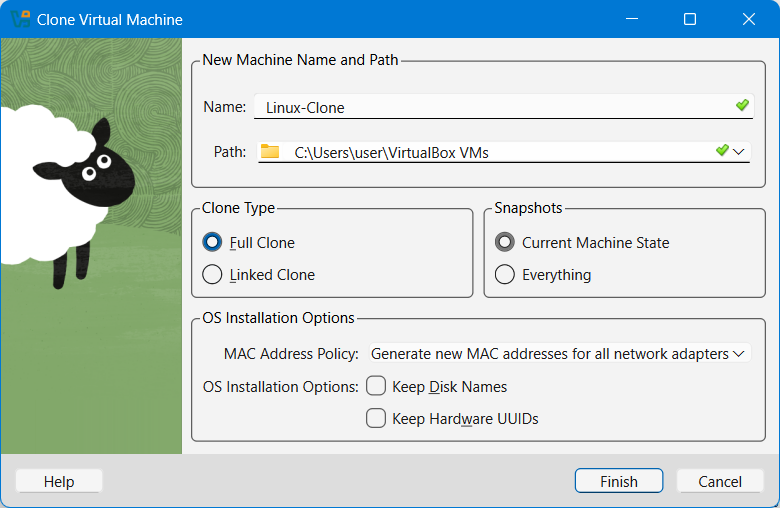
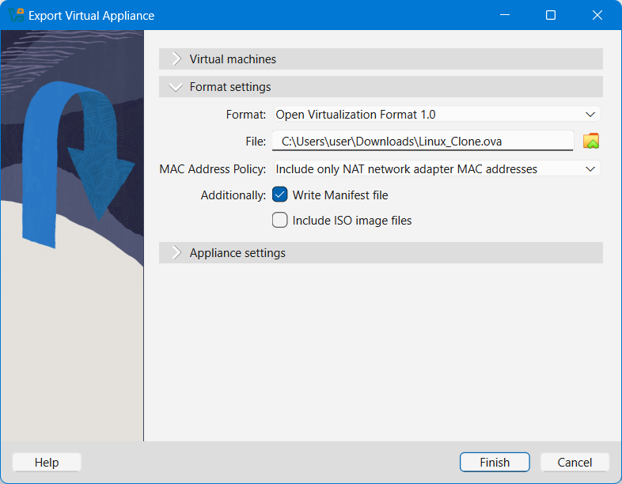
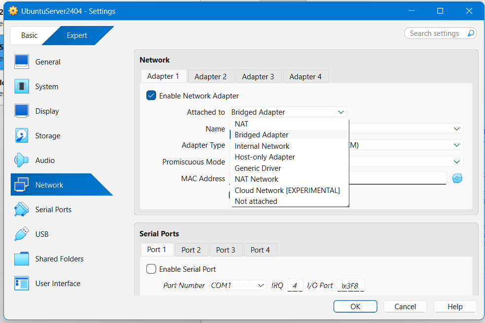
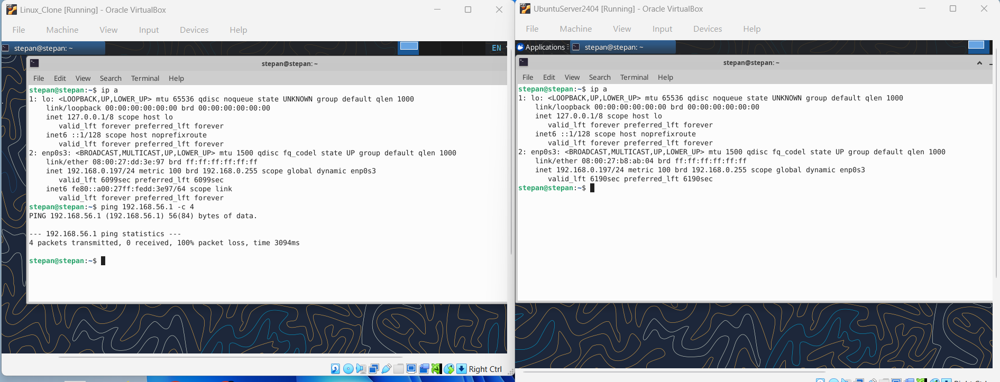
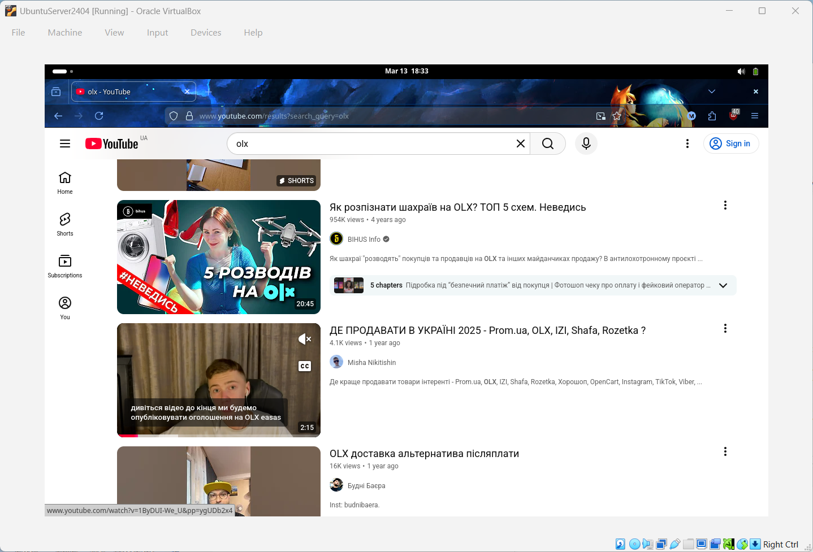
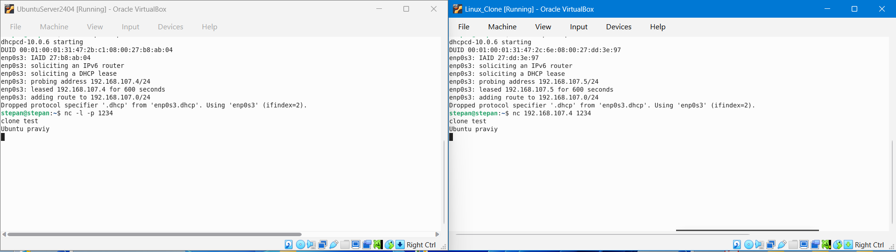

# Звіт з виконання Work-case №3
**Дисципліна:** ОС  
**Студент:** Фокін Степан Володимирович  
**Група:** РПЗ-33  
**Роль:** Technical Support / Reporter

---

## 1. Клонування та експорт віртуальної машини (Завдання 1)
**Мета:** Створити незалежну копію існуючої робочої ОС та підготувати її до перенесення в інше середовище.

### 1.1. Клонування робочої ОС
Для безпечного масштабування та тестування мережі я створив клон базової віртуальної машини (з Work-case 2) засобами гіпервізора. 
* **Тип клонування:** Повний клон (Full clone). Це гарантує повну ізоляцію файлової системи та віртуального диска нової машини від оригіналу.
* **Налаштування MAC-адрес:** Щоб уникнути конфліктів на канальному рівні (L2) в майбутній мережі, я обрав політику **Generate new MAC addresses for all network adapters**. 

  

### 1.2. Експорт віртуальної ОС
Для перенесення налаштованої операційної системи на інший фізичний хост необхідно виконати її експорт.
Через меню **File -> Export Appliance** я зберіг конфігурацію ВМ (параметри процесора, пам'яті та образ диска) у єдиний стандартизований архів формату **.ova** (Open Virtualization Format Archive).

  

---

## 2. Типи організації мережевих з'єднань (Завдання 2)
Для забезпечення взаємодії між операційними системами гіпервізор пропонує кілька режимів роботи віртуальних мережевих адаптерів:

* **Трансляція мережевих адрес (NAT - Network Address Translation):** Віртуальна машина виходить в Інтернет, використовуючи IP-адресу хостової ОС. Внутрішня IP-адреса ВМ залишається прихованою від зовнішньої локальної мережі.
* **Мережевий міст (Bridged Adapter):** Віртуальний мережевий інтерфейс підключається безпосередньо до фізичного комутатора/роутера. ВМ отримує власну унікальну IP-адресу в локальній мережі (наприклад, через DHCP) і працює як окремий фізичний ПК.
* **Віртуальний адаптер хоста (Host-only Adapter):** Створюється закрита мережа виключно між хостовою операційною системою та віртуальними машинами. Доступу до Інтернету в цьому режимі немає.
* **Внутрішня мережа (Internal Network):** Найбільш ізольований режим. Віртуальні машини можуть спілкуватися лише між собою. Хост та зовнішній світ доступу до цієї мережі не мають.

  

---

## 3. Розгортання мережі між робочою ОС та клоном (Завдання 3)

### 3.1. Базові налаштування та перевірка зв'язку
Щоб машини "бачили" одна одну і мали доступ до Інтернету, я налаштував їхні адаптери в режим **Bridged Adapter**.
* Команда `ip a` (або `ip addr`) використовувалась для визначення отриманих IP-адрес та перевірки стану інтерфейсів.
* Команда `ping [IP-адреса_клону]` дозволила відправити ICMP-запити та підтвердити наявність двостороннього зв'язку між ОС.

  

### 3.2. Доступ до мережі Інтернет
Обидві віртуальні системи успішно пройшли маршрутизацію через фізичний роутер. Для демонстрації працездатності мережевого стеку я відкрив браузер та запустив відео на YouTube.

  

### 3.3. Обмін повідомленнями через локальну мережу
Для передачі повідомлень на прикладному рівні я використав утиліту `netcat` (nc), яка дозволяє читати та писати дані через мережеві з'єднання (TCP/UDP).
1. На першій ОС відкрито порт для прослуховування: `nc -l -p 1234`
2. На другій ОС ініційовано підключення: `nc [IP_першої_ОС] 1234`
Цей метод підтверджує, що мережа дозволяє вільний обмін пакетами між процесами різних ОС.

  

### 3.4. Спільна мережева папка (SSHFS)
Замість складних протоколів на кшталт Samba, для систем сімейства Linux я використав **SSHFS** (монтування файлової системи через SSH).
Командою `sshfs username@[IP_оригіналу]:/home/username ~/Desktop/Shared_Folder` я підключив домашню директорію першої ОС до робочого столу клону, забезпечивши швидке копіювання файлів.

  

---

## 4. Обмін інформацією між основною ОС (Windows) та віртуальними ОС (Завдання 4)

### 4.1. Організація обміну (Shared Folders)
Для подолання ізоляції між гіпервізором та хостовою системою я використав функцію **Shared Folders** за умови встановлених "Guest Additions". У налаштуваннях ВМ була підключена локальна папка з диска Windows, яка автоматично змонтувалася в директорію `/media/sf_[Назва_папки]` на віртуальній машині.

  

### 4.2. Робота з файлами у терміналі
* **Копіювання аудіофайлу з хоста:** Зі змонтованої папки на робочий стіл ВМ файл переносився командою копіювання: 
  `cp /media/sf_Share/audio.mp3 ~/Desktop/`
* **Зворотна дія (Експорт документа):** Створений на робочому столі віртуальної ОС текстовий документ передавався на Windows командою:
  `cp ~/Desktop/document.txt /media/sf_Share/`

  

---

## 5. Glossary (English Terminology)

| Ukrainian Term | English Term | Definition (UA / EN) |
| :--- | :--- | :--- |
| **Клонування** | **Cloning** | Створення ідентичної копії віртуальної машини з власною апаратною конфігурацією. *Creating an identical copy of a virtual machine with its own hardware configuration.* |
| **Мережевий міст** | **Bridged Networking** | Режим, при якому ВМ підключається до фізичної мережі нарівні з хостом. *A mode where the VM connects to the physical network on par with the host.* |
| **Трансляція мережевих адрес** | **NAT (Network Address Translation)** | Механізм підміни IP-адрес, що дозволяє ізольованій ВМ виходити в Інтернет. *An IP address spoofing mechanism that allows an isolated VM to access the Internet.* |
| **Монтування файлової системи** | **File System Mounting** | Процес прив'язки зовнішньої файлової системи до існуючої структури каталогів ОС. *The process of attaching an external file system to the existing OS directory structure.* |
| **Утиліта Netcat** | **Netcat Utility** | Універсальний інструмент для читання/запису даних через мережеві з'єднання TCP та UDP. *A versatile networking tool for reading from and writing to network connections using TCP or UDP.* |

---

## 6. Висновки / Conclusions

У рамках Work-case 3 я поглибив знання з адміністрування операційних систем у віртуалізованих середовищах. Я успішно виконав повне клонування віртуальної машини з генерацією нових MAC-адрес та протестував процес її експорту у формат OVA. Практично дослідивши різні режими роботи віртуальних мережевих адаптерів, я розгорнув мережу типу "Мережевий міст" (Bridged) між двома ОС Linux, налаштувавши їхню мережеву маршрутизацію. 

Додатково було відпрацьовано навички роботи з мережевими утилітами командного рядка (ip, ping, netcat), організовано локальний канал передачі повідомлень та налаштовано обмін файлами як між двома гостьовими системами (за допомогою SSHFS), так і між гіпервізором та хостовою системою Windows через спільні папки.

---

During Work-case 3, I deepened my knowledge of operating system administration in virtualized environments. I successfully performed a full clone of a virtual machine, generating new MAC addresses, and tested the export process to the OVA format. By practically investigating different virtual network adapter modes, I deployed a "Bridged" network between two Linux OS instances, configuring their network routing.

Additionally, I practiced using command-line networking utilities (ip, ping, netcat), established a local message transmission channel, and configured file sharing both between the two guest systems (using SSHFS) and between the hypervisor and the Windows host system via shared folders.