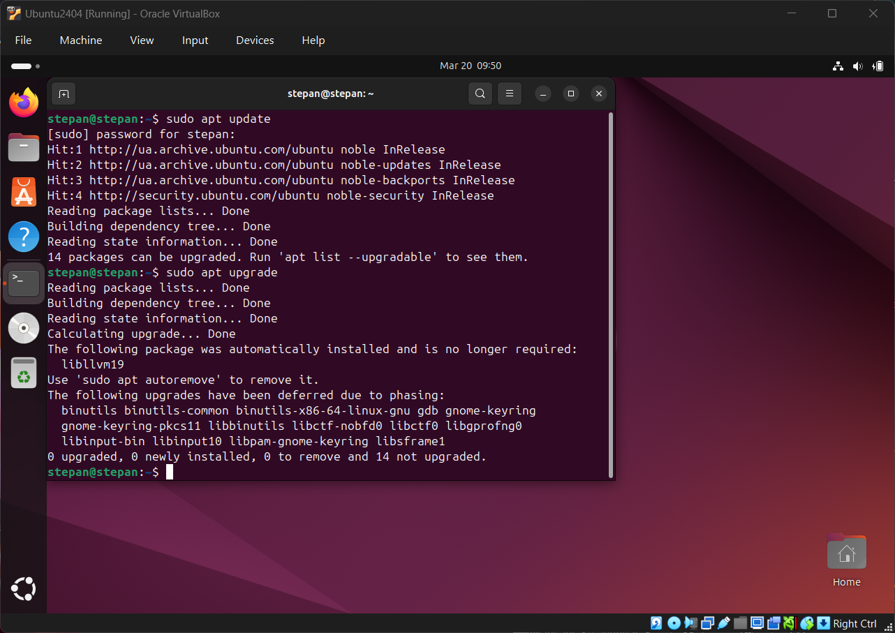
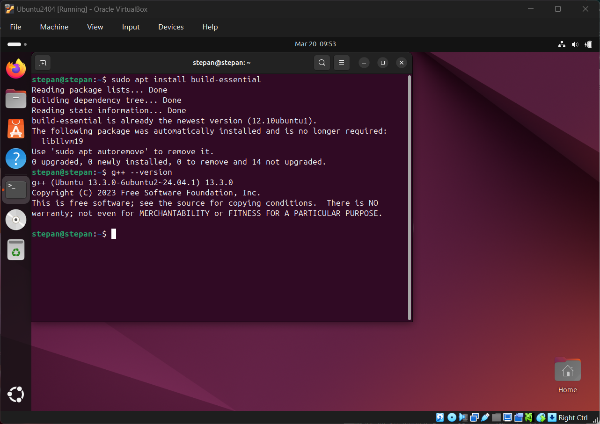

# Звіт з виконання Work-case №4

**Дисципліна:** Операційні системи  
**Студент:** Фокін Степан Володимирович  
**Група:** РПЗ-33  
**Роль:** Technical Support / Reporter  
**Дата:** 2026

---

## ЗМІСТ

1. [Робота з менеджерами пакетів: глибока теорія](#1-робота-з-менеджерами-пакетів-глибока-теорія)
2. [Управління пакетами в Ubuntu Linux (APT та Snap)](#2-управління-пакетами-в-ubuntu-linux-apt-та-snap)
3. [Покрокове встановлення програмного забезпечення](#3-покрокове-встановлення-програмного-забезпечення)
4. [Встановлення програм у графічному середовищі GNOME](#4-встановлення-програм-у-графічному-середовищі-gnome)
5. [Glossary](#5-glossary)
6. [Conclusions](#6-conclusions)

---

## 1. РОБОТА З МЕНЕДЖЕРАМИ ПАКЕТІВ: ГЛИБОКА ТЕОРІЯ

### 1.1. Мета завдання
Зрозуміти архітектуру розповсюдження програмного забезпечення в ОС Linux, дати розгорнуте визначення ключовим термінам та проаналізувати існуючі рішення для управління пакетами.

### 1.2. Теоретичні відомості

У середовищі Windows програми зазвичай постачаються як єдині інсталятори `.exe` або `.msi`, які містять усе необхідне. У Linux підхід інакший — він базується на **модульності** та **спільному використанні бібліотек**.

* **Пакет** — це структурований архів, який містить:
    * Скомпільовані бінарні файли програми.
    * Файли конфігурації.
    * Документацію (man-сторінки).
    * **Метадані:** найважливіша частина, яка містить інформацію про версію програми та список її **залежностей** (інших пакетів, без яких ця програма не працюватиме).
* **Репозиторій** — це віддалений сервер, що містить тисячі перевірених пакетів та спеціальні індексні файли (каталоги).

**Як працює менеджер пакетів (наприклад, APT):**
Коли користувач дає команду встановити програму, менеджер пакетів не просто завантажує її. Він читає метадані пакету, бачить список залежностей, перевіряє, чи встановлені вони в системі, і якщо ні — автоматично завантажує їх із репозиторію разом із основною програмою. Це вирішує проблему, відому як "Dependency Hell" (пекло залежностей).

### 1.3. Огляд існуючих менеджерів пакетів

| Менеджер | Сімейство | Особливості та архітектура |
|----------|-----------|----------------------------|
| **APT / dpkg** | Ubuntu, Debian | Базовий рівень — утиліта `dpkg` (встановлює локальні `.deb` файли). `apt` — це високорівнева надбудова, яка вміє завантажувати ці файли з інтернету та розв'язувати залежності. |
| **DNF / RPM** | Fedora, RHEL | Використовує формат `.rpm`. DNF автоматизує роботу з репозиторіями та використовує сучасні алгоритми вирішення залежностей (libsolv). |
| **Pacman** | Arch Linux | Максимально простий і швидкий. Не розділяє пакети на бінарні та "dev" (для розробки), як це робить APT. |
| **Snap / Flatpak** | Універсальні | Новий підхід: контейнеризація. Пакет містить програму і абсолютно всі її залежності. Плюс: працює всюди і безпечно ізольовано. Мінус: займає більше місця на диску. |

---

## 2. УПРАВЛІННЯ ПАКЕТАМИ В UBUNTU LINUX (APT ТА SNAP)

### 2.1. Мета завдання
Описати та застосувати основні команди для роботи з менеджером пакетів системи (Ubuntu 24.04).

### 2.2. Базові команди та їх глибоке пояснення

В Ubuntu 24.04 ми використовуємо `apt` для системних бібліотек і утиліт, та `snap` для великих користувацьких програм.

**Покрокова робота з оновленням системи:**
Дуже важливо розуміти різницю між `update` та `upgrade`.

1. **Крок 1: Синхронізація індексів.**
```bash
   sudo apt update
```
   > <sub> **Що відбувається:** Система не оновлює самі програми. Вона завантажує з серверів нові "каталоги" (індексні файли), щоб дізнатися, які версії програм зараз актуальні.</sub>

2. **Крок 2: Безпосереднє оновлення програм.**
```bash
   sudo apt upgrade
```
   > <sub> **Що відбувається:** Система порівнює локальні версії програм з оновленими каталогами (з Кроку 1) і завантажує/встановлює нові версії пакетів.</sub>

**Пошук, встановлення та видалення:**

* **Пошук пакету (наприклад, текстового редактора nano):**
```bash
  apt search nano
```
* **Перегляд деталей перед встановленням (розмір, залежності):**
```bash
  apt show nano
```
* **Встановлення пакету:**
```bash
  sudo apt install nano
```
* **Повне та чисте видалення:**
```bash
  sudo apt purge nano     # Видаляє програму та її файли налаштувань
  sudo apt autoremove     # Видаляє "осиротілі" залежності, які залишилися після видалення програм
```

<p align="center">
  
</p>

*Рисунок 2.1 - Процес синхронізації індексів репозиторіїв та оновлення пакетів*

---

## 3. ПОКРОКОВЕ ВСТАНОВЛЕННЯ ПРОГРАМНОГО ЗАБЕЗПЕЧЕННЯ

### 3.1. Мета завдання
Встановити відеоплеєр та налаштувати повноцінне середовище для розробки мовою C++.

### 3.2. Хід виконання: Встановлення середовища для C++

Для мови C++ нам потрібен компілятор (`g++`) та редактор коду з підсвіткою синтаксису.

**Крок 1: Оновлення списку пакетів.**
Перед будь-яким встановленням завжди оновлюємо індекси, щоб не отримати помилку "404 Not Found" (якщо пакет на сервері вже оновився, а наша система шукає стару версію).
```bash
sudo apt update
```

**Крок 2: Встановлення набору інструментів розробника.**
В Ubuntu є зручний мета-пакет `build-essential`, який одразу тягне за собою компілятори `gcc/g++`, бібліотеки C та утиліту `make`.
```bash
sudo apt install build-essential
```

**Крок 3: Перевірка встановлення.**
Переконаємося, що компілятор встановлено і він готовий до роботи:
```bash
g++ --version
```

> <sub> *(Очікуваний результат: вивід інформації про версію g++, наприклад g++ (Ubuntu 13.2.0-...))*</sub> 

**Крок 4: Встановлення середовища розробки (Visual Studio Code).**
Для встановлення сучасних IDE в Ubuntu найкраще використовувати пакетний менеджер `snap`, оскільки він завжди надає найсвіжішу версію від розробників Microsoft.
```bash
sudo snap install code --classic
```

> <sub> *Пояснення:* Прапорець `--classic` необхідний для середовищ розробки. Він вимикає сувору ізоляцію (пісочницю) Snap-пакета, дозволяючи VS Code мати доступ до системних компіляторів (`g++`), встановлених на Кроці 2.</sub> 

<p align="center">
  
</p>

*Рисунок 3.1 - Встановлення компіляторів та перевірка успішності їх розгортання*

### 3.3. Хід виконання: Встановлення відеоплеєра VLC

**Крок 1: Пошук точної назви пакету.**
```bash
apt search vlc
```

**Крок 2: Встановлення:**
```bash
sudo apt install vlc
```

---

## 4. ВСТАНОВЛЕННЯ ПРОГРАМ У ГРАФІЧНОМУ СЕРЕДОВИЩІ GNOME

### 4.1. Мета завдання
Ознайомитися з альтернативними методами встановлення ПЗ через GUI (графічний інтерфейс користувача).

### 4.2. Механіка роботи App Center

У новітній Ubuntu 24.04 використовується новий, написаний на Flutter додаток **"App Center" (Центр програм)**. Під капотом він виконує ті ж самі дії (встановлює `snap` або `.deb` пакети), але ховає консольний вивід за приємним інтерфейсом.

**Покроковий процес встановлення програми (на прикладі Telegram):**

1. Відкриваємо **App Center** через меню активностей GNOME (клавіша Super/Win).
2. У рядку пошуку вводимо назву програми (наприклад, "Telegram").
3. На сторінці програми ми можемо побачити джерело: за замовчуванням це **Snap Store**, що гарантує ізоляцію додатку від основної системи.
4. Натискаємо кнопку **Install (Встановити)**.
5. Оскільки встановлення ПЗ вимагає прав суперкористувача, система відобразить вікно аутентифікації Polkit. Вводимо свій пароль.
6. Спостерігаємо за прогрес-баром. Після завершення, програму можна запустити прямо з Центру програм або знайти в головному меню.

---

## 5. GLOSSARY

### Українсько-англійський словник термінів

| Український термін | English Term | Визначення (UA) | Definition (EN) |
|-------------------|--------------|-----------------|-----------------|
| **Пакет** | Package | Архів з файлами програми, конфігураціями та метаданими. | An archive containing compiled binaries, configurations, and metadata. |
| **Репозиторій** | Repository | Віддалений сервер, що зберігає програмні пакети. | A remote server storage location from which software packages are retrieved. |
| **Залежність** | Dependency | Інший пакет, який обов'язково потрібен для роботи програми. | A secondary piece of software that a primary program relies on to function. |
| **Менеджер пакетів** | Package Manager | Утиліта, що автоматизує встановлення, оновлення та вирішення залежностей ПЗ. | A tool that automates installing, upgrading, and resolving software dependencies. |
| **Оновлення індексів** | Repository Update | Завантаження актуальних списків доступних програм з сервера. | The process of fetching the latest lists of available packages from repositories. |

---

## 6. CONCLUSIONS

### 6.1. Achieved Results

During the execution of Work-case №4, the following tasks were successfully completed:

#### 🔹 **Theoretical Part**

- Conducted an in-depth analysis of Linux software distribution architecture, distinguishing between standard binaries and dependency-driven package management.
- Reviewed the characteristics of major Linux package managers (APT, DNF, Pacman) and modern containerized formats (Snap, Flatpak).

#### 🔹 **Practical Part**

- Mastered the default package managers in Ubuntu 24.04 (`apt` for system-level `.deb` packages and `snap` for isolated applications).
- Executed step-by-step terminal commands to update repository indexes (`apt update`), upgrade the system (`apt upgrade`), search, install, and cleanly remove software (`apt purge`, `apt autoremove`).
- Successfully deployed a fully functional C++ development environment by installing the `build-essential` metapackage (providing the `g++` compiler) and Visual Studio Code via `snap` with classic confinement.
- Explored graphical software installation methods using the new GNOME App Center in Ubuntu 24.04.

> **Переклад:**  
> Під час виконання роботи №4 успішно завершено всі заплановані завдання. У теоретичній частині проаналізовано архітектуру розповсюдження ПЗ у Linux та оглянуто основні менеджери пакетів (APT, DNF, Pacman) і сучасні контейнеризовані формати (Snap, Flatpak). У практичній частині освоєно роботу з `apt` та `snap` в Ubuntu 24.04: виконано оновлення репозиторіїв, пошук, встановлення та видалення пакетів; розгорнуто середовище розробки C++ (`build-essential`, VS Code); досліджено графічний спосіб встановлення ПЗ через GNOME App Center.

---

### 6.2. Acquired Skills

**Technical Skills:**

-  Deep understanding of the difference between updating package lists and upgrading the actual software.
-  Ability to properly set up a development environment using terminal commands and verify compiler installations.

**Analytical Skills:**

-  Capability to troubleshoot missing software by searching repositories and analyzing package metadata (dependencies) before installation.

> **Переклад:**  
> Набуті технічні навички: глибоке розуміння різниці між оновленням списків пакетів та оновленням самого ПЗ; вміння налаштовувати середовище розробки через термінал та перевіряти коректність встановлення компіляторів. Аналітичні навички: здатність діагностувати відсутнє ПЗ шляхом пошуку в репозиторіях та аналізу метаданих (залежностей) перед встановленням.

---

### 6.3. Overall Summary

Work-case №4 has been successfully completed in full scope. I gained practical, step-by-step experience in managing software on Ubuntu Linux. Understanding how to properly use `apt` and `snap` to resolve dependencies, install development tools (like C++ compilers), and maintain system hygiene is a fundamental skill for advanced system administration and software development.

> **Переклад:**  
> Роботу №4 виконано в повному обсязі. Здобуто практичний покроковий досвід управління програмним забезпеченням в Ubuntu Linux. Розуміння правильного використання `apt` та `snap` для вирішення залежностей, встановлення інструментів розробки (наприклад, компіляторів C++) та підтримки «гігієни» системи є фундаментальною навичкою для просунутого системного адміністрування та розробки програмного забезпечення.