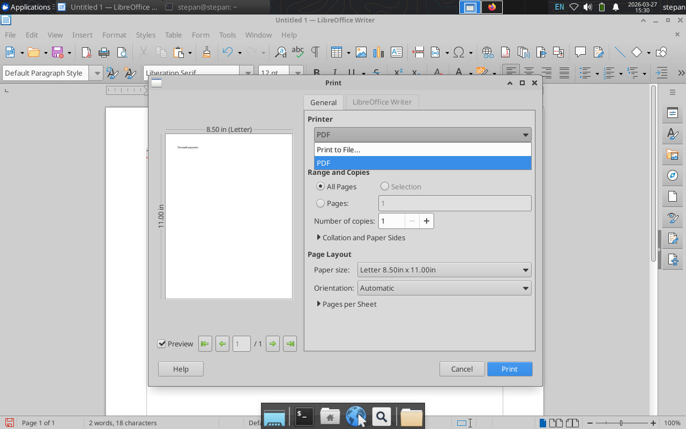

# Звіт з виконання Work-case №5

**Дисципліна:** Операційні системи  
**Студент:** Фокін Степан Володимирович  
**Група:** РПЗ-33  
**Роль:** Technical Support / Reporter  
**Дата:** 2026

---

## ЗМІСТ

1. [Механізм роботи з периферійним обладнанням у Linux](#1-механізм-роботи-з-периферійним-обладнанням-у-linux)
2. [Операція монтування: сутність та застосування](#2-операція-монтування-сутність-та-застосування)
3. [Робота з периферією: порівняння Linux та Windows](#3-робота-з-периферією-порівняння-linux-та-windows)
4. [Практичне завдання: копіювання та друк файлів (GUI та CLI)](#4-практичне-завдання-копіювання-та-друк-файлів-gui-та-cli)
5. [Glossary](#5-glossary)
6. [Conclusions](#6-conclusions)

---

## 1. МЕХАНІЗМ РОБОТИ З ПЕРИФЕРІЙНИМ ОБЛАДНАННЯМ У LINUX

### 1.1. Мета завдання

Дослідити, як операційна система Linux ідентифікує та взаємодіє з підключеними периферійними пристроями на прикладі USB-накопичувачів (флешок) та принтерів.

### 1.2. Теоретичні відомості

У Linux діє фундаментальне правило: **"Все є файлом" (Everything is a file)**. Це означає, що апаратні пристрої представлені в системі у вигляді спеціальних файлів пристроїв (device nodes), які зазвичай знаходяться в каталозі `/dev`.

* **Робота з флешкою (USB-накопичувачем):**
  Коли ви підключаєте флешку, ядро Linux розпізнає її як блоковий пристрій. Їй присвоюється ім'я в каталозі `/dev`, наприклад, `/dev/sdb`. Розділи на цій флешці будуть позначатися цифрами: `/dev/sdb1`, `/dev/sdb2`. Щоб користувач міг читати або записувати дані, цей файл пристрою необхідно "змонтувати" у файлову систему.
  
* **Робота з принтером:**
  Принтер у класичній теорії ОС є пристроєм монопольного доступу (exclusive device). Оскільки кілька програм не можуть друкувати одночасно, ОС Linux використовує механізм **спулінгу (Spooling)**. Замість прямого звернення до заліза, програми відправляють файли у спеціальну дискову чергу (буфер). За обробку цієї черги відповідає служба **CUPS** (Common UNIX Printing System). Цей фоновий демон приймає завдання, обробляє їх і по черзі відправляє на символьний файл пристрою (наприклад, `/dev/usb/lp0`), звільняючи програми від необхідності чекати завершення друку.

---

## 2. ОПЕРАЦІЯ МОНТУВАННЯ: СУТНІСТЬ ТА ЗАСТОСУВАННЯ

### 2.1. Що таке монтування?

**Монтування (Mounting)** — це процес підключення файлової системи, що знаходиться на фізичному носії (флешці, жорсткому диску, CD-ROM) або у віртуальному образі, до єдиного ієрархічного дерева каталогів операційної системи Linux.

### 2.2. Для чого воно використовується і як працює?

Оскільки в Linux немає понять "Диск C:" чи "Диск D:", усі файли починаються від єдиного кореня `/`. 
Ця архітектура базується на рівні **VFS (Virtual File System — Віртуальна файлова система)**. VFS створює єдину абстракцію для всіх типів файлових систем. Щоб ОС могла читати дані з флешки (яка може бути відформатована у FAT32), система повинна прив'язати (змонтувати) її до порожньої папки в існуючому дереві VFS (наприклад, у `/mnt/usb`). Після монтування ядро через драйвери VFS прозоро транслює стандартні запити користувача у специфічні команди для USB-накопичувача.

---

## 3. РОБОТА З ПЕРИФЕРІЄЮ: ПОРІВНЯННЯ LINUX ТА WINDOWS

| Характеристика | Windows | ОС Linux |
|----------------|---------|----------|
| **Ідентифікація носіїв** | Використовує літери дисків (`C:`, `D:`). Кожен диск має власне незалежне дерево каталогів. | Використовує єдине дерево каталогів від кореня `/`. Пристрої монтуються у вигляді звичайних папок під управлінням VFS. |
| **Драйвери (PnP)** | Зазвичай вимагає завантаження пропрієтарних драйверів з сайтів виробників або через Windows Update. | Більшість драйверів вже вбудована безпосередньо в ядро Linux. Пристрої працюють "з коробки". |
| **Система друку** | Windows Print Spooler (диспетчер черги друку), сильно залежить від GUI-драйверів виробника. | **CUPS** — гнучка мережева система друку зі спулінгом. Дозволяє легко налаштовувати принтери та керувати чергами через веб-інтерфейс (localhost:631). |
| **Файли пристроїв** | Сховані від звичайного користувача у диспетчері пристроїв. | Прямо доступні у каталозі `/dev` (`/dev/sda`, `/dev/lp0`), з якими можна працювати як з файлами. |

---

## 4. ПРАКТИЧНЕ ЗАВДАННЯ: КОПІЮВАННЯ ТА ДРУК ФАЙЛІВ (GUI ТА CLI)

> *Примітка: Оскільки під час виконання роботи фізична USB-флешка та апаратний принтер були відсутні, для повноцінного виконання практичного завдання було використано механізми симуляції Linux. Замість принтера встановлено віртуальний `CUPS-PDF` принтер, а замість флешки використано `loop-пристрій` (віртуальний образ диска), що ідеально демонструє архітектуру ОС.*

### 4.1. Виконання через графічний інтерфейс (GUI)

**Методика виконання операцій з пристроєм:**  

1. При підключенні носія ядро генерує подію, і середовище GNOME автоматично монтує її у директорію `/media/$USER/назва_пристрою`.  
2. У файловому менеджері Nautilus з'являється значок носія. Користувач може скопіювати файл з носія на Робочий стіл звичайним перетягуванням (Drag-and-Drop).
3. Для друку файлу необхідно відкрити його подвійним кліком, натиснути `Ctrl+P`, обрати системний принтер (у моєму випадку віртуальний *PDF Printer*) та натиснути "Print". Завдання буде відправлено у буфер спулінгу.

<div align="center">  



*Рисунок 1 — Демонстрація діалогового вікна друку в GNOME на віртуальний принтер PDF*  

</div>

### 4.2. Виконання через термінал (CLI)

За допомогою термінала створено віртуальну "флешку", змонтовано її, скопійовано файл і відправлено на друк через CUPS.

**Крок 1: Встановлення віртуального принтера (заміна фізичному)**  

```bash
sudo apt update
sudo apt install printer-driver-cups-pdf
```

**Крок 2: Створення віртуальної флешки (loop device)**  

```bash
# Створюємо порожній файл розміром 50 МБ
dd if=/dev/zero of=virtual_flash.img bs=1M count=50

# Форматуємо його у файлову систему FAT32 (як у звичайних флешок)
mkfs.vfat virtual_flash.img
```

**Крок 3: Монтування нашої віртуальної "флешки"**  

```bash
sudo mkdir -p /mnt/myusb
sudo mount -o loop virtual_flash.img /mnt/myusb
```

**Крок 4: Створення тестового файлу на "флешці" та його копіювання в систему**  

```bash
# Імітуємо наявність файлу на зовнішньому носії
sudo sh -c 'echo "This is a test file from virtual USB" > /mnt/myusb/report_cli.txt'

# Копіюємо файл з пристрою в домашню папку Документи
cp /mnt/myusb/report_cli.txt ~/Documents/
```

**Крок 5: Відправлення файлу на друк (до черги спулінгу)**  

```bash
# Відправляємо скопійований файл на друк через систему CUPS
lp ~/Documents/report_cli.txt
```

> **Пояснення:** Команда `lp` автоматично перенаправляє завдання на принтер за замовчуванням (CUPS-PDF). Файл буде успішно оброблено і збережено у папці `~/PDF`.

**Крок 6: Безпечне відмонтування пристрою**  

```bash
sudo umount /mnt/myusb
```

<div align="center">  


*Рисунок 2 — Виконання команд створення loop-пристрою, монтування, копіювання та друку файлу (`lp`)*

</div>

---

## 5. GLOSSARY

### Українсько-англійський словник термінів

| Український термін | English Term | Визначення (UA) | Definition (EN) |
|-------------------|--------------|-----------------|-----------------|
| **Монтування** | Mounting | Процес приєднання файлової системи зовнішнього носія до дерева каталогів ОС. | The process of attaching an external file system to the main directory tree of the OS. |
| **Віртуальна файлова система** | Virtual File System (VFS) | Програмний шар абстракції в ядрі ОС, що дозволяє працювати з різними файловими системами через єдиний інтерфейс. | An abstraction layer on top of a more concrete file system, providing a uniform interface. |
| **Спулінг** | Spooling | Процес запису даних у тимчасовий буфер (чергу) для подальшої обробки повільним периферійним пристроєм (принтером). | The process of placing data in a temporary working area for another program or device to process. |
| **Система друку CUPS**| Common UNIX Printing System | Стандартна підсистема керування друком у UNIX-подібних ОС. | A modular printing system for Unix-like computer operating systems. |
| **Петльовий пристрій** | Loop device | Псевдо-пристрій у Linux, що дозволяє монтувати звичайні файли так, ніби це фізичні диски. | A pseudo-device that makes a file accessible as a block device. |
| **Відмонтування** | Unmounting | Процес безпечного відключення файлової системи від дерева каталогів. | The process of safely detaching a file system from the directory tree. |

---

## 6. CONCLUSIONS

### 6.1. Achieved Results

During the execution of Work-case №5, the following tasks were successfully completed:

#### **Theoretical Part**

+ Investigated the mechanisms of handling peripheral devices in Linux, deeply exploring the "everything is a file" concept via device nodes in the `/dev` directory.
+ Analyzed the process of mounting and the role of the Virtual File System (VFS) in attaching external file systems to a unified directory tree.
+ Explored the concept of Spooling to manage exclusive devices, and compared peripheral management between Linux (CUPS, VFS) and Windows.

#### **Practical Part**

+ Due to the absence of physical hardware, advanced Linux simulation mechanisms were successfully deployed.
+ Installed and configured a virtual CUPS-PDF printer to handle print spooling jobs.
+ Created a virtual flash drive using a loopback device (`dd` and `mkfs.vfat`), simulating physical block storage.
+ Executed file operations and printing using theoretical GUI methodologies and practical CLI commands (`mount -o loop`, `cp`, `lp`, and `umount`).

> **Переклад:** Під час виконання роботи №5 успішно завершено всі заплановані завдання. У теоретичній частині досліджено механізми роботи з периферією у Linux (концепція "все є файлом"). Проаналізовано процес монтування, роль віртуальної файлової системи (VFS), а також концепцію спулінгу для управління пристроями монопольного доступу. У практичній частині, через відсутність фізичного обладнання, успішно застосовано механізми симуляції Linux: встановлено віртуальний принтер (CUPS-PDF) та створено віртуальну флешку (loop-пристрій) за допомогою `dd` та `mkfs.vfat`. Успішно виконано копіювання та друк файлів як в теорії (через GUI), так і на практиці в терміналі.

---

### 6.2. Acquired Skills

**Technical Skills:**

+ Proficiency in creating disk images (`dd`) and formatting them (`mkfs`).
+ Advanced skills in mounting virtual file systems using loop devices (`mount -o loop`).
+ Ability to manage print jobs directly from the command line using CUPS spooling utilities without physical printers.

**Analytical Skills:**

+ Capability to creatively solve hardware constraints by leveraging core OS features (VFS, loop devices, spooling) and understanding the unified Linux architecture.

> **Переклад:** Набуті технічні навички: вміння створювати образи дисків (`dd`) та форматувати їх; просунуті навички монтування віртуальних файлових систем за допомогою петльових пристроїв; здатність керувати завданнями друку з командного рядка через утиліти спулінгу CUPS без фізичного принтера. Аналітичні навички: здатність креативно вирішувати проблеми відсутності обладнання, використовуючи базові можливості ОС (VFS, петльові пристрої, спулінг).

---

### 6.3. Overall Summary

Work-case №5 has been successfully completed. I gained critical practical experience in managing peripheral devices within a Linux environment. Navigating the absence of physical hardware by creating virtual block devices and utilizing CUPS-PDF deepened my understanding of Linux architecture. Understanding VFS, the mounting process, and Spooling is crucial for effective and flexible system administration.

> **Переклад:** Роботу №5 виконано успішно. Здобуто критично важливий практичний досвід управління периферійними пристроями у середовищі Linux. Вирішення проблеми відсутності фізичного обладнання шляхом створення віртуальних блокових пристроїв та використання CUPS-PDF значно поглибило моє розуміння архітектури Linux. Розуміння принципів роботи VFS, процесу монтування та спулінгу є життєво необхідним для ефективного системного адміністрування.
