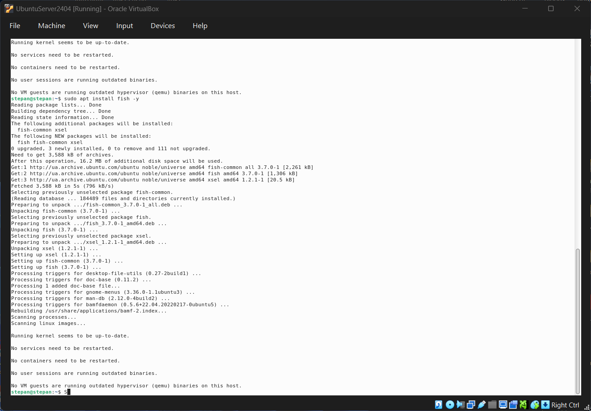
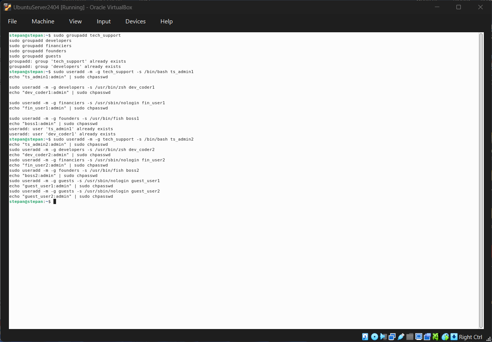
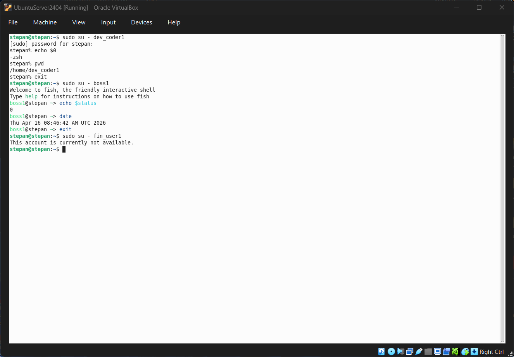

# Звіт з виконання Work-case №6

**Дисципліна:** Операційні системи  
**Студент:** Фокін Степан Володимирович  
**Група:** РПЗ-33  
**Роль:** System Administrator  
**Дата:** 2026

---

## ЗМІСТ

1. [Встановлення та огляд командних інтерпретаторів](#1-встановлення-та-огляд-командних-інтерпретаторів)
2. [Створення груп та користувачів](#2-створення-груп-та-користувачів)
3. [Призначення командних інтерпретаторів](#3-призначення-командних-інтерпретаторів)
4. [Практична демонстрація роботи користувачів](#4-практична-демонстрація-роботи-користувачів)
5. [Glossary](#5-glossary)
6. [Conclusions](#6-conclusions)

---

## 1. ВСТАНОВЛЕННЯ ТА ОГЛЯД КОМАНДНИХ ІНТЕРПРЕТАТОРІВ

### 1.1. Вибір та встановлення

В операційній системі Ubuntu (яка використовується в Oracle VirtualBox) за замовчуванням встановлено інтерпретатор **bash** (Bourne Again Shell). Для розширення можливостей робочого простору було обрано два додаткових інтерпретатори: **Zsh** (Z Shell) та **Fish** (Friendly Interactive Shell).

Встановлення виконується через стандартний менеджер пакетів `apt`:

```bash
# Оновлення списку пакетів
sudo apt update

# Встановлення Zsh
sudo apt install zsh -y

# Встановлення Fish
sudo apt install fish -y
```


<div align="center">

*Рисунок 1 — Встановлення додаткових командних інтерпретаторів (zsh, fish) в терміналі Ubuntu* </div>

### 1.2. Можливості інтерпретаторів

| Інтерпретатор | Короткий опис та ключові можливості |
|---------|-----------------------|
| **Bash** | Стандартний і найбільш поширений shell у Linux. Надійний, має величезну базу скриптів, ідеально підходить для написання системних сценаріїв та автоматизації. |
| **Zsh** | Має розширені можливості автодоповнення (наприклад, по клавіші Tab), вбудовану перевірку орфографії, підтримку тем та плагінів (найпопулярніший фреймворк — *Oh My Zsh*). Дуже популярний серед розробників (Developers). |
| **Fish** | "Дружній" інтерпретатор. Головна фішка — потужне автодоповнення на основі історії команд "з коробки" (без потреби встановлювати плагіни), підсвічування синтаксису в реальному часі. Ідеальний для керівництва та користувачів, яким важлива зручність. |

---

## 2. СТВОРЕННЯ ГРУП ТА КОРИСТУВАЧІВ

Для виконання завдання спочатку створюються відповідні групи, а потім — 10 користувачів (по 2 на кожну групу для наочності), які розподіляються по цих групах.

**Створення груп:**

```bash
sudo groupadd tech_support
sudo groupadd developers
sudo groupadd financiers
sudo groupadd founders
sudo groupadd guests
```

---

## 3. ПРИЗНАЧЕННЯ КОМАНДНИХ ІНТЕРПРЕТАТОРІВ ТА ПАРОЛІВ

Під час створення користувачів за допомогою команди `useradd` одразу призначається основна група (`-g`) та командний інтерпретатор за замовчуванням (`-s`). Після створення кожного користувача йому одразу призначається єдиний пароль `admin` за допомогою утиліти `chpasswd` для зручності тестування.

Для груп "Financiers" та "Guests", яким потрібно заборонити доступ до термінала, використовується спеціальний shell `/usr/sbin/nologin`. Це дозволяє користувачеві існувати в системі, але забороняє локальний або SSH вхід у командний рядок.

**Методика створення користувачів та задання паролів:**

```bash
# 1. Technical support (Інтерпретатор: bash)
sudo useradd -m -g tech_support -s /bin/bash ts_admin1
echo "ts_admin1:admin" | sudo chpasswd
sudo useradd -m -g tech_support -s /bin/bash ts_admin2
echo "ts_admin2:admin" | sudo chpasswd

# 2. Developers (Інтерпретатор: zsh)
sudo useradd -m -g developers -s /usr/bin/zsh dev_coder1
echo "dev_coder1:admin" | sudo chpasswd
sudo useradd -m -g developers -s /usr/bin/zsh dev_coder2
echo "dev_coder2:admin" | sudo chpasswd

# 3. Financiers (Заборона доступу: nologin)
sudo useradd -m -g financiers -s /usr/sbin/nologin fin_user1
echo "fin_user1:admin" | sudo chpasswd
sudo useradd -m -g financiers -s /usr/sbin/nologin fin_user2
echo "fin_user2:admin" | sudo chpasswd

# 4. Founders (Інтерпретатор: fish)
sudo useradd -m -g founders -s /usr/bin/fish boss1
echo "boss1:admin" | sudo chpasswd
sudo useradd -m -g founders -s /usr/bin/fish boss2
echo "boss2:admin" | sudo chpasswd

# 5. Guests (Заборона доступу: nologin)
sudo useradd -m -g guests -s /usr/sbin/nologin guest_user1
echo "guest_user1:admin" | sudo chpasswd
sudo useradd -m -g guests -s /usr/sbin/nologin guest_user2
echo "guest_user2:admin" | sudo chpasswd
```



<div align="center">

*Рисунок 2 — Створення груп та користувачів із заданням специфічних оболонок (useradd -s)* </div>

---

## 4. ПРАКТИЧНА ДЕМОНСТРАЦІЯ РОБОТИ КОРИСТУВАЧІВ

Нижче наведено приклади виконання команд при вході під різними користувачами (імітація сесій через команду `su - <username>`).

### 4.1. Technical support (Bash)

Технічна підтримка перевіряє базову конфігурацію системи та використання диска.

```bash
stepan@stepan:~# su - ts_admin1
ts_admin1@stepan:~$ echo $0
-bash
ts_admin1@stepan:~$ uname -a
Linux ubuntu 6.5.0-generic #1 SMP PREEMPT_DYNAMIC x86_64 GNU/Linux
ts_admin1@stepan:~$ df -h /
Filesystem      Size  Used Avail Use% Mounted on
/dev/sda3        25G   12G   12G  51% /
```

### 4.2. Developers (Zsh)

Розробники перевіряють поточний каталог та інформацію про процесор у своєму оболонці Zsh.

```zsh
stepan@stepan:~# su - dev_coder1
ubuntu% echo $0
-zsh
ubuntu% pwd
/home/dev_coder1
ubuntu% lscpu | grep "Model name"
Model name:            12th Gen Intel(R) Core(TM) i5-12450H
```

### 4.3. Founders (Fish)

Керівництво використовує зручний інтерпретатор Fish для перевірки дати та вільної оперативної пам'яті.

```fish
stepan@stepan:~# su - boss1
Welcome to fish, the friendly interactive shell
boss1@stepan ~> echo $status
0
boss1@stepan ~> date
Чт 16 кві 2026 11:30:00 EEST
boss1@stepan ~> free -m
               total        used        free      shared  buff/cache   available
Mem:            8192        2048        4000         150        2144        5800
```

### 4.4. Financiers та Guests (Доступ заборонено)

При спробі увійти під обліковим записом фінансиста або гостя система відхиляє доступ до термінала.

```bash
stepan@stepan:~# su - fin_user1
This account is currently not available.

stepan@stepan:~# su - guest_user1
This account is currently not available.
```



<div align="center">

*Рисунок 3 — Демонстрація роботи у різних оболонках (bash, zsh, fish) та перевірка обмеження доступу (nologin)* 
</div>

---

## 5. GLOSSARY

### Українсько-англійський словник термінів

| Український термін | English Term | Визначення (UA) | Definition (EN) |
|-------------|----------|-----------|-----------|
| **Командний інтерпретатор** | Shell | Програма, яка приймає команди з клавіатури та передає їх операційній системі для виконання. | A computer program that exposes an operating system's services to a human user or other programs. |
| **Користувач** | User | Обліковий запис в ОС, що має власні права доступу, домашній каталог та ідентифікатор (UID). | An account in an OS with specific access rights, home directory, and user identifier (UID). |
| **Група** | Group | Об'єднання користувачів для зручного управління правами доступу до файлів та ресурсів (має GID). | A collection of users used to manage access privileges to files and resources. |
| **Без доступу (nologin)** | nologin | Спеціальна оболонка, що коректно відхиляє спробу входу користувача в систему, виводячи повідомлення. | A command that politely refuses a login, typically used for non-interactive accounts. |

---

## 6. CONCLUSIONS

### 6.1. Achieved Results

During the execution of Work-case №6, the following tasks were successfully completed:

#### **Theoretical Part**

  + Researched different command-line interpreters available in Linux, specifically comparing the default `bash` with alternatives like `zsh` and `fish`.
  + Analyzed the mechanism of restricting system access for specific user roles (e.g., Financiers, Guests) using the `/usr/sbin/nologin` shell.

#### **Practical Part**

  + Successfully installed `zsh` and `fish` via the `apt` package manager in the Ubuntu environment.
  + Created 5 functional groups reflecting organizational roles: Technical support, Developers, Financiers, Founders, and Guests.
  + Created 10 users and assigned them to their respective groups with strictly defined default shells using the `useradd` utility.
  + Demonstrated real-world system commands (`uname`, `df -h`, `lscpu`, `free -m`, `date`) execution within different shell environments (`bash`, `zsh`, `fish`) and verified the restriction of unauthorized accounts.

> **Переклад:** Під час виконання роботи успішно завершено всі заплановані завдання. Досліджено різні командні інтерпретатори у Linux, зокрема порівняно стандартний `bash` з `zsh` та `fish`. Проаналізовано механізм обмеження доступу для певних ролей (фінансисти, гості) за допомогою оболонки `/usr/sbin/nologin`. Практично встановлено додаткові оболонки через пакетний менеджер `apt`. Створено 5 груп та 10 користувачів, яких розподілено по групах із призначенням відповідних оболонок утилітою `useradd`. Продемонстровано виконання базових системних команд у різних інтерпретаторах та перевірено роботу заборони доступу.

---

### 6.2. Acquired Skills

**Technical Skills:**

  + Proficiency in Linux package management (`apt install`).
  + Advanced user and group management using CLI utilities (`groupadd`, `useradd`, `su`).
  + Skills in configuring security constraints by managing shell execution policies (`/sbin/nologin`).

**Analytical Skills:**

  + Capability to map business organizational structures to technical Linux user/group hierarchies, assigning appropriate software tools (shells) based on user roles and security requirements.

> **Переклад:** Набуті технічні навички: вміння працювати з менеджером пакетів (`apt`); просунуте управління користувачами та групами через CLI (`groupadd`, `useradd`, `su`); навички налаштування обмежень безпеки через політику виконання оболонок (`nologin`). Аналітичні навички: здатність проектувати бізнес-структуру організації на технічну ієрархію користувачів/груп Linux, призначаючи відповідні інструменти залежно від ролей та вимог безпеки.

---

### 6.3. Overall Summary

Work-case №6 has been successfully completed. Administering users, groups, and permissions is a cornerstone of Linux system administration. Assigning specific command-line interpreters based on user needs — such as providing powerful tools like `zsh` for developers, or completely denying interactive access for non-technical roles using `nologin`— demonstrates a secure and customized approach to managing an operating system. This practice solidifies foundational skills in enterprise-level OS management.

> **Переклад:** Роботу виконано успішно. Адміністрування користувачів, груп та прав доступу є основою системного адміністрування Linux. Призначення специфічних командних інтерпретаторів залежно від потреб — наприклад, надання потужних інструментів типу `zsh` розробникам, або повна заборона інтерактивного доступу нетехнічним ролям через `nologin` — демонструє безпечний та індивідуальний підхід до управління ОС. Ця практика познайомитися і ознайомитися з базовими навичками управління ОС на рівні підприємства.