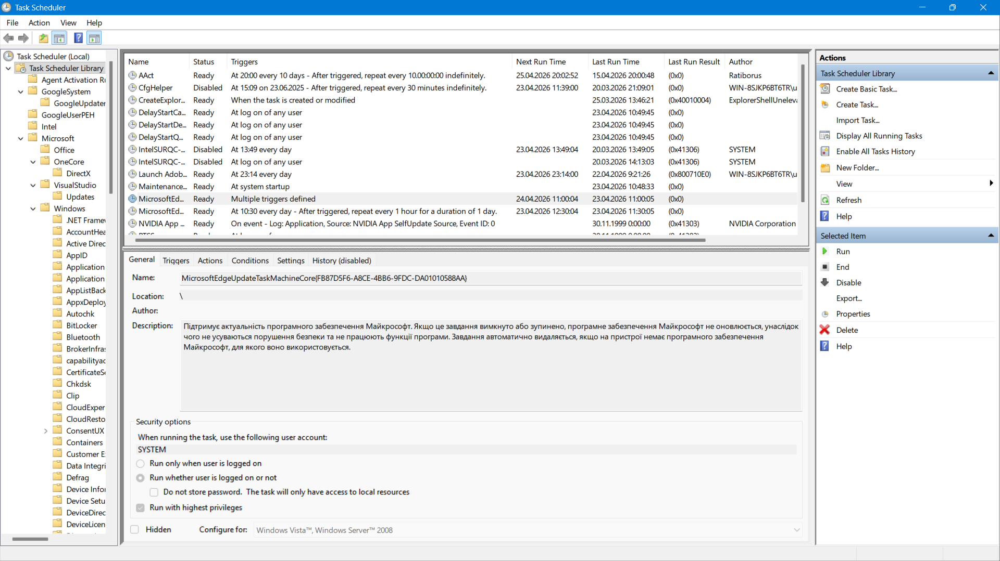
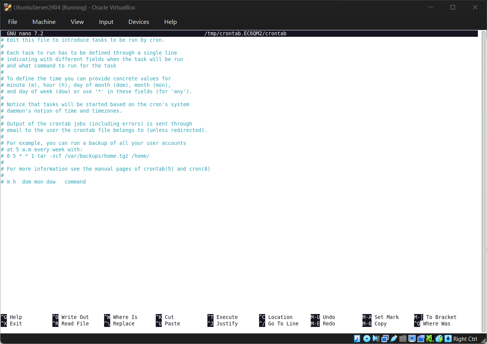
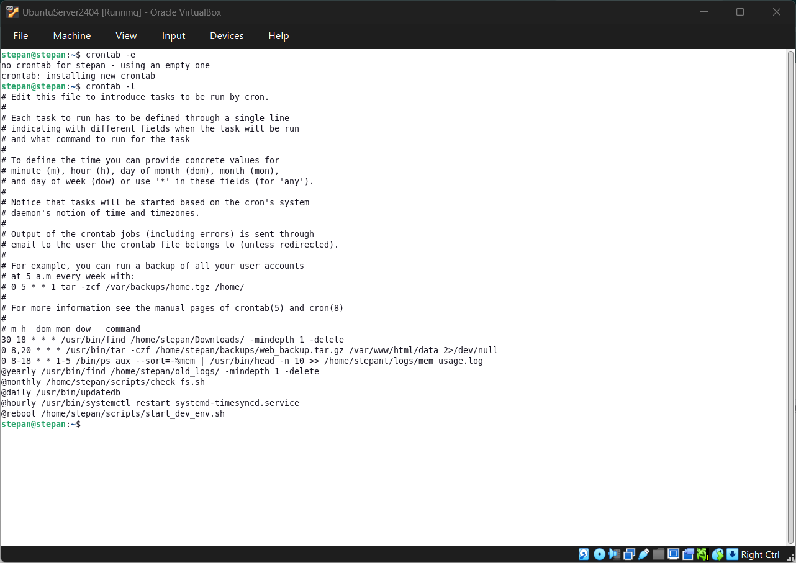
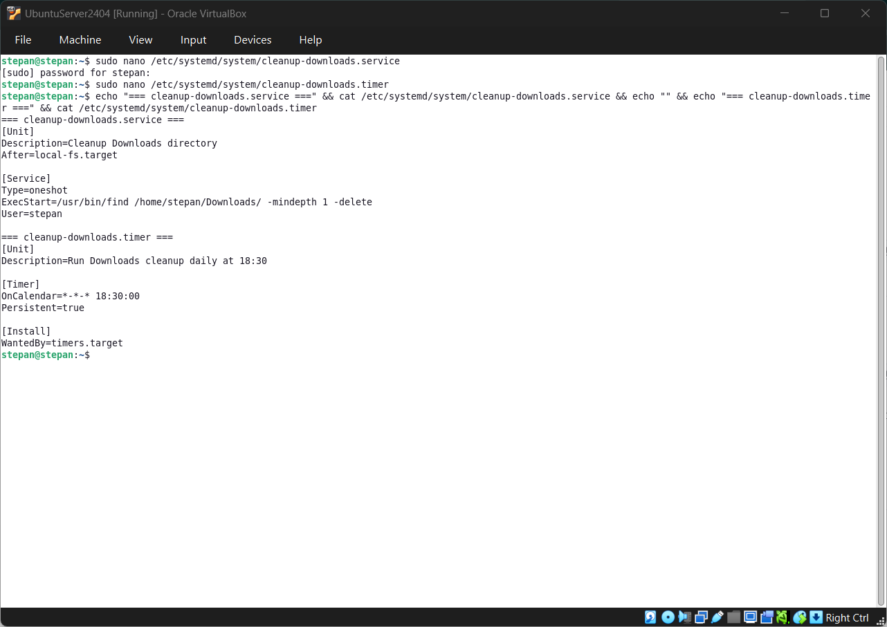
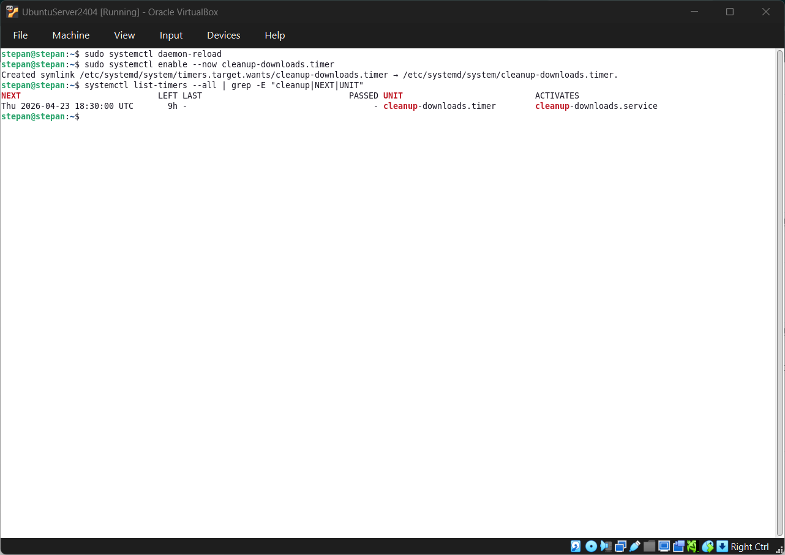

# Звіт з виконання СРС: WORK-CASE №7

**Дисципліна:** Операційні системи  
**Студент:** Фокін Степан Володимирович  
**Група:** РПЗ-33  
**Навчальний заклад:** Київський фаховий коледж зв'язку  
**Середовище:** Oracle VirtualBox (Ubuntu Server + GNOME)  
**Роль:** System Administrator  
**Дата:** 2026

---

## 1. ТЕОРЕТИЧНІ ВІДОМОСТІ: ПЛАНУВАННЯ ЗАДАЧ В ОС

### 1.1. Основні функції планувальника завдань

Планувальник завдань — це системна служба, яка забезпечує автоматичне виконання програм, сценаріїв або команд у заздалегідь визначений час або при виникненні конкретних системних подій.

**Ключові функції:**

  * **Автоматизація обслуговування:** Регулярне створення резервних копій (backup), оновлення системних пакетів та баз даних.
  * **Оптимізація ресурсів:** Перенесення ресурсомістких задач на нічний час або періоди низької активності користувачів.
  * **Системна гігієна:** Автоматичне видалення тимчасових файлів, очищення кешу та ротація лог-файлів для запобігання переповненню диска.
  * **Моніторинг:** Періодична перевірка стану сервісів та відправка сповіщень адміністратору у разі збоїв.

### 1.2. Порівняння планувальників: Windows vs Linux

Хоча концепція автоматизації спільна, підходи до реалізації в різних ОС відрізняються:

| Характеристика | Windows Task Scheduler | Linux (Cron / Systemd Timers) |
| :--- | :--- | :--- |
| **Інтерфейс** | Повнофункціональний графічний інтерфейс (MMC snap-in). | Переважно текстові конфігураційні файли (crontab / unit-файли). |
| **Тригери** | Час, вхід користувача, простій системи, конкретна подія в Event Viewer. | Точний час, інтервали, завантаження системи або залежність від інших юнітів. |
| **Зберігання** | XML-файли в системних папках. | Текстові файли в `/var/spool/cron/`, `/etc/crontab` або `/etc/systemd/system/`. |
| **Точність** | До секунди. | Cron — до хвилини; Systemd Timers — до мілісекунди з підтримкою `AccuracySec`. |




<p align="center"><i>Рисунок 1 – Порівняння графічного інтерфейсу планувальника Windows та консольного редактора Crontab у Linux</i></p>

### 1.3. Принципи роботи з Cron в Linux

**Cron** — це демон (фонова служба), який щохвилини перевіряє таблиці планування (`crontab`).

**Налаштування:**
Виконується через команду `crontab -e`. Кожен рядок має формат:
`[хв] [год] [день_міс] [місяць] [день_тижня] [команда]`

**Альтернативи Cron:**

1.  **Systemd Timers:** Сучасний стандарт, інтегрований у систему ініціалізації. Забезпечує точність до мілісекунди, підтримує залежності між службами, логування через `journald` та коректну обробку пропущених запусків (`Persistent=true`).
2.  **Anacron:** Використовується для систем, які не працюють цілодобово, оскільки виконує пропущені задачі після ввімкнення ПК.
3.  **at:** Призначений виключно для виконання одноразових задач у майбутньому.

---

## 2. ПРАКТИЧНА РЕАЛІЗАЦІЯ: НАЛАШТУВАННЯ CRON

1. Відкрив термінал у GNOME (`Ctrl+Alt+T`).
2. Перевірив своє ім'я користувача командою `whoami` → отримав `stepan`.
3. Створив усі необхідні директорії, щоб уникнути помилок виконання:
   ```bash
   mkdir -p ~/backups ~/logs ~/old_logs ~/scripts ~/workcase7/assets
   ```
4. Створив пусті виконувані скрипти, на які посилається Cron:
   ```bash
   touch ~/scripts/check_fs.sh ~/scripts/start_dev_env.sh
   chmod +x ~/scripts/*.sh
   ```
5. Відкрив редактор планування: `crontab -e`. Обрав `nano` (варіант 1).
6. В кінець файлу вставив готовий блок задач, зберіг через `Ctrl+O → Enter → Ctrl+X`.
7. Перевірив результат командою `crontab -l` та зробив скріншот для звіту.

### 2.1. Файл планування `crontab` (реальний вміст)
Усі команди вказано з абсолютними шляхами, оскільки середовище Cron має обмежений `$PATH`. Ім'я користувача `stepan` використано в усіх домашніх шляхах.

```bash
30 18 * * * /usr/bin/find /home/stepan/Downloads/ -mindepth 1 -delete
0 8,20 * * * /usr/bin/tar -czf /home/stepan/backups/web_backup.tar.gz /var/www/html/data 2>/dev/null
0 8-18 * * 1-5 /bin/ps aux --sort=-%mem | /usr/bin/head -n 10 >> /home/stepan/logs/mem_usage.log
@yearly /usr/bin/find /home/stepan/old_logs/ -mindepth 1 -delete
@monthly /home/stepan/scripts/check_fs.sh
@daily /usr/bin/updatedb
@hourly /usr/bin/systemctl restart systemd-timesyncd.service
@reboot /home/stepan/scripts/start_dev_env.sh
```

**Пояснення розкладів:**
| Рядок | Періодичність | Призначення |
|---|---|---|
| `30 18 * * *` | Щодня о 18:30 | Очищення `Downloads/` |
| `0 8,20 * * *` | Двічі на день (08:00, 20:00) | Архівування веб-даних |
| `0 8-18 * * 1-5` | Пн-Пт, щогодини з 08 до 18 | Логування топ-процесів за пам'яттю |
| `@yearly` | 1 січня щороку | Видалення старих логів |
| `@monthly` | 1 число щомісяця | Перевірка ФС |
| `@daily` | Щодня опівночі | Оновлення індексу `locate` |
| `@hourly` | Щогодини | Синхронізація часу |
| `@reboot` | При завантаженні ОС | Запуск dev-середовища |



<p align="center"><i>Рисунок 2 – Вивід команди crontab -l після успішного додавання всіх регламентних завдань</i></p>

---

## 3. ВСТАНОВЛЕННЯ ТА НАЛАШТУВАННЯ АЛЬТЕРНАТИВНОГО ПЛАНУВАЛЬНИКА: SYSTEMD TIMERS

1. Створив файл служби (що виконувати) через `sudo nano /etc/systemd/system/cleanup-downloads.service`. Вставив конфігурацію, зберіг.
2. Створив файл таймера (коли виконувати) через `sudo nano /etc/systemd/system/cleanup-downloads.timer`. Вставив розклад, зберіг.
3. Вивів вміст обох файлів у термінал для фіксації у звіті:
   ```bash
   echo "=== cleanup-downloads.service ===" && cat /etc/systemd/system/cleanup-downloads.service && echo "" && echo "=== cleanup-downloads.timer ===" && cat /etc/systemd/system/cleanup-downloads.timer
   ```
4. Оновив конфігурацію systemd та активував таймер:
   ```bash
   sudo systemctl daemon-reload
   sudo systemctl enable --now cleanup-downloads.timer
   ```
5. Перевірив, що система бачить розклад:
   ```bash
   systemctl list-timers --all | grep -E "cleanup|NEXT|UNIT"
   ```
6. Зробив скріншоти терміналу для `Picture3.png` та `Picture4.png`.

### 3.1. Конфігурація `.service` (логіка виконання)
Файл: `/etc/systemd/system/cleanup-downloads.service`
```ini
[Unit]
Description=Cleanup Downloads directory
After=local-fs.target

[Service]
Type=oneshot
ExecStart=/usr/bin/find /home/stepan/Downloads/ -mindepth 1 -delete
User=stepan
```

### 3.2. Конфігурація `.timer` (розклад запуску)
Файл: `/etc/systemd/system/cleanup-downloads.timer`
```ini
[Unit]
Description=Run Downloads cleanup daily at 18:30

[Timer]
OnCalendar=*-*-* 18:30:00
Persistent=true

[Install]
WantedBy=timers.target
```



<p align="center"><i>Рисунок 3 – Вивід команди cat для створених .service та .timer файлів</i></p>

### 3.3. Активація та перевірка роботи таймера
Після створення файлів systemd не бачить їх автоматично. Необхідно оновити дерево юнітів та увімкнути таймер:
```bash
sudo systemctl daemon-reload
sudo systemctl enable --now cleanup-downloads.timer
```

Перегляд активних розкладів та часу наступного запуску:
```bash
systemctl list-timers --all
```
У виводі чітко видно колонки `NEXT` (наступний запуск), `LEFT` (час до запуску) та `UNIT` (назва таймера). Це підтверджує, що задача успішно інтегрована в систему ініціалізації.



<p align="center"><i>Рисунок 4 – Вивід systemctl list-timers --all з активним таймером cleanup-downloads.timer</i></p>

### 3.4. Відповідність задач з розділу 2 у systemd
Systemd timers повністю покривають функціонал Cron, але використовують інший синтаксис у секції `[Timer]`:

| Завдання з п.2 | Cron | Systemd Timer (`OnCalendar=`) |
|----|----|---|
| Щодня о 18:30 | `30 18 * * *` | `*-*-* 18:30:00` |
| Двічі на день | `0 8,20 * * *` | `OnCalendar=*-*-* 08:00:00`<br>`OnCalendar=*-*-* 20:00:00` |
| Будні 08-18 | `0 8-18 * * 1-5` | `OnCalendar=Mon..Fri *-*-* 08:00:00` (і далі погодинно) |
| Раз у рік/місяць/день | `@yearly` / `@monthly` / `@daily` | `yearly` / `monthly` / `daily` |
| При завантаженні | `@reboot` | `OnBootSec=1min` |

---

## 4. GLOSSARY

| English | Українська | Пояснення (Explanation) |
| :--- | :--- | :--- |
| **Scheduling** | Планування | **EN:** The process of deciding which task should run at a specific time. <br> **UA:** Процес визначення того, яке завдання має виконуватися у певний час. |
| **Daemon** | Демон | **EN:** A background process that handles system requests without user intervention. <br> **UA:** Фоновий процес, який обробляє системні запити без втручання користувача. |
| **Crontab** | Кронтаб | **EN:** A configuration file that specifies shell commands to run periodically on a given schedule. <br> **UA:** Конфігураційний файл, що визначає команди оболонки для періодичного запуску за розкладом. |
| **Systemd Timer** | Таймер Systemd | **EN:** A modern alternative to Cron in Linux, managed by the systemd service manager. Supports dependencies, journal logging, and millisecond accuracy. <br> **UA:** Сучасна альтернатива Cron в Linux, якою керує менеджер системних служб systemd. Підтримує залежності, логування та високу точність. |
| **Job Queue** | Черга завдань | **EN:** A sequence of tasks waiting to be processed by the scheduler. <br> **UA:** Послідовність завдань, що очікують на обробку планувальником. |
| **Backup** | Резервна копія | **EN:** A duplicate of data made to protect against data loss. <br> **UA:** Дублікат даних, створений для захисту від втрати інформації. |
| **OnCalendar** | Календарний тригер | **EN:** A systemd timer directive that defines when a service should be triggered using calendar event syntax. <br> **UA:** Директива таймера systemd, що визначає час запуску служби за допомогою синтаксису календарних подій. |

---

## 5. CONCLUSIONS

У ході виконання Work-case №7 було детально досліджено інструменти автоматизації в операційних системах. На прикладі Ubuntu Server з GNOME освоєно роботу з класичним планувальником **Cron**, який залишається зручним рішенням для швидкого налаштування періодичних задач завдяки компактному синтаксису.

**Мій практичний шлях** включав підготовку директорій, створення тестових скриптів, редагування `crontab` через `nano` та верифікацію розкладів командою `crontab -l`. У процесі роботи було закріплено важливе правило: у Cron обов'язково використовувати абсолютні шляхи до виконуваних файлів, оскільки фонове середовище не завантажує звичайний `$PATH` користувача.

Окрему увагу приділено сучасній альтернативі — **systemd timers**. Їх впровадження продемонструвало переваги модульної архітектури Linux: розділення логіки виконання (`.service`) та розкладу (`.timer`), підтримку точного часу, вбудоване логування через `journalctl` та механізм `Persistent=true` для компенсації пропущених запусків під час вимкнення системи. Хоча налаштування systemd вимагає створення більше конфігураційних файлів та виконання `daemon-reload`, цей підхід є стандартом для production-серверів завдяки надійності, інтеграції з іншими юнітами та зручному моніторингу через `systemctl list-timers`.

Вміння автоматизувати очищення логів, резервне копіювання, моніторинг та синхронізацію часу є критично важливим для системного адміністратора, оскільки це підвищує стабільність інфраструктури, оптимізує навантаження та мінімізує ризики, пов'язані з людським фактором.

