# Work-case 8: Робота в терміналі (Linux)

**Робоче середовище:** Oracle VirtualBox, Ubuntu 24.04 GNOME 
**Виконав:** студент групи `РПЗ-33` Фокін Степан
**Користувач:** `stepan`

> 💡 Перед встановленням будь-яких нових пакетів рекомендується оновити список репозиторіїв:
>```bash
>sudo apt update
>```

---

## 1. Робота без графічної оболонки

При роботі з серверними системами або на комп'ютерах з обмеженими ресурсами графічну оболонку часто вимикають або не встановлюють. Linux дозволяє виконувати більшість повсякденних задач виключно через термінал за допомогою спеціалізованих консольних пакетів.

### 📁 Перегляд файлів та папок через файловий менеджер
- **`mc` (Midnight Commander)** – класичний двопанельний менеджер з інтуїтивним інтерфейсом та підтримкою миші.
- **`ranger`** – мінімалістичний менеджер з навігацією у стилі Vim (керування клавішами `h/j/k/l`).

```bash
# Встановлення mc
sudo apt install mc
```

```bash
# Запуск mc
mc
```
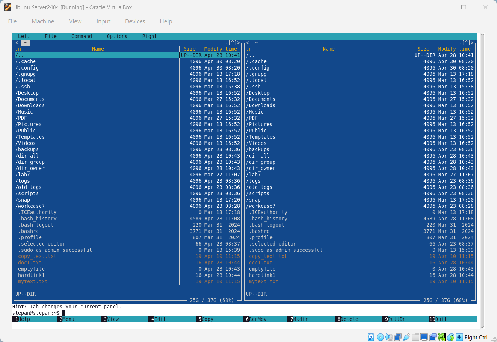
```bash
# Встановлення ranger
sudo apt install ranger
```

```bash
# Запуск ranger
ranger
```
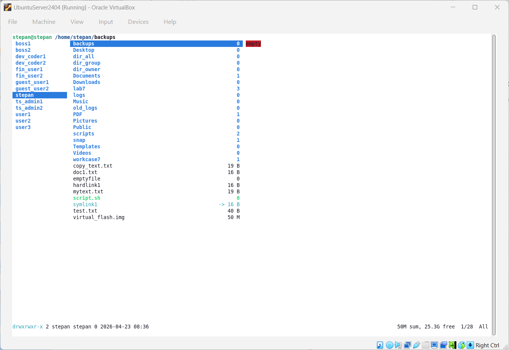

### 🌐 Перегляд веб-сторінок через текстовий браузер
- **`lynx`** – один з найстаріших текстових браузерів, ідеальний для швидкого читання статей без графіки.
- **`w3m`** – сучасніший текстовий браузер з покращеною підтримкою таблиць, форм та вкладок.

```bash
# Встановлення lynx
sudo apt install lynx
```

```bash
# Запуск lynx
lynx https://google.com
```

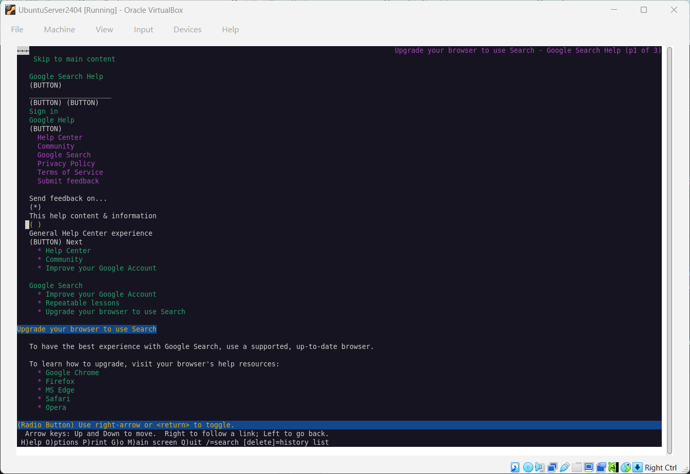

```bash
# Встановлення w3m
sudo apt install w3m
```

```bash
# Запуск w3m
w3m https://uk.wikipedia.org
```
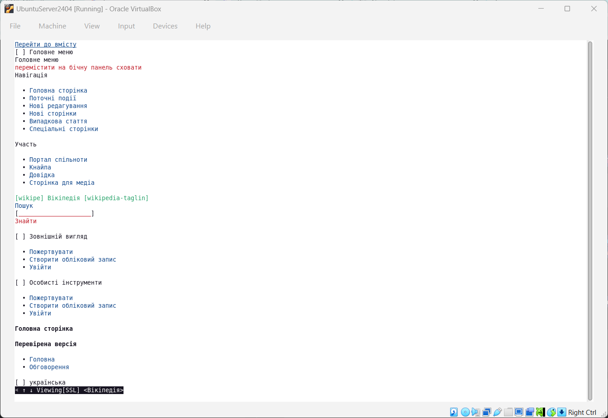


### 📧 Перегляд електронної пошти в терміналі
- **`mutt`** – потужний, гнучко налаштовуваний клієнт для досвідчених користувачів (конфігурація через `~/.muttrc`).
- **`alpine`** – клієнт з графічним меню в терміналі, орієнтований на початківців та швидке налаштування.

```bash
# Встановлення mutt
sudo apt install mutt
```

```bash
# Запуск mutt
mutt
```
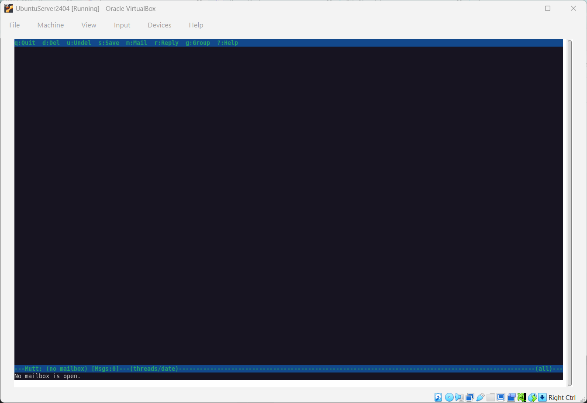
```bash
# Встановлення alpine
sudo apt install alpine
```

```bash
# Запуск alpine
alpine
```
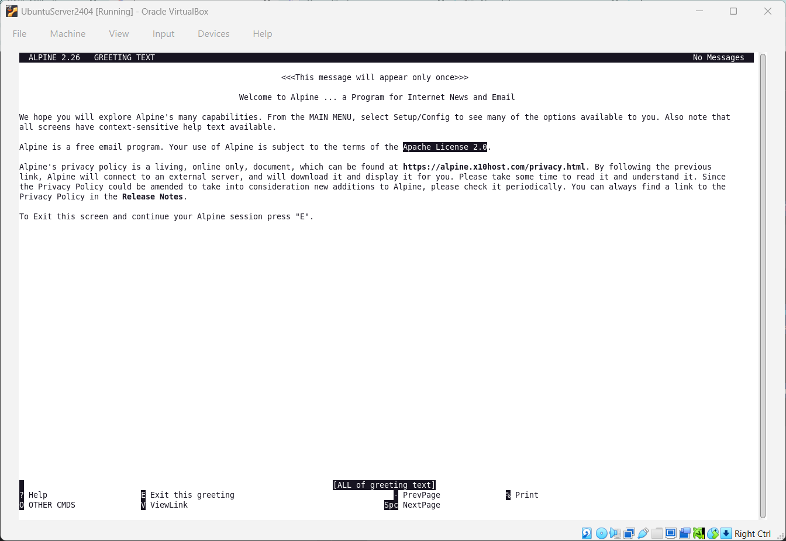

### 🎵 Прослуховування музики через термінал
- **`cmus`** – надлегкий та швидкий плеєр з підтримкою плейлистів та тегів.
- **`moc` (Music On Console)** – працює за клієнт-серверною архітектурою: музика грає у фоні навіть після закриття інтерфейсу.

```bash
# Встановлення cmus
sudo apt install cmus
```

```bash
# Запуск cmus
cmus
```
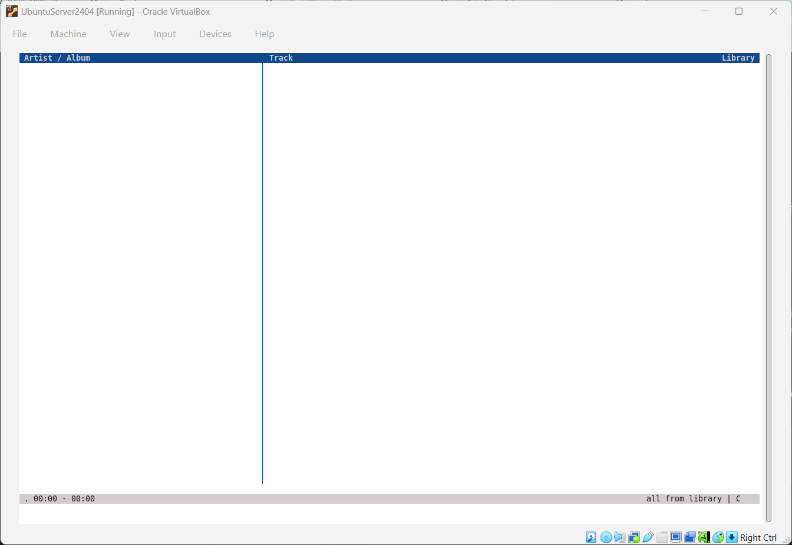
```bash
# Додавання теки з музикою всередині cmus (ввести в інтерфейсі)
:add /home/stepan/Music
```

```bash
# Встановлення moc
sudo apt install moc
```

```bash
# Запуск інтерфейсу moc (зверніть увагу: команда відрізняється від назви пакета)
mocp
```
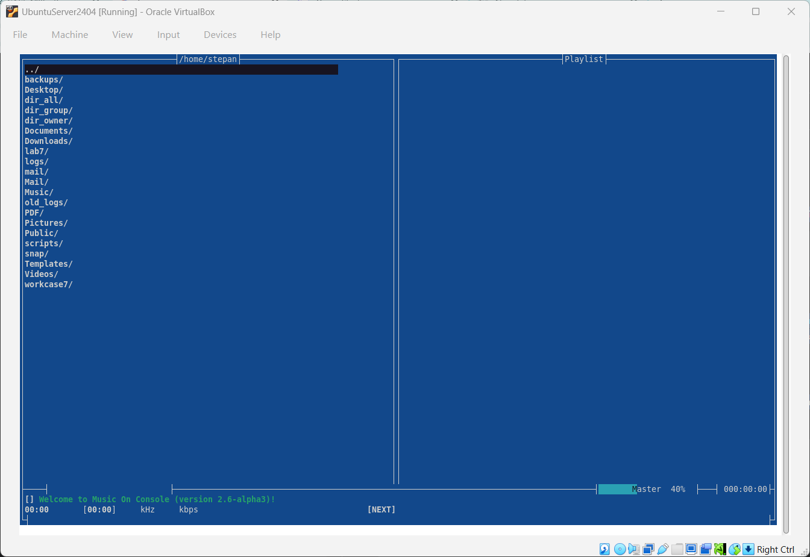

### 📦 Завантаження торентів через термінал
- **`rtorrent`** – високопродуктивний клієнт з керуванням через клавіатурні комбінації.
- **`transmission-cli`** – консольна версія популярного Transmission, знайома багатьом користувачам.

```bash
# Встановлення rtorrent
sudo apt install rtorrent
```

```bash
# Запуск завантаження торент-файлу
rtorrent /home/stepan/Downloads/file.torrent
```

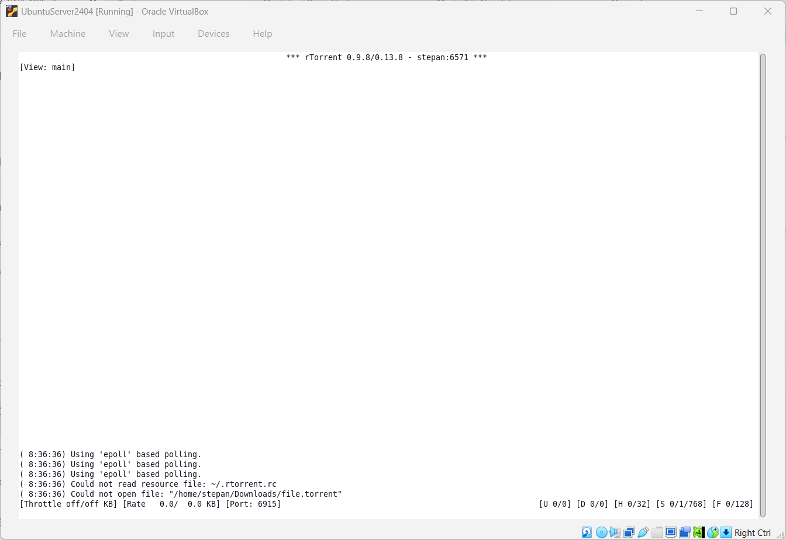

```bash
# Встановлення transmission-cli
sudo apt install transmission-cli
```

```bash
# Запуск із вказуванням папки для збереження
transmission-cli -w /home/stepan/Downloads /home/stepan/Downloads/file.torrent
```

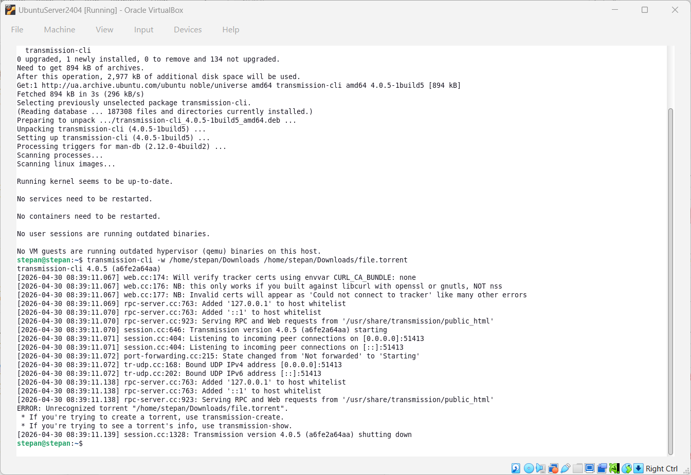


### 📅 Планування дій у календарі та нагадування
- **`calcurse`** – повноцінний органайзер: календар, список справ, нагадування та експорт/імпорт iCal.
- **`cal`** – вбудована утиліта для миттєвого перегляду календаря без встановлення додаткових пакетів.

```bash
# Встановлення calcurse
sudo apt install calcurse
```

```bash
# Запуск calcurse
calcurse
```
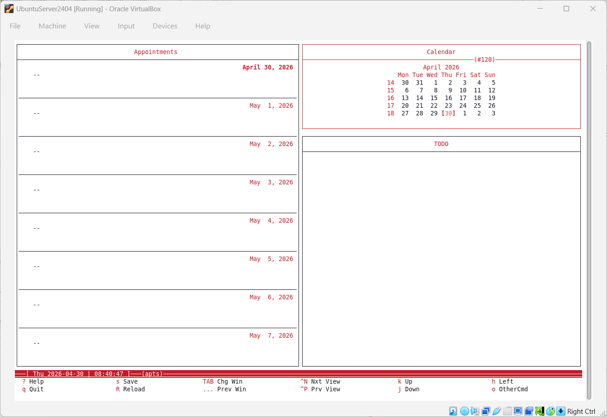
```bash
# Перегляд поточного місяця (вбудована команда)
cal
```

```bash
# Перегляд усього року
cal -y
```
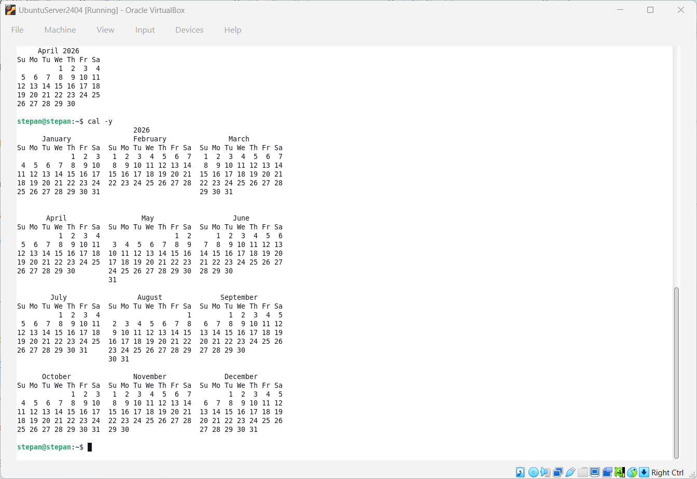

### 🖼️ Перегляд зображень в терміналі
Перед переглядом зображення його необхідно завантажити. Термінал дозволяє зробити це за допомогою `wget` або `curl`, а потім відобразити файл через спеціалізовані переглядачі.

```bash
# Створення директорії для зображень (якщо відсутня)
mkdir -p /home/stepan/Pictures
```

```bash
# Завантаження зображення через wget
wget -O /home/stepan/Pictures/photo.jpg https://upload.wikimedia.org/wikipedia/commons/thumb/4/47/PNG_transparency_demonstration_1.png/280px-PNG_transparency_demonstration_1.png
```

```bash
# Альтернативне завантаження через curl
curl -o /home/stepan/Pictures/photo.jpg https://upload.wikimedia.org/wikipedia/commons/thumb/4/47/PNG_transparency_demonstration_1.png/280px-PNG_transparency_demonstration_1.png
```

- **`fbi`** – відображає зображення через Linux framebuffer. Працює **лише в чистому TTY** (`Ctrl+Alt+F3..F6`), не підтримує графічні емулятори термінала.
- **`timg`** – рендерить зображення прямо у вікні термінала за допомогою Unicode-напівграфіки або підтримуваних протоколів (Sixel/Kitty).

```bash
# Встановлення fbi
sudo apt install fbi
```

```bash
# Запуск fbi (потребує прав root та доступу до framebuffer)
sudo fbi -d /dev/fb0 /home/stepan/Pictures/photo.jpg
```
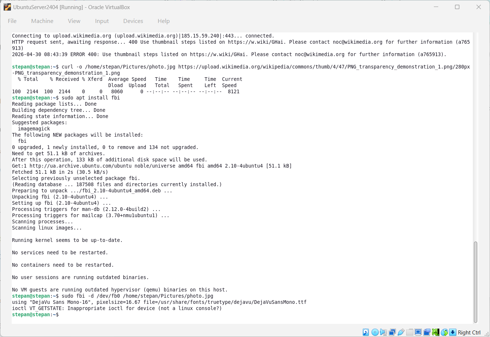
```bash
# Встановлення timg
sudo apt install timg
```

```bash
# Запуск timg у звичайному терміналі
timg /home/stepan/Pictures/photo.jpg
```
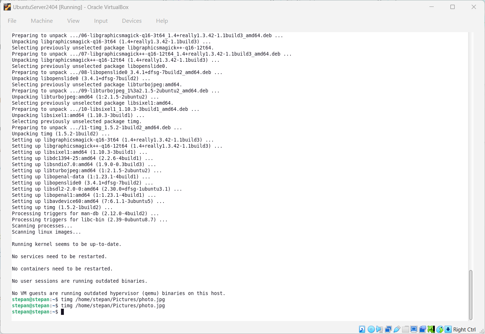

---

## 2. Класичні дії адміністратора

Ці інструменти є стандартом де-факто для системного адміністрування, налаштування конфігураційних файлів та моніторингу стану сервера.

### 📝 Введення, редагування та видалення тексту (редактори файлів)
- **`nano`** – простий редактор з підказками комбінацій клавіш у нижній частині екрана. Встановлений за замовчуванням в Ubuntu 24.04.
- **`vim`** – модальний редактор з потужною системою команд, макросів та плагінів. Стандарт для професійних адміністраторів.

```bash
# Створення або редагування файлу в nano (вже встановлений)
nano /home/stepan/document.txt
```
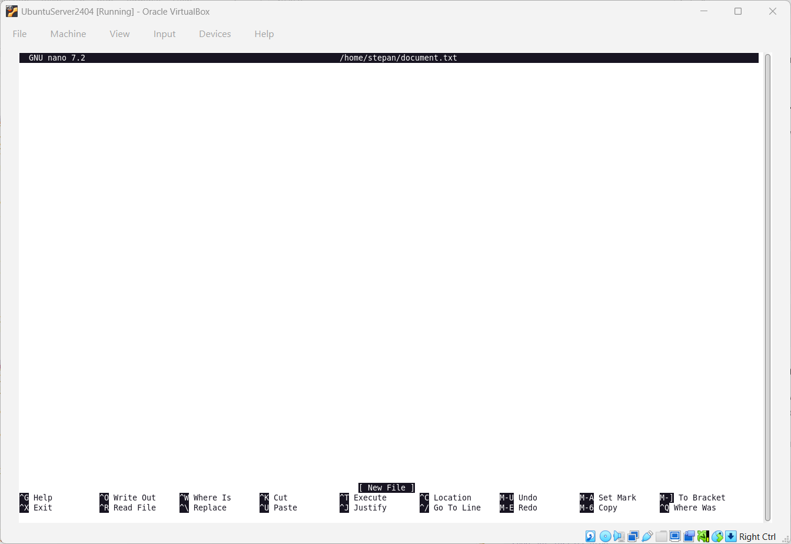
```bash
# Встановлення vim
sudo apt install vim
```

```bash
# Запуск vim
vim /home/stepan/document.txt
```

### 📊 Моніторинг процесів та ресурсів системи
- **`top`** – базова вбудована утиліта для відстеження CPU, RAM та активних процесів у реальному часі.
- **`htop`** – покращена, кольорова версія з підтримкою миші, горизонтальної прокрутки та зручного керування процесами (`F9` для kill).
- **`btop`** – сучасний монітор з графіками, віджетами мережі/дисків та апаратним прискоренням рендерингу.

```bash
# Запуск вбудованого top
top
```
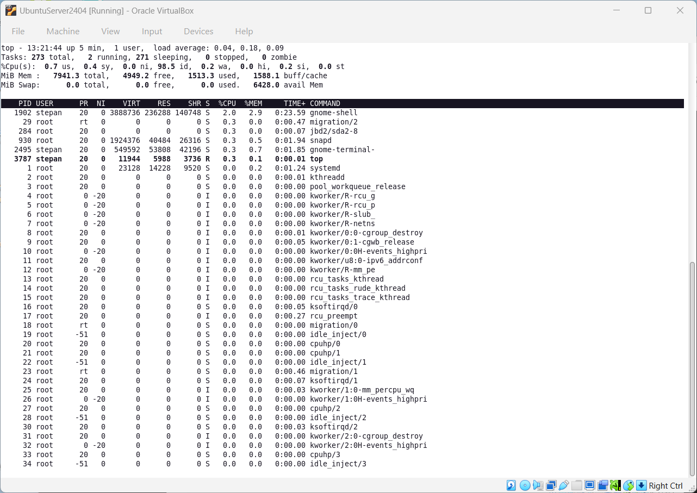
```bash
# Встановлення htop
sudo apt install htop
```

```bash
# Запуск htop
htop
```
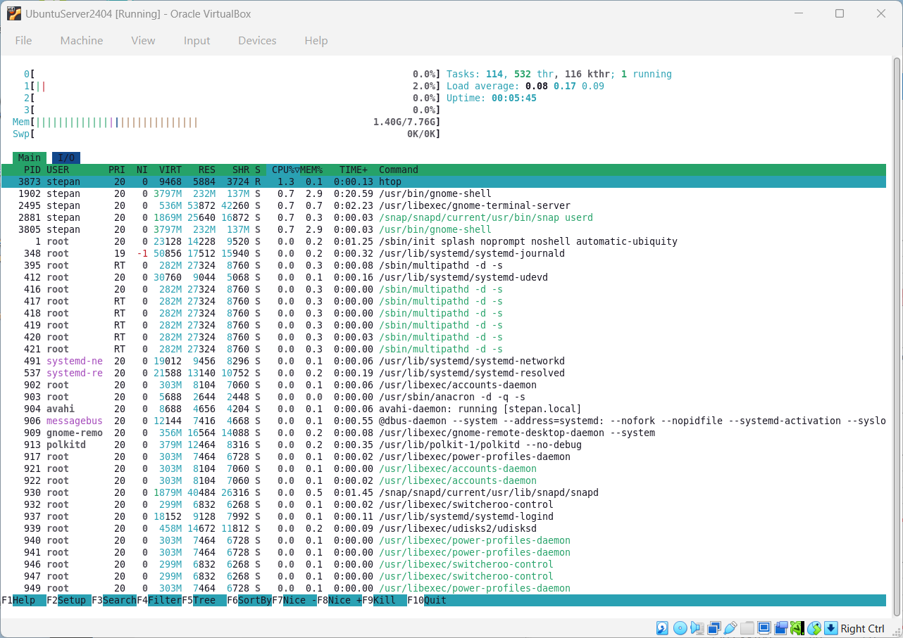
```bash
# Встановлення btop
sudo apt install btop
```

```bash
# Запуск btop
btop
```
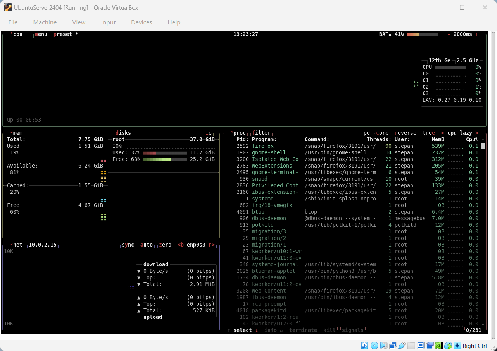

---

## 3. Задачі для настрою («пасхалки») ☺

Linux-спільнота відома своїм гумором. Нижче наведено класичні консольні «пасхалки», які працюють у більшості дистрибутивів.

### 🚂 Паровий локомотив з вагоном
Жартівлива анімація, яка спрацьовує при помилковому вводі `ls` як `sl`. Корисна для тренування уважності.

```bash
# Встановлення sl
sudo apt install sl
```

```bash
# Запуск анімації
sl
```
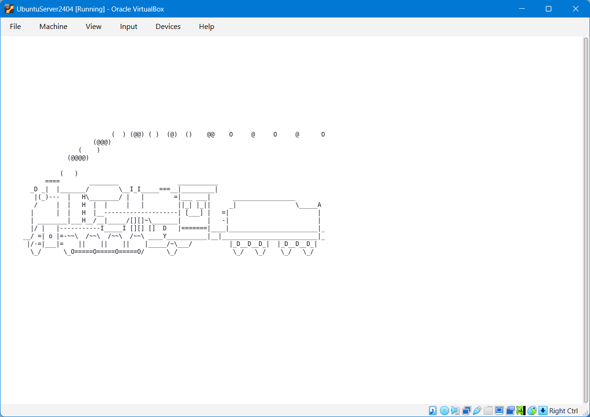
### ⭐ Зоряні війни в терміналі
Повнометражний 4-й епізод, відтворений у ASCII-графіці через протокол Telnet.

```bash
# Встановлення telnet-клієнта
sudo apt install telnet
```

```bash
# Підключення до сервера анімації
telnet starwarstel.net
```

### 🐮 Діалог з коровою
Утиліта генерує ASCII-корову, яка «вимовляє» переданий їй текст.

```bash
# Встановлення cowsay
sudo apt install cowsay
```

```bash
# Запуск з повідомленням
cowsay "Привіт, stepan! Як успіхи з Linux?"
```
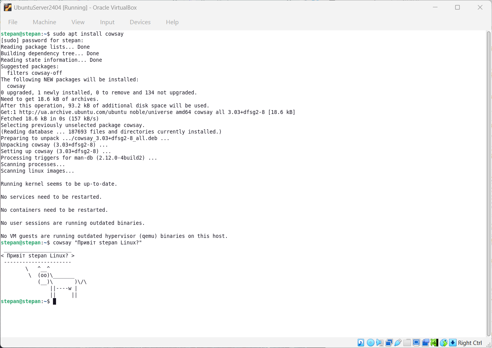

### 🎁 Додаткові цікаві інтерактиви (Бонус)
- **`cmatrix`** – ефект падаючого зеленого коду з фільму «Матриця».
- **`fortune`** – генератор випадкових цитат, який можна комбінувати з `cowsay` через конвеєр `|`.
- **`figlet`** – перетворює звичайний текст на великі ASCII-банери.

```bash
# Встановлення cmatrix
sudo apt install cmatrix
```

```bash
# Запуск матриці
cmatrix
```
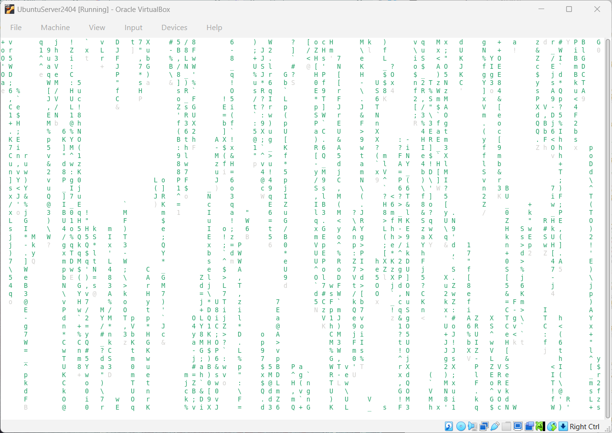
```bash
# Встановлення fortune
sudo apt install fortune
```

```bash
# Комбінований запуск: випадкова цитата від корови
fortune | cowsay
```
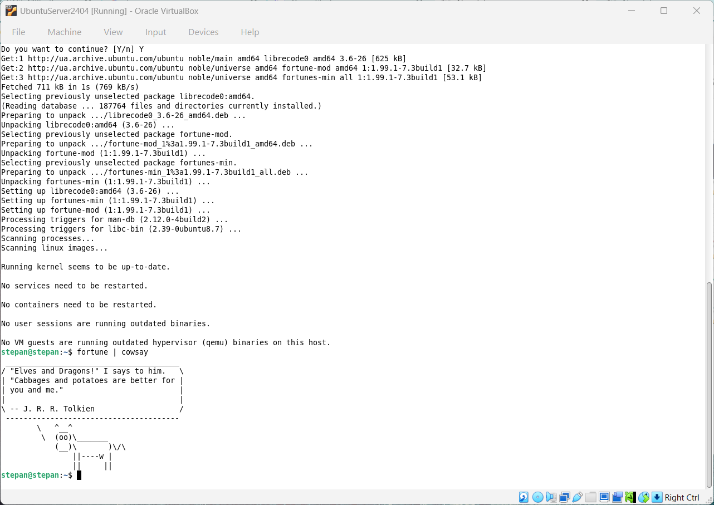
```bash
# Встановлення figlet
sudo apt install figlet
```

```bash
# Генерація текстового банера
figlet "Stepan Linux"
```
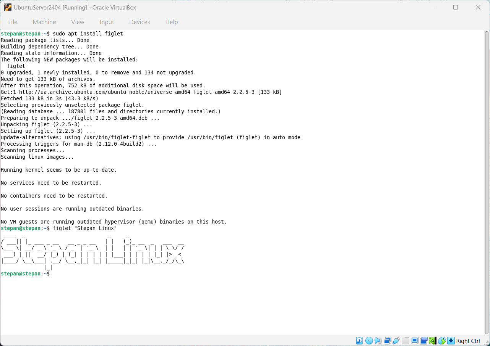