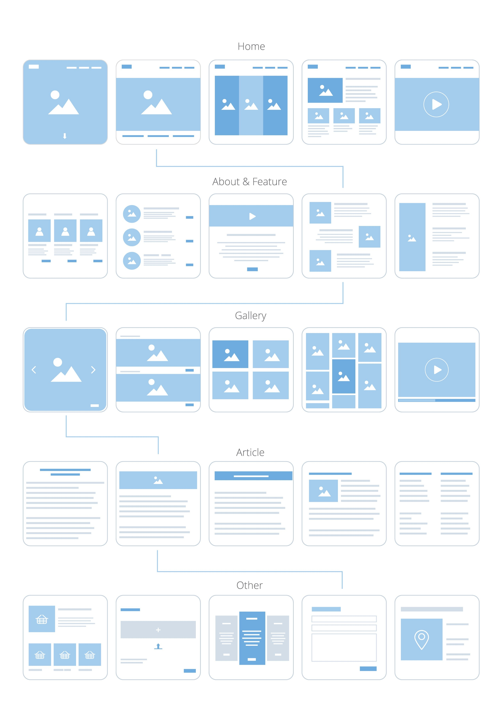
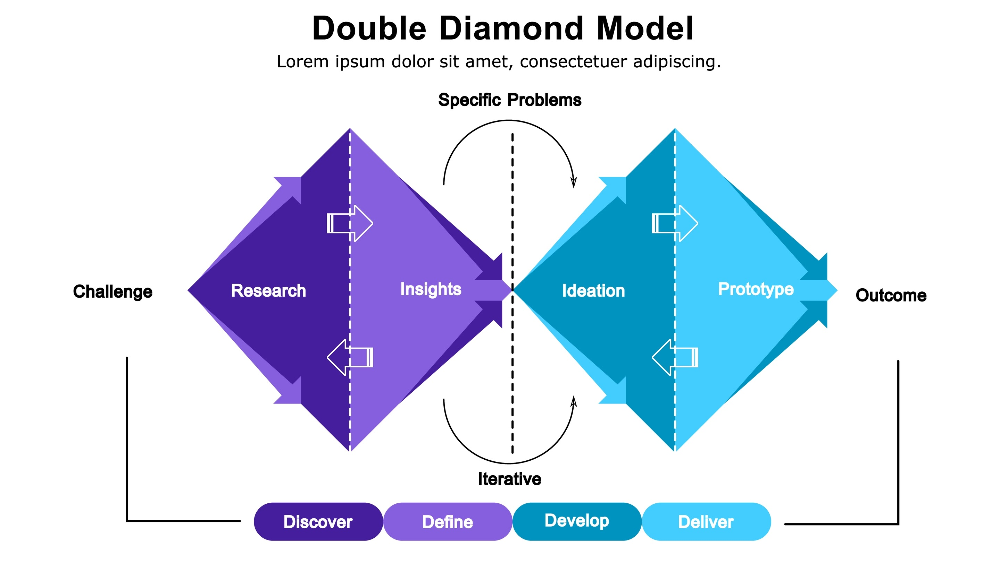

**Самостійна робота №3: Дизайн-процес та методи UX**

**Студент:** Фокін Степан , група РПЗ-33
**Предмет:** Основи UI/UX дизайну

---

### 1. Контрольні запитання

**1. Яке призначення Problem Statement?**
**Problem Statement** (Формулювання проблеми) — це чіткий і стислий опис ключової проблеми користувача, який базується на даних досліджень, а не на припущеннях. 
Його призначення — слугувати "технічним завданням людською мовою" для команди. Воно допомагає сфокусуватися на вирішенні конкретної болі користувача.
* **Формула:** Користувач [хто] не може [що], тому що [чому], внаслідок чого [наслідок].

**2. Чим User Persona відрізняється від реального користувача?**
* **Реальний користувач:** Це конкретна жива людина з унікальним набором характеристик.
* **User Persona (Персона):** Це збірний образ (архетип), створений на основі даних про багатьох реальних користувачів. Персона об'єднує типові патерни поведінки, цілі та болі певної групи людей. Це інструмент для емпатії, щоб дизайнер пам'ятав, для кого він створює продукт (наприклад, "Макс, 34 роки, менеджер", а не просто "абстрактний юзер").

**3. Для чого потрібні вайрфрейми?**

**Вайрфрейми (Wireframes)** — це "скелет" майбутнього інтерфейсу. Вони потрібні для:
* Візуалізації структури сторінки та розташування елементів без відволікання на дизайн (кольори, картинки).
* Швидкого погодження логіки роботи з командою чи замовником.
* Економії часу: перемалювати "сірий прямокутник" набагато швидше, ніж готовий кольоровий макет.

**4. Чому UX-тестування важливе ще до початку програмування?**
Тому що виправляти помилки на етапі дизайну в десятки разів дешевше, ніж у коді. 
* **Принцип:** "Один клік у Figma = тижні роботи розробника". 
Тестування прототипів дозволяє знайти логічні діри та незручні моменти до того, як команда витратить бюджет на написання бекенду та верстку.

**5. Чому скетчі на папері іноді кращі за ідеальні макети у Figma на початку роботи?**
* **Швидкість:** Намалювати ідею олівцем займає секунди.
* **Фокус на суті:** Папір не дозволяє "загратися" зі шрифтами чи тінями, змушуючи думати про логіку та структуру.
* **Відсутність жалю:** Скетч легко викинути і намалювати новий, тоді як випещений макет у Figma психологічно важче переробляти.

---

### 2. Питання на дослідження

**1. Зв'язок UX-дизайну та Agile-розробки**
UX-дизайн та Agile мають спільну філософію — ітеративність.
* **Agile** працює циклами: Розробка → Тест → Виправлення → Повторити. 
* **UX-процес (Design Thinking)** працює так само: Гіпотеза → Прототип → Тест → Покращення.

В сучасному IT UX-дизайнер не віддає готовий макет "назавжди", а постійно супроводжує розробку, тестує проміжні результати та вносить зміни, що є суттю Agile-підходу.

**2. Метод "5 Чому" (Case: Видалення додатка для мов)**
* **Проблема:** Користувач видалив додаток для вивчення іноземної мови.
    1.  **Чому?** Я перестав ним користуватися через тиждень.
    2.  **Чому?** У мене не вистачало часу на уроки.
    3.  **Чому?** Уроки тривали по 15 хвилин, а я мав лише короткі перерви.
    4.  **Чому?** Додаток не пропонував коротших сесій і постійно надсилав нагадування "Ти пропускаєш урок!", що викликало провину.
    5.  **Чому (Коренева причина):** Додаток використовував негативну мотивацію (тиск) замість адаптації під графік користувача, перетворюючи навчання на "борг".
* **Рішення:** Ввести мікро-уроки по 3 хвилини та змінити тон комунікації на підтримуючий.

**3. Кейс "Double Diamond": Airbnb (Боротьба з дискримінацією)**

Компанія Airbnb використала модель Double Diamond, щоб вирішити проблему упередженого ставлення хостів до гостей.

* **♦ Діамант 1: Проблема (Discover & Define)**
    * **Discover (Дослідження):** Команда виявила, що гостям з афроамериканськими іменами відмовляють у бронюванні на 16% частіше.
    * **Define (Визначення):** Проблема не в технічній помилці, а в людському факторі (несвідоме упередження), яке підсилюється тим, що фото гостя показується до підтвердження броні.
* **♦ Діамант 2: Рішення (Develop & Deliver)**
    * **Develop (Розробка ідей):** Брейнштормінг рішень: прибрати фото зовсім? Показувати лише після броні? Зробити "миттєве бронювання" (Instant Book) пріоритетним?
    * **Deliver (Реалізація):** Впровадження функції Instant Book (де хост не може відмовити) та зміни дизайну, де фото профілю стало менш помітним до моменту оплати, акцентуючи увагу на відгуках та репутації.

**4. HMW-питання (Камери схову в супермаркеті)**
**Проблема:** Люди часто забувають забирати свої речі з камер схову.
* **HMW (Як ми можемо...):** Як ми можемо зробити ключ від скриньки частиною процесу покупок, щоб він був потрібен на касі? *(Наприклад, ключ — це карта лояльності).*
* **HMW:** Як ми можемо нагадати користувачеві про речі в момент, коли він фізично покидає магазин? *(Наприклад, RFID-мітка на ключі, що пищить на виході).*
* **HMW:** Як ми можемо прибрати необхідність у фізичному ключі, який можна загубити чи забути? *(Наприклад, відкриття скриньки через додаток магазину, який надішле пуш-повідомлення при геолокаційному виході з зони).*
> **Примітка до кейсу:** Дана відповідь була запропонована колегою. Щодо останнього пункту (рішення через додаток) маю певний скепсис: ідея виглядає перспективною, проте її реалізація технічно складна. До того ж, якщо кожен магазин створить власний окремий застосунок, це призведе до «цифрового перевантаження» користувачів та створить додаткові незручності.

**5. User Story (Telegram)**
**Додаток:** Telegram
* **As a** (Як) адміністратор робочого чату,
* **I want to** (я хочу) мати можливість створювати папки для чатів та закріплювати їх зверху,
* **So that** (щоб) відділяти особисті переписки від робочих і не пропускати термінові повідомлення від колег у потоці новин.

---

### Висновок

У ході виконання цієїсамостійної роботи було розглянуто ключові етапи UX-дизайну та методи дослідження. Було вивчено призначення проблемних заяв (Problem Statement), принципи створення персонажів (User Persona) та вайрфреймів. Також було проаналізовано взаємозв'язок між UX та Agile-розробкою, застосовано метод "5 Чому" та розібрано використання моделі Double Diamond на реальному кейсі. Додатково було сформовано HMW-питання для вирішення користувацьких проблем та створено User Story для конкретного функціоналу.
