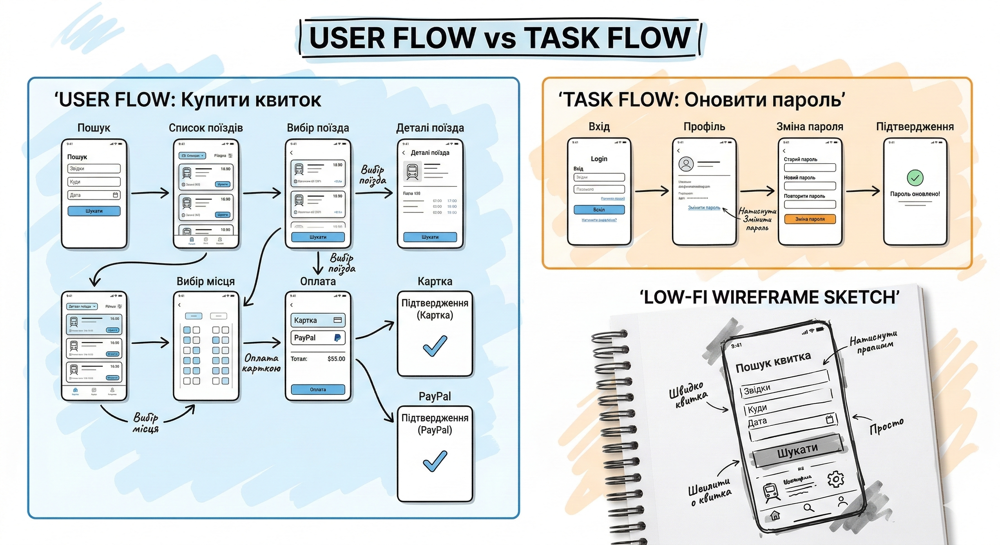
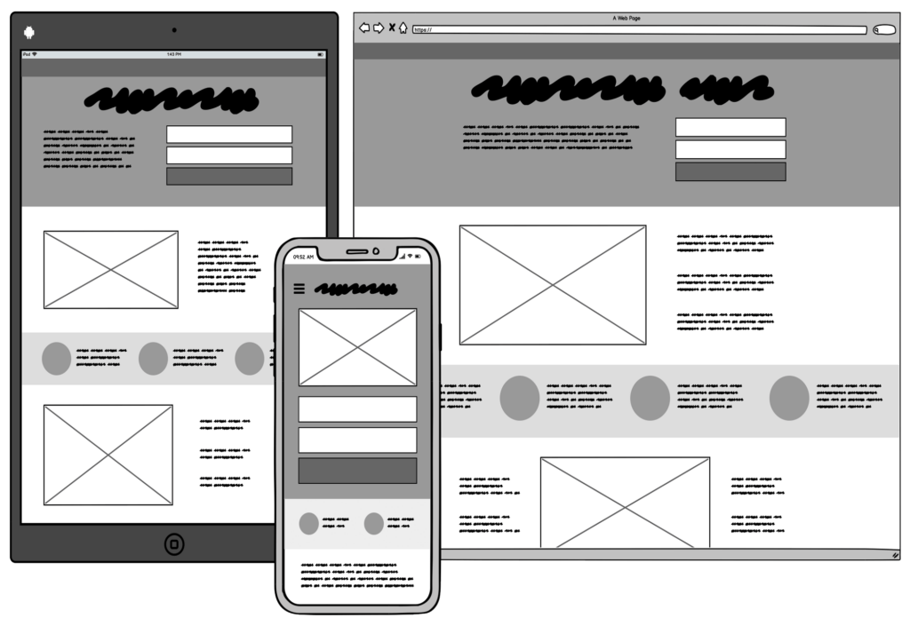
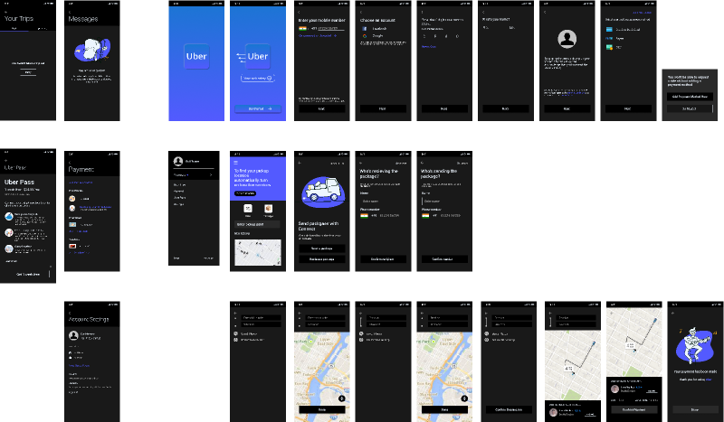

**Самостійна робота №4: Проєктування досвіду, User Flow та Прототипування**  

**Студент:** Фокін Степан , група РПЗ-33  
**Предмет:** Основи UI/UX дизайну  

---

### 1. Контрольні запитання (по 1 балу)

**1. Чим відрізняється User Flow від Task Flow?**  
* **User Flow** описує загальний шлях користувача до досягнення глобальної цілі в продукті. Він може охоплювати багато кроків і враховувати різні стани системи.  
* **Task Flow** (послідовність дій в рамках якогось завдання) концентрується на значно менших, локальних задачах (наприклад, лише флоу "Забув пароль" або "редагування кошика").  

> **Примітка:** Якщо застосувати метафору, то User Flow — це загальна карта вашої подорожі з одного міста в інше з усіма зупинками, а Task Flow — це детальна схема проїзду одного конкретного складного перехрестя.

**2. У яких випадках доцільно використовувати Low-Fi?**  
Low-fidelity (схематичні начерки, ескізи) доцільно використовувати для швидких експериментів, початкового обговорення ідей та швидкої перевірки концепції.  

> **Примітка:** Low-Fi навмисно виглядає "незавершеним", щоб відвернути увагу від візуальної естетики. Вимогливий стейкхолдер на High-Fi макеті може "зачепитися" за не той відтінок синього чи не той шрифт, проігнорувавши логічну діру в навігації. Low-Fi фокусує дискусію виключно на структурі та логіці екранів.

**3. Чому використання тексту "Lorem Ipsum" може зашкодити при створенні вайрфреймів?**  
Згідно з лекцією, на етапі High-fi деталізовані макети повинні розроблятися з реальним текстом для наближення до реального досвіду користувача. Використання "риби" (Lorem Ipsum) приховує реальні проблеми контенту: ідеальна довжина слів ніколи не збігається з реальністю. Це не дає перевірити когнітивне навантаження та часто призводить до "зламаної" верстки на етапі розробки.

**4. Що таке Wireflow?**  
Wireflow — це гібридний формат, сценарій із використанням вайрфреймів. Це більш деталізована версія юзерфлоу або таск флоу, де замість прямокутників із абстрактним текстом дій застосовуються схематичні нариси екранів (вайрфрейми).  

> **Примітка:** Wireflow виступає ідеальним мостом між дизайнерами та програмістами. Це найкращий спосіб показати розробникам, як виглядає інтерфейс на кожному кроці та як працює складна логіка переходів.

**5. Чому паперовий та інтерактивний прототип економить бюджет?**  
Прототипування є інструментом перевірки гіпотез. Основна причина економії — здатність виявити UX-проблеми та перевірити логіку, сценарії та зручність ще *до початку програмування*. Ціна помилки зростає в геометричній прогресії з кожним етапом розробки (виправити логіку в макеті — хвилини, виправити її в коді — тижні роботи команди).

---

### 2. Питання на дослідження (по 2 бали)

**1. У яких випадках паперові прототипи ефективніші за цифрові?**  
Паперові прототипи є найефективнішими на самих ранніх стадіях (Discovery & Ideation) та під час брейнштормінгів.
* **Спільна творчість (Co-creation):** Вони знижують технічний бар'єр. Будь-хто з команди (менеджер, клієнт) може взяти маркер і запропонувати зміну, що неможливо швидко зробити у складних програмах.
* **Відвертість фідбеку:** Дослідження показують, що під час тестування користувачі більш охоче критикують недбалий начерк на папері, тоді як ідеально рівні цифрові прототипи соромляться критикувати, побоюючись знецінити роботу розробників.

**2. Дослідіть сервіс Balsamiq Wireframes: чим він відрізняється від Figma і чому його досі використовують аналітики?**  
Balsamiq — це спеціальна програма для створення вайрфреймів, що навмисно імітує неакуратно намальовані від руки фігури.  

* **Відмінності:** Figma — це інструмент з необмеженими можливостями для Pixel Perfect дизайну, тоді як Balsamiq працює виключно у Low-Fi форматі.
* **Для Бізнес-Аналітиків (BA):** Завдання BA — візуалізувати вимоги (requirements). Balsamiq має бібліотеку готових UI-компонентів (drag-and-drop), що дозволяє швидко зібрати екран без навичок дизайну та уникнути передчасних суперечок із замовником щодо кольорів чи шрифтів.

**3. Що таке "Двері Нормана" (Norman Doors) у контексті UX-флоу?**  
"Двері Нормана" — це поняття від Дона Нормана, що описує об'єкт, дизайн якого дає неправильні підказки (affordances) щодо його використання (наприклад, двері з ручкою-скобою, які треба штовхати, а не тягнути).  

* **У контексті UX-флоу:** Це метафора неінтуїтивного інтерфейсу. Якщо кнопка виглядає як текст, або неклікабельний елемент виглядає як кнопка. Якщо користувач регулярно "спотикається" або потребує додаткових інструкцій для виконання базової дії — ваш дизайн має "Двері Нормана".

**4. Як прототипування впливає на зменшення ризиків у SDLC?**  
У Життєвому циклі розробки (SDLC) прототипування діє як механізм ранньої валідації:
* **Мітигація бізнес-ризиків:** Тестування інтерактивного прототипу на реальних користувачах може показати, що продукт їм незручний. Бізнес дізнається про це до великих витрат на код.
* **Зниження архітектурних ризиків:** Якщо на прототипі користувач кілька разів натискає кнопку "Купити", бо не бачить лоадера, розробники заздалегідь закладуть в архітектуру обробку станів очікування.

**5. Знайдіть у мережі приклад "Monster User Flow" великого сервісу. Проаналізуйте, як дизайнери групують блоки, щоб схема залишалася читабельною.**  
"Monster User Flow" описує величезні мапи застосунків (як Uber), де існують сотні екранів та паралельних ролей.  

Щоб схема не перетворилася на хаотичне "спагеті", застосовують:
1. **Кольорове кодування (Color Coding):** Зелені стрілки — Happy Path, червоні — стани помилок.
2. **Swimlanes (Доріжки зон відповідальності):** Розбиття поля на зони ("Дії Користувача", "Бекенд", "Інтерфейс Водія").
3. **Модульність (Sub-flows):** Основний Monster Flow показує лише ключові модулі, кожен з яких є посиланням на деталізований Task Flow.
4. **Стандартизація символів:** Ромб — вибір (decision), прямокутник — екран/дія.

---

### Висновок

Під час давання відповідей на запитання цієї самостійної роботи було досліджено ключові інструменти та артефакти проєктування користувацького досвіду. Розглянуто відмінності між різними типами флоу (User, Task, Wireflow) та обґрунтовано економічну доцільність прототипування на ранніх етапах SDLC. Також проаналізовано методи зниження ризиків і способи організації складних архітектурних схем (Monster User Flow).