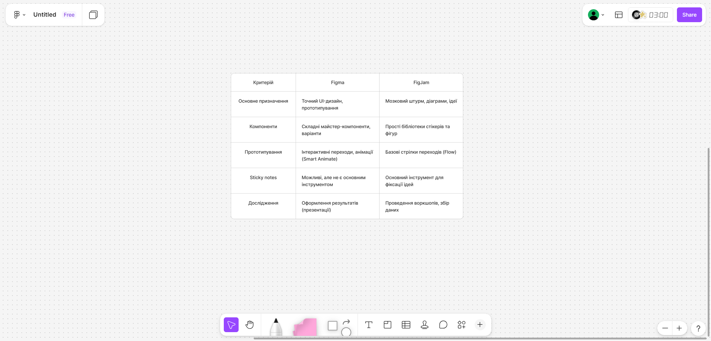
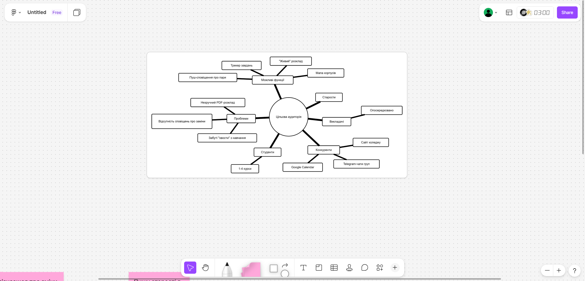
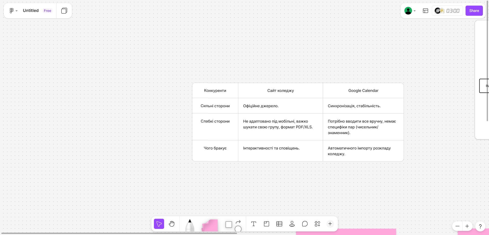
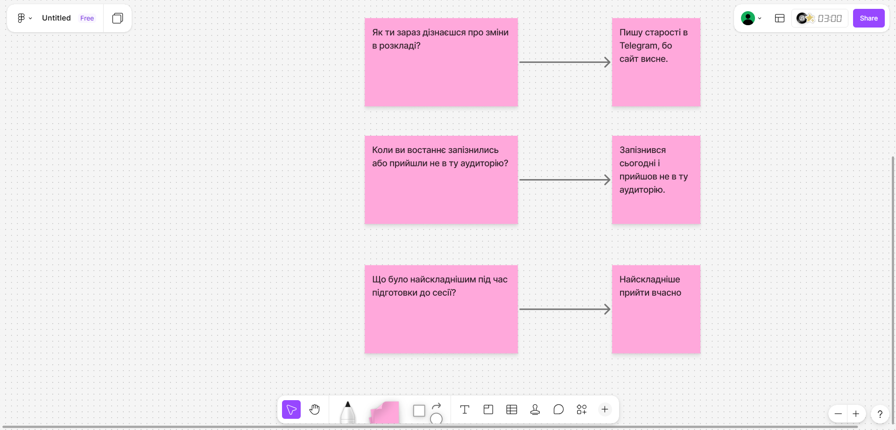

# **"Київський фаховий коледж зв'язку"**

## **Циклова комісія комп'ютерної та програмної інженерії**

**ЗВІТ ПО ВИКОНАННЮ**

**ЛАБОРАТОРНОЇ РОБОТИ №3**

з дисципліни: «Основи UX/UI дизайну»

**Тема: «Знайомство з Figma та FigJam та визначення теми комплексного проєкту»**

**Виконав студент**

групи РПЗ-33

Фокін Степан

**Перевірила викладач**

Сушанова В.С.

Київ 2026

**Мета роботи:**

1.  Ознайомитися з можливостями Figma та FigJam (реєстрація під студентським акаунтом).
2.  Навчитися розрізняти інструменти для візуального дизайну та інструменти для досліджень.
3.  Визначити тему комплексного проєкту та провести початкове дослідження (етап Empathy).

**Матеріальне забезпечення занять:**

Персональний комп'ютер, доступ до мережі Інтернет, обліковий запис Google, середовища Figma та FigJam.

---

### **Завдання для попередньої підготовки**

**1. Короткий словник базових понять (англ. мовою):**

| Термін (англ.) | Термін (укр.) | Визначення |
| :--- | :--- | :--- |
| **Empathy** | Емпатія | Перший етап дизайн-процесу: дослідження реальних потреб та проблем користувача через інтерв'ю та спостереження. |
| **Domain Research** | Дослідження домену | Аналіз предметної області, ринку та існуючих рішень (конкурентів). |
| **User Interview** | Інтерв'ю користувача | Якісний метод дослідження, де дизайнер ставить відкриті питання про минулий досвід користувача. |
| **User Flow** | Потік користувача | Схема кроків, які користувач робить у продукті для досягнення мети. |
| **Norman Door** | "Двері Нормана" | Елемент дизайну, який своїм виглядом вводить в оману щодо способу використання (погана афордансність). |
| **Insight** | Інсайт | Глибоке розуміння справжньої (часто прихованої) мотивації користувача, отримане під час досліджень. |
| **Wireframe** | Вайрфрейм | Схематичне креслення інтерфейсу (скелет), що показує структуру без детального дизайну. |

**2. Відповіді на питання попередньої підготовки:**

**3.1. Яка головна різниця між Figma та FigJam?**
* **Figma:** Інструмент для точного UI-дизайну, створення дизайн-систем, компонентів, макетів та інтерактивних прототипів. Використовується на етапах візуалізації (UI) та тестування.
* **FigJam:** Онлайн-дошка для командної роботи, мозкового штурму, створення діаграм (MindMap, User Flow) та стікерів. Ідеально підходить для етапів емпатії (Empathy) та визначення проблеми (Define).

**3.2. Що таке "Двері Нормана" і як це пов'язане з емпатією?**
Це термін Дона Нормана для речей, дизайн яких не підказує, як ними користуватися (наприклад, двері з ручкою, яку треба штовхати, а не тягнути). Це приклад відсутності емпатії у творця продукту, який не подумав про зручність користувача.

**3.3. (*) Різниця між Domain Research та User Interview:**
* *Domain Research (Кабінетне дослідження):* Ми вивчаємо **продукти** (аналоги, конкурентів, статті). Це дає розуміння ринку.
* *User Interview (Польове дослідження):* Ми вивчаємо **людей** (їхні болі, звички, контекст). Це дає розуміння користувача.

**3.4. (*) Чому важливо ставити питання "Чому?", а не "Так/Ні"?**
Закриті питання ("Вам зручно?") дають лише поверхневу статистику. Питання "Чому?" (техніка "5 Why") дозволяє докопатися до кореневої причини проблеми та справжньої мотивації людини.

**3.5. (**) Чому UX-процес не починається з дизайну кнопок?**
Тому що дизайн — це вирішення проблеми. Неможливо якісно вирішити проблему (намалювати кнопку), якщо ми ще не з'ясували, у чому вона полягає і чи потрібна ця кнопка взагалі (етап Empathy).

**3.6. (**) Що станеться з проєктом, якщо пропустити етап Empathy?**
Команда створить продукт, який базується на власних припущеннях (галюцинаціях), а не на реальних потребах. Це призведе до розробки непотрібного функціоналу, втрати бюджету та необхідності переробляти продукт після релізу.

---

### **Хід роботи**

#### **Практичне завдання №1. Знайомство з Figma та FigJam (Базовий рівень)**

1.  Створено акаунт у Figma, подано заявку на Student Education Plan.
2.  Створено файли у середовищах Figma та FigJam.
3.  Проведено порівняння інструментів за заданими критеріями:

*(Знімок таблиці з FigJam)*

*Рис. 1. Порівняльна характеристика Figma та FigJam*

**Висновок:** Для етапу дослідження (Empathy) я обираю **FigJam**, а для етапу UI-дизайну — **Figma**.

---

#### **Практичне завдання №2. Формування ідеї семестрового проєкту (Середній рівень \*)**

**Обрана тема:** Мобільний застосунок "College Mate" (Помічник студента коледжу).
**Обґрунтування:** Студенти часто плутають аудиторії через зміни в розкладі та пропускають дедлайни здачі лабораторних.

У середовищі FigJam розроблено MindMap (ментальну карту) ідеї:

*Рис. 2. MindMap проєкту "College Mate"*

**Структура MindMap:**
* **Цільова аудиторія:** Студенти 1-4 курсів, старости, викладачі (опосередковано).
* **Проблеми:** Незручний PDF-розклад, відсутність сповіщень про заміни, забуті "хвости" з навчання.
* **Можливі функції:** "Живий" розклад, пуш-сповіщення про пари, трекер завдань, мапа корпусів.
* **Конкуренти:** Сайт коледжу, Google Calendar, Telegram-чати груп.

---

#### **Практичне завдання №3. Етап Empathy (Підвищений рівень \*\*)**

Всі завдання виконано на дошці FigJam.

**1. Domain Research (Аналіз конкурентів)**
Досліджено 2 аналоги: Google Calendar та Розклад на сайті коледжу.

*Рис. 3. Таблиця аналізу конкурентів*

* **Google Calendar:**
    * *Сильні сторони:* Синхронізація, стабільність.
    * *Слабкі сторони:* Потрібно вводити все вручну, немає специфіки пар (чисельник/знаменник).
    * *Чого бракує:* Автоматичного імпорту розкладу коледжу.
* **Сайт коледжу (розділ розкладу):**
    * *Сильні сторони:* Офіційне джерело.
    * *Слабкі сторони:* Не адаптовано під мобільні, важко шукати свою групу, формат PDF/XLS.
    * *Чого бракує:* Інтерактивності та сповіщень.

**2. User Interview (Інтерв'ю з користувачами)**
Проведено інтерв'ю з двома студентами групи.
*Мета:* Зрозуміти, як вони зараз вирішують проблему змін у розкладі.

**Використані питання (відкриті):**
* "Коли ви востаннє запізнились або прийшли не в ту аудиторію?"
* "Як ви зараз дізнаєтесь про зміни в розкладі?"
* "Що було найскладнішим під час сесії?"

*(Знімок стікерів з відповідями)*

*Рис. 4. Фіксація результатів інтерв'ю (Sticky Notes)*

**Результати (Інсайти):**
1.  Студенти дізнаються про зміни з чату в Telegram, але повідомлення часто губляться у Розмові.
2.  Найбільша проблема — не час пари, а **номер аудиторії**, який можуть змінити в останній момент.

---

### **Контрольні запитання**

1.  **Що таке Empathy в UX?**
    Це фундамент дизайну, процес занурення у світ користувача для розуміння його справжніх потреб та емоційного стану. Без емпатії дизайн стає просто декоруванням.
2.  **(*) Чому UX-дизайнер досліджує поведінку, а не думки?**
    Думки суб'єктивні і часто помилкові (люди кажуть те, що від них хочуть почути). Поведінка — це об'єктивний факт. Те, як людина діє в реальності, краще показує проблеми інтерфейсу, ніж її розповіді.
3.  **(**) Чим відрізняється User Interview від Field Studies?**
    * **User Interview:** Це діалог (розповідь про минуле). Ми отримуємо суб'єктивні дані та історії.
    * **Field Studies (Спостереження):** Це споглядання за користувачем у його природному середовищі "тут і зараз". Ми бачимо реальні проблеми, про які користувач міг би промовчати або забути на інтерв'ю.

---

### **Висновки**

Під час виконання лабораторної роботи я ознайомився з інтерфейсом та функціоналом **Figma** та **FigJam**.
Я визначив, що **FigJam** є ідеальним інструментом для етапу **Empathy** (дослідження, інтерв'ю, брейншторм), оскільки дозволяє швидко працювати з ідеями. **Figma** ж призначена для етапу **Prototyping & UI**, де важлива точність.

Практично я відпрацював етап **Empathy**:
1.  Сформував ідею проєкту "College Mate".
2.  Через **Domain Research** виявив, що існуючі рішення не закривають потребу в актуальній інформації про аудиторії.
3.  Через **User Interview** підтвердив гіпотезу, що головним болем студентів є не статичний розклад, а оперативні зміни та комунікація старости.

**Conclusions:**
In this lab work, I explored Figma and FigJam. I determined that FigJam is best for the Research phase (Empathy), while Figma is for UI design. I selected a project topic ("College Mate"), analyzed competitors, and conducted user interviews, confirming that the main student problem is tracking schedule changes and room numbers.