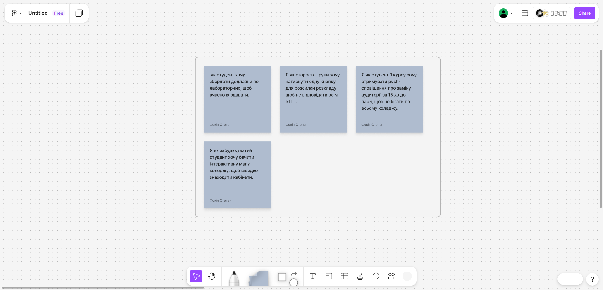
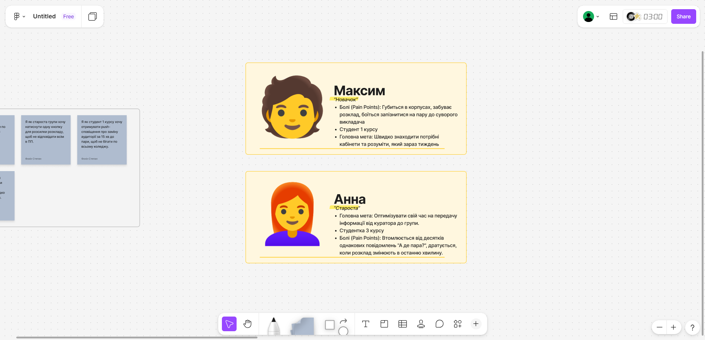
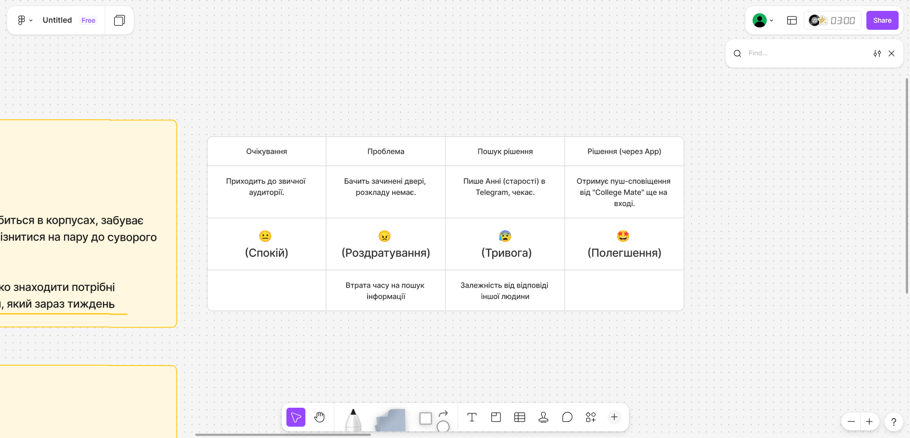

# **"Київський фаховий коледж зв'язку"**

## **Циклова комісія комп'ютерної та програмної інженерії**

**ЗВІТ ПО ВИКОНАННЮ**

**ЛАБОРАТОРНОЇ РОБОТИ №4**

з дисципліни: «Основи UX/UI дизайну»

**Тема: «UX-дослідження та формування користувацьких вимог (етапи Empathy & Define)»**

**Виконав студент:**

групи РПЗ-33

Фокін Степан

**Перевірила викладач:**

Сушанова В.С.

Київ 2026

**Мета роботи:**

1. Опанувати методику UX-дослідження через аналіз конкурентів та інтерв'ю з користувачами.
2. Навчитися структурувати отримані дані за допомогою інструментів емпатії.
3. Сформувати портрет цільової аудиторії та проаналізувати її взаємодію з продуктом через Customer Journey Map (CJM).
4. Розвинути навички візуальної комунікації ідей на онлайн-дошці FigJam.

**Матеріальне забезпечення занять:**

Персональний комп'ютер, доступ до мережі Інтернет, обліковий запис Google, середовища Figma та FigJam.

---

### **Завдання для попередньої підготовки**

**1. Короткий словник базових понять (англ. мовою):** 

| Термін (англ.) | Термін (укр.) | Визначення |
| :--- | :--- | :--- |
| **User Persona** | Персонаж користувача | Збірний образ типового представника цільової аудиторії продукту з його цілями, мотивами та "болями". |
| **User Story** | Історія користувача | Коротке формулювання вимоги до продукту з точки зору цінності для користувача. |
| **Touchpoint** | Точка контакту | Будь-яка ситуація або інтерфейс, через які користувач взаємодіє з продуктом або компанією. |
| **Pain Point** | Точка болю | Конкретна проблема або перешкода, з якою стикається користувач на своєму шляху. |
| **Customer Journey Map** | Карта шляху клієнта | Візуалізація історії взаємодії користувача з продуктом по кроках для виявлення проблемних місць. |

**2. Відповіді на питання попередньої підготовки:** 

**3.1. Що таке Еmpathy в UX і чому це не те саме, що жалість до користувача?** 
Емпатія — це здатність зрозуміти контекст, емоції та логіку користувача, щоб створити для нього зручне рішення. Жалість — це пасивне співчуття ("Ой, як йому незручно"). Емпатія ж активна і веде до інсайтів: ми розуміємо *чому* незручно і виправляємо це.

**3.2. (*) Навіщо потрібна Persona, якщо ми можемо просто описати «всіх людей 18-45 років»?** 
"18-45 років" — це демографія, яка нічого не говорить про поведінку. 20-річний студент, який постійно запізнюється, і 20-річний староста, який все контролює, мають абсолютно різні потреби. Persona перетворює сухі дані на живих персонажів із конкретними мотиваціями, дозволяючи розробляти цільові функції, а не "продукт для всіх і нікого".

**3.3. (**) Що таке Pain Point і як її знайти під час інтерв'ю?** 
Pain Point (точка болю) — це момент, коли користувач відчуває роздратування, втрачає час або гроші. Щоб знайти її на інтерв'ю, потрібно ставити відкриті запитання про минулий досвід: "Розкажіть про ситуацію, коли ви востаннє шукали потрібну аудиторію", "Що вас найбільше дратує у цьому процесі?".

---

### **Хід роботи**

#### **Практичне завдання №1. Етап Define. Створення User Stories (Базовий рівень)** 

На базі ідеї мобільного застосунку "College Mate" (з ЛР №3) було сформовано 4 User Stories за класичним Agile-форматом:

*Рис. 1. User Stories розроблені у FigJam*

1. **Я як** студент першого курсу **хочу** отримувати push-сповіщення про заміну аудиторії за 15 хвилин до пари, **щоб** не бігати по всьому коледжу і не запізнюватись.
2. **Я як** староста групи **хочу** мати змогу натиснути одну кнопку для розсилки оновленого розкладу, **щоб** не відповідати кожному одногрупнику в особисті повідомлення.
3. **Я як** забудькуватий студент **хочу** бачити інтерактивну мапу коледжу, **щоб** швидко знаходити кабінети з нестандартною нумерацією.
4. **Я як** студент **хочу** зберігати свої дедлайни по лабораторних роботах у застосунку, **щоб** вчасно їх здавати та не псувати середній бал.

---

#### **Практичне завдання №2. Етап Define. Створення User Persona (Середній рівень \*)**  

Для кращого розуміння цільової аудиторії застосунку у FigJam було створено дві персони.

*Рис. 2. User Personas (Максим та Анна)*

* **Persona 1: Максим (Новачок).** Студент 1 курсу. Погано орієнтується в просторі коледжу, плутається в чисельнику/знаменнику тижнів. Його головна ціль — швидка та безстресова навігація навчальним процесом.
* **Persona 2: Анна (Староста).** Студентка 3 курсу. Відповідальна, але перевантажена комунікацією. Її головна ціль — оптимізація часу на передачу організаційної інформації групі.

---

#### **Практичне завдання №3. Етап Define. Створення Customer Journey Mар (Підвищений рівень \*\*)** 

Було змодельовано Customer Journey Map (CJM) для сценарію: "Студент дізнається про раптову заміну аудиторії".

*Рис. 3. Customer Journey Map (CJM)*

**Короткий опис CJM:**
1.  **Крок 1 (Очікування):** Студент приходить до звичної аудиторії. *Емоція: Нейтральна.*
2.  **Крок 2 (Проблема):** Аудиторія зачинена, розкладу на дверях немає. *Емоція: Роздратування. Pain Point: Відсутність швидкого доступу до інформації.*
3.  **Крок 3 (Пошук):** Студент пише старості в Telegram і чекає на відповідь. *Емоція: Тривога.*
4.  **Крок 4 (Рішення через App):** Якби у студента був застосунок "College Mate", він би ще на вході в коледж отримав пуш-сповіщення з новим номером кабінету. *Рішення: Автоматизація сповіщень.*

---

### **Контрольні запитання** 

1.  **Чому User Story обов'язково має закінчуватися частиною «щоб [користь]»?** 
    Ця частина пояснює команді розробників *справжню цінність* функції. Якщо програміст знає *навіщо* (щоб не бігати по поверхах), він може запропонувати краще технічне рішення, ніж було задумано спочатку.
2.  **(*) Чому UX-дизайнер має досліджувати саме поведінку, а не думки?** 
    Люди часто помиляються щодо власних звичок або дають соціально очікувані відповіді. Наприклад, студент може сказати: "Я буду щодня заповнювати планер", але його реальна поведінка свідчить про те, що він згадує про дедлайни лише за день до здачі. Дизайн має базуватися на реальних діях (поведінці).
3.  **(**) Як Customer Journey Мар допомагає команді приймати продуктові рішення?** 
    CJM наочно показує "провалля" в досвіді (Pain Points). Дивлячись на карту, команда розуміє, який саме етап викликає найбільше роздратування у користувача. Це дозволяє правильно розставити пріоритети під час розробки (наприклад, спочатку зробити систему пуш-сповіщень, а вже потім додавати темну тему чи інші другорядні функції).

---

### **Висновки** 

Під час виконання лабораторної роботи №4 я навчився переходити від абстрактних ідей до конкретних користувацьких вимог, використовуючи інструменти етапу **Define** першого діаманту моделі Double Diamond. 

Мною було:
1.  Створено **User Personas** (студента-новачка та старосту), що дозволило "олюднити" суху статистику цільової аудиторії.
2.  Написано 4 **User Stories**, які чітко формулюють, яку саме користь отримають студенти від кожної функції застосунку.
3.  Побудовано **Customer Journey Map (CJM)**, яка допомогла візуалізувати проблемний шлях студента при раптовій зміні розкладу та виявити критичні Pain Points (точки болю).

Ці артефакти є необхідним фундаментом для наступного етапу — безпосереднього проєктування інформаційної архітектури та створення Wireframes.  
Посилання на дошку:[https://www.figma.com/board/Y6p0MHfP1X8NRyg0iqUdD8/Untitled?t=OWnXW53HU5sA7Uvs-6](https://www.figma.com/board/Y6p0MHfP1X8NRyg0iqUdD8/Untitled?t=OWnXW53HU5sA7Uvs-6)