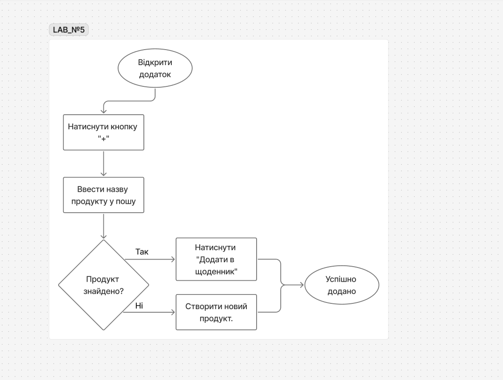
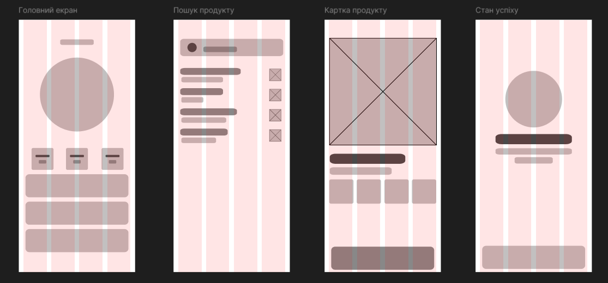
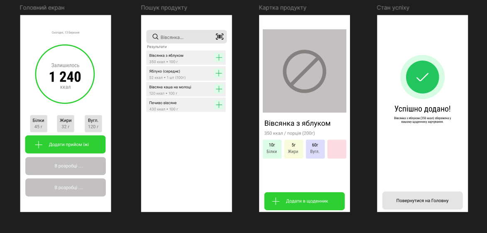
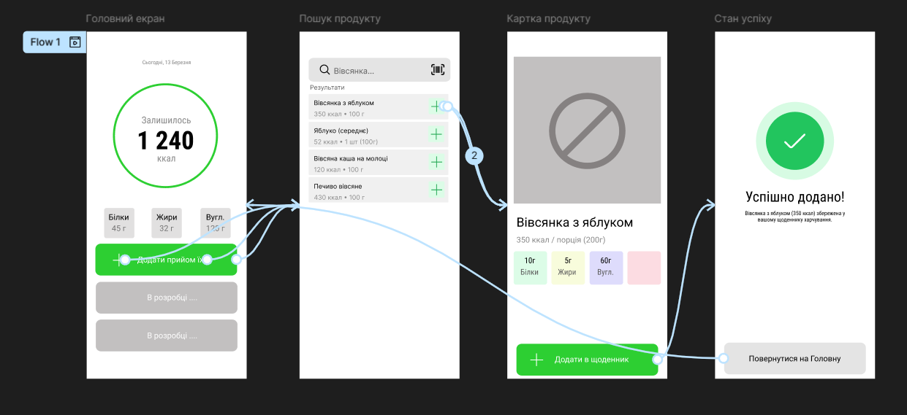

# Лабораторна робота №5

**Дисципліна:** Основи UX/UI дизайну  
**Тема:** Проєктування архітектури та створення вайрфреймів у Figma. Від User Flow до Low-fidelity прототипу  
**Студент:** Групи РПЗ-33 Фокін Степан

---

## 1. Завдання для попередньої підготовки

### 1.1. Короткий словник базових понять
| Англіською | Українською | Пояснення |
| :--- | :--- | :--- |
| **Wireframe** | Вайрфрейм | Статичне зображення конкретного екрана продукту, який визначає розташування та розмір UI-елементів. |
| **User Flow** | Шлях користувача | Загальний шлях користувача до досягнення цілі. |
| **Task Flow** | Потік завдань | Детально пропрацьований сценарій конкретної задачі (наприклад, "Забув пароль" або "Додати продукт"), який дозволяє розбити великий процес на дрібні кроки. |
| **Low-fidelity (Low-fi)** | Низька деталізація | Схематичні начерки (скетчі, ескізи, user flow, паперові прототипи), мета яких — швидка перевірка концепції. |
| **High-fidelity (High-fi)** | Висока деталізація | Деталізовані макети (вайрфрейми) з реальним текстом, зображеннями та анімацією (інтерактивні прототипи). |
| **Placeholder** | Плейсхолдер | Елемент-замінник на вайрфреймі (наприклад, перекреслений прямокутник позначає зображення або логотип). |
| **Layout Grid** | Сітка макета | Система напрямних ліній для структурування контенту, вирівнювання елементів та підтримання візуального порядку. |

### 1.2. Відповіді на теоретичні питання

**2.1. Чим Task Flow відрізняється від User Flow?**
User Flow — це загальний шлях користувача до досягнення цілі. Натомість Task flow дозволяє пропрацювати тонкощі конкретної невеликої задачі. Якби ми робили все в рамках юзер флоу, схема могла б набути монструозних розмірів і розібратись в ній було б дуже складно. Тому Task Flow дозволяє розділяти та працювати з маленькими шматочками інформації.

**2.2. *Чому вайрфрейми зазвичай виконуються у відтінках сірого?**
Візуальна частина вайрфреймів завжди обмежується чорно-білою палітрою та простими фігурами. Це потрібно для виконання їхніх основних функцій: визначення розміщення елементів, формування інформаційної ієрархії та зменшення когнітивного навантаження.

**2.3. **Що таке «Grey Box Method» у прототипуванні?**
Це проміжний етап між Low-fi та High-fi вайрфреймами, де використовуються різні відтінки сірого для створення візуальної ієрархії та глибини інтерфейсу перед додаванням реальних кольорів бренду.

---

## 2. Хід роботи

### Практичне завдання №1. Побудова логіки (User Flow / Task Flow)
**Мета:** Розробити схему руху користувача для основного сценарію фітнес-додатка (додавання прийому їжі до щоденника харчування), використовуючи овал для старту/кінця, прямокутники для дій та ромб для перевірки/прийняття рішень. Схему відображено на Рис. 1.

  
   
  <i>Рисунок 1 -- Схема User Flow для додавання продукту у щоденник</i>

* [**Посилання на FigJam:**](https://www.figma.com/board/Y6p0MHfP1X8NRyg0iqUdD8/Labs?node-id=0-1)

### Практичне завдання №2. *Створення Low-fidelity вайрфреймів
**Мета:** Створити 4 екрани фітнес-додатка (Головний екран / Дашборд, Пошук продукту, Картка продукту, Стан успішного додавання) у форматі Low-fi Wireframes.
*Використання Layout Grid:* Використано 4-колонкову модульну сітку для мобільного екрана. Зображення продуктів та графіки калорій позначені перекресленими прямокутниками, заголовки — жирними лініями, кнопки ("Додати", "Сканувати штрих-код") — пустими прямокутниками (див. Рис. 2).

  
   
  <i>Рисунок 2 -- Low-fidelity вайрфрейми екранів фітнес-додатка</i>

* [**Посилання на Figma:** ](https://www.figma.com/design/UUKZ3Ib9nfPfTbNf923gbY/prototipa?node-id=0-1&p=f&t=NScmO2qsrvjrvpFj-0)

### Практичне завдання №3. *Наповнення контентом та High-fi Wireframing
**Мета:** Замінити перекреслені прямокутники на реальні іконки (наприклад, іконку сканера штрих-кодів чи пошукової лупи), а лінії — на реальні текстові блоки з відображенням КБЖУ (калорії, білки, жири, вуглеводи). Результат наповнення макету представлено на Рис. 3.

  
   
  <i>Рисунок 3 -- High-fidelity вайрфрейми з реальними текстами (КБЖУ) та іконками</i>

* [**Посилання на Figma:**](https://www.figma.com/design/UUKZ3Ib9nfPfTbNf923gbY/prototipa?node-id=0-1&p=f&t=NScmO2qsrvjrvpFj-0) 

### Практичне завдання №4. **Створення Wireflow та інтерактивність
**Мета:** Поєднати вайрфрейми стрілками у вкладці Prototype для створення інтерактивного макета. Налаштовано логіку переходу від натискання кнопки "+" на дашборді до пошуку та успішного додавання продукту в щоденник. Деталі відображено на Рис. 4.

  
   
  <i>Рисунок 4 -- Налаштування інтерактивного прототипу у Figma</i>

* [**Посилання на інтерактивний прототип:** ](https://www.figma.com/design/UUKZ3Ib9nfPfTbNf923gbY/prototipa?node-id=0-1&p=f&t=NScmO2qsrvjrvpFj-0)

---

## 3. Контрольні запитання

**1. Який елемент вайрфрейму вказує на те, що тут буде зображення?**
Перекреслений прямокутник позначає зображення (наприклад, фотографію продукту або графік активності).

**2. Навіщо використовувати реальні тексти замість "Lorem Ipsum" на етапі High-fi вайрфреймів?**
Текстові блоки стають корисними та показують коротку характеристику (наприклад, калорійність страви, грамівку чи кількість пройдених кроків). High-fidelity вайрфрейми потрібні, щоб наблизитися до реального досвіду користувача та отримати точний зворотний зв’язок щодо дизайну.

**3. Що таке "Happy Path" у сценарії користувача?**
Це ідеальний шлях користувача, за якого він досягає своєї мети (наприклад, швидке знаходження страви у базі та додавання її до щоденника) без жодних помилок чи відхилень від основного сценарію.

**4. *Як Layout Grid допомагає у передачі макета розробнику?**
Сітка надає розробнику чіткі математичні параметри (ширину колонок, розмір відступів), що дозволяє легко перенести дизайн у код за допомогою CSS Grid чи Flexbox.

**5. **Чому важливо проєктувати екран "Success State" (успіх), якщо дія відбувається на сервері?**
Якщо користувач натискає цільову кнопку (наприклад, "Додати в щоденник"), але не бачить підтвердження, він може подумати, що запис не зберігся, і натиснути кнопку ще раз, задублювавши калорії. Саме тому дизайнер обов'язково має позначати "стан очікування" або "успішну дію" у прототипі.

---

## 4. Висновки

У ході виконання лабораторної роботи я навчився перетворювати результати попередніх етапів (User Stories з ЛР №4) на чітку архітектуру та візуальні макети. На прикладі розробки фітнес-додатка було побудовано схему User Flow (сценарій додавання продукту до щоденника харчування), що дозволило візуалізувати всі кроки та точки прийняття рішень (наприклад, "Чи знайдено продукт у базі?").

Було успішно опановано інструментарій Figma для створення Low-fidelity начерків (для швидкої перевірки концепції) та деталізованих High-fidelity вайрфреймів, наповнених реальними показниками КБЖУ та іконками. Окрему увагу було приділено роботі з Layout Grid (4 колонки для мобільного екрана) для підтримки візуального порядку. На фінальному етапі було розроблено клікабельний інтерактивний прототип, який імітує реальну взаємодію з інтерфейсом та вирішує проблему відображення стану очікування і успішної дії.