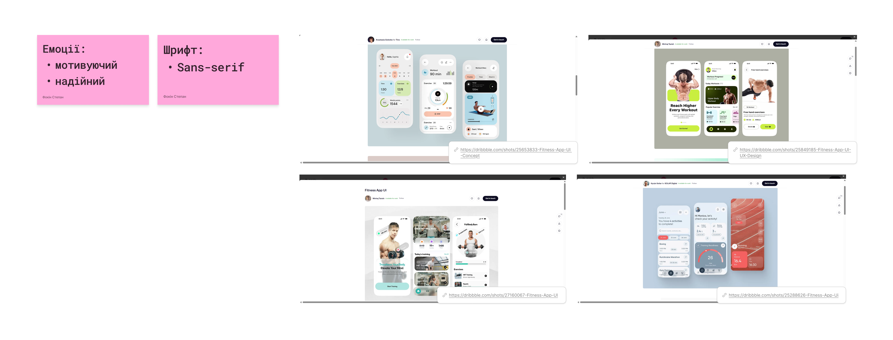
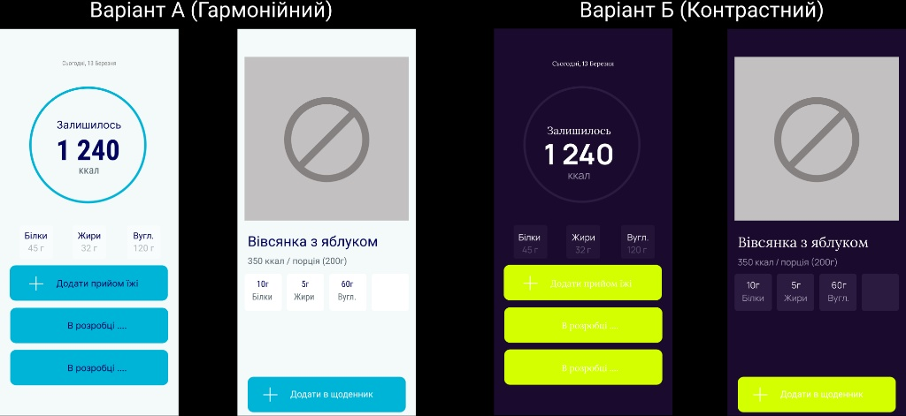
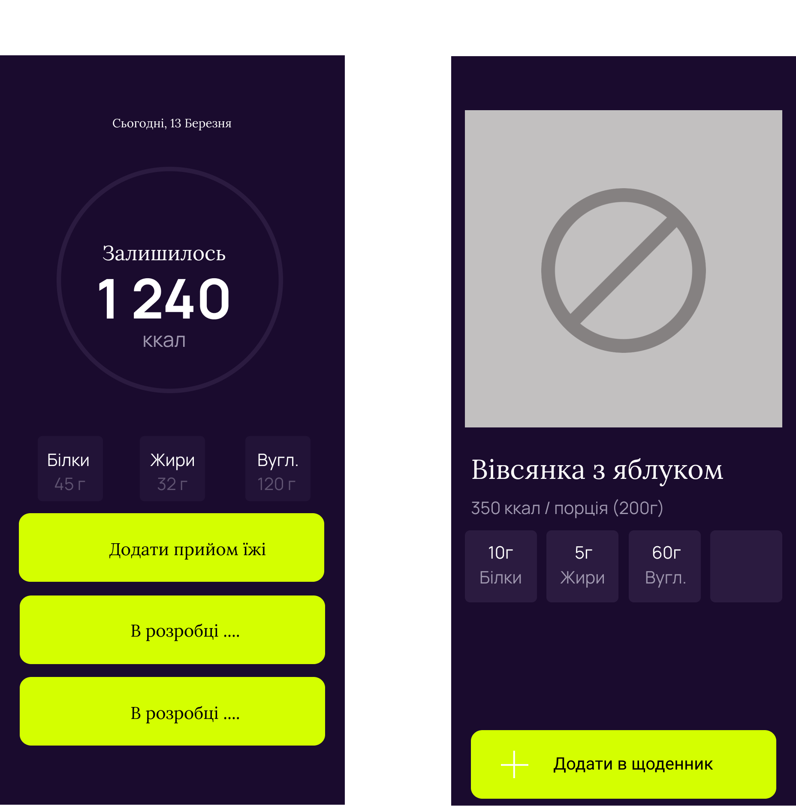

# Лабораторна робота №6

**Дисципліна:** Основи UX/UI дизайну  
**Тема:** Візуальна ідентифікація проєкту: типографія, колористика та аудит доступності (A11y) у Figma  
**Студент:** Групи РПЗ-33 Фокін Степан

---

## 1. Завдання для попередньої підготовки

### 1.1. Короткий словник базових понять
| Англіською | Українською | Пояснення |
| :--- | :--- | :--- |
| **Typography** | Типографія | Мистецтво та техніка оформлення тексту для забезпечення його читабельності, привабливості та зручності сприйняття. |
| **Accessibility (A11y)** | Доступність | Практика проєктування цифрових продуктів таким чином, щоб ними могли користуватися люди з різними можливостями, зокрема з порушеннями зору. |
| **Contrast Ratio** | Коефіцієнт контрастності | Відношення яскравості між кольором тексту та кольором фону (стандарт WCAG вимагає мінімум 4.5:1 для звичайного тексту). |
| **Serif** | Шрифт із зарубками | Тип шрифту, літери якого мають невеликі декоративні штрихи на кінцях (наприклад, Times New Roman, Playfair Display). |
| **Sans-serif** | Шрифт без зарубок (гротеск) | Тип шрифту без декоративних штрихів на кінцях літер, що виглядає сучасно та мінімалістично (наприклад, Roboto, Inter). |
| **Color Palette** | Кольорова палітра | Набір кольорів, що використовуються в інтерфейсі для створення цілісного візуального стилю та передачі емоцій бренду. |
| **Typographic Hierarchy** | Типографічна ієрархія | Система організації тексту (заголовки, підзаголовки, основний текст) за допомогою розміру, ваги та кольору для управління увагою користувача. |

### 1.2. Дослідження типів шрифтів
* **Serif (Антиква):** Мають зарубки. Асоціюються з традиціями, преміальністю та класикою. *Приклади:* Playfair Display, Merriweather. *Використання:* друковані видання, блоги, сайти преміальних брендів.
* **Sans-serif (Гротеск):** Не мають зарубок. Виглядають чисто та сучасно. *Приклади:* Inter, SF Pro, Open Sans. *Використання:* інтерфейси мобільних додатків, веб-сервіси, панелі керування (dashboard) завдяки високій читабельності на екранах.
* **Monospace (Моноширинні):** Усі літери мають однакову ширину. Асоціюються з технологіями та кодом. *Приклади:* JetBrains Mono, Courier New. *Використання:* редактори коду, термінали, відображення числових даних.
* **Display (Акцидентні):** Декоративні та виразні шрифти. *Приклади:* Bebas Neue, Lobster. *Використання:* виключно для великих заголовків, логотипів або банерів для привернення уваги.

### 1.3. *Дослідження типів кольорових схем
* **Monochromatic (Монохромна):** Будується на відтінках, тонах і тінях одного базового кольору. Створює мінімалістичний і спокійний вигляд.
* **Analogous (Аналогова):** Використовує 2-3 кольори, що розташовані поруч на колірному колі. Дуже гармонійна і приємна для ока.
* **Complementary (Комплементарна):** Побудована на двох кольорах, що знаходяться один навпроти одного на колірному колі. Створює високий контраст і динаміку.
* **Triadic (Тріадная):** Три кольори, рівновіддалені один від одного на колірному колі. Яскрава, але збалансована.

### 1.4. **Типографічна ієрархія
Типографічна ієрархія — це спосіб візуального впорядкування тексту, який допомагає користувачеві миттєво зрозуміти, що читати спочатку, а що потім. Її доцільно застосовувати завжди: для виділення заголовка екрана (H1), підзаголовків (H2), кнопок і дрібних підписів. Для її створення використовують генератори шкал (Type-Scale) та систему Text Styles у Figma.

---

## 2. Хід роботи

### Практичне завдання №1. Теоретичний пошук та мудборд (FigJam)
**Мета:** Визначити настрій фітнес-додатка, підібрати шрифти та референси.

* **Тип шрифту:** Для фітнес-додатка обрано **Sans-serif** (гротеск). Інтерфейс містить багато числових показників та графіків. Шрифти без зарубок забезпечують максимальну читабельність на екранах мобільних пристроїв та виглядають сучасно.
* **Емоція бренду:** Мотивуючий і надійний. Дизайн має спонукати користувача до активних дій і досягнення цілей, викликаючи довіру до збережених даних.
* **Референси:** На дошці FigJam зібрано референси, які демонструють вдале використання карток активності, типографіки та акцентних кольорів у спортивних застосунках.

  
   
  <i>Рисунок 1 -- Мудборд з референсами та емоційною картою фітнес-додатка</i>

* **Посилання на FigJam:** [ПОСИЛАННЯ ТУТ](https://www.figma.com/board/Y6p0MHfP1X8NRyg0iqUdD8/Labs?node-id=0-1)

### Практичне завдання №2. *Розробка візуальних концепцій (Figma)
**Мета:** На базі ключових екранів розробити два варіанти дизайну.

* **Варіант А (Гармонійний / Надійний):** Використано аналогову палітру (відтінки м'ятного, блакитного та темно-синього). Цей дизайн передає відчуття спокою та надійності. Шрифтова пара: два сучасні гротески (Inter + Roboto).
* **Варіант Б (Контрастний / Мотивуючо-енергійний):** Використано комплементарну палітру (глибокий темний фон `#1A0B2E` та неоновий лаймовий акцент `#D4FF00`). Цей стиль стимулює до активних тренувань і привертає максимум уваги. Шрифтова пара: Serif для заголовків та Sans-serif для основного тексту.

  
   
  <i>Рисунок 2 -- Порівняння Варіанту А (гармонійний) та Варіанту Б (контрастний)</i>

* **Посилання на Figma:** [ПОСИЛАННЯ ТУТ](https://www.figma.com/design/UUKZ3Ib9nfPfTbNf923gbY/prototipa?m=auto&t=fD7YCjco8jd2a2Em-6)

### Практичне завдання №3. **Аудит доступності (Accessibility)
**Мета:** Перевірити контрастність елементів за допомогою плагіна у Figma.

Було перевірено кнопку CTA ("Додати продукт") у Варіанті Б.
* **Початковий результат:** Неоновий фон + білий текст дали низький коефіцієнт контрастності, що призвело до статусу **"Fail"** (не відповідає WCAG AA).
* **Виправлення:** Колір тексту на кнопці було змінено на темний. Новий коефіцієнт суттєво зріс, статус змінився на **"Pass"**.

  
   
  <i>Рисунок 3 -- Результати перевірки на доступність (Fail та виправлений Pass)</i>

---

## 3. Контрольні запитання

**1. У чому різниця між шрифтами Serif та Sans Serif? Який з них краще використовувати для довгих текстів у мобільному застосунку?**
Serif має декоративні зарубки на кінцях літер, а Sans Serif — ні. Для довгих текстів у мобільних застосунках завжди краще використовувати Sans Serif (гротеск). Через особливості роздільної здатності екранів зарубки можуть "зливатися" і створювати візуальний шум, тоді як гладкі лінії Sans Serif залишаються чіткими і знижують навантаження на очі.

**2. *Який тип палітри варто обрати, якщо ви хочете створити дизайн, що «кричить» про знижки або акції?**
Для привернення максимальної уваги та створення відчуття терміновості найкраще підійде **комплементарна** палітра. Протилежні кольори (наприклад, червоний банер на зеленому фоні) створюють найсильніший візуальний контраст, який неможливо проігнорувати.

**3. **Які додаткові маркери (крім кольору) ви використаєте для повідомлення про успішну дію або помилку?**
Згідно з правилами доступності (A11y), колір не може бути єдиним індикатором статусу. Додатково потрібно використовувати:
* **Іконки:** галочка (у разі успіху) або хрестик/знак оклику (у разі помилки).
* **Текстові пояснення:** чітке повідомлення (наприклад, "Невірний пароль").
* **Анімацію або тактильний відгук:** вібрація телефону або візуальне "трусіння" поля вводу при помилці.

---

## 4. Висновки / Conclusions

**[Українською]**
У ході виконання лабораторної роботи №6 я на практиці ознайомився з принципами візуальної ідентифікації цифрового проєкту та застосував правила типографіки й колористики в UI-дизайні. 

На основі розроблених раніше вайрфреймів фітнес-додатка було створено мудборд та сформовано дві візуальні концепції. Для першого, гармонійного варіанту (Варіант А), було використано аналогову колірну палітру та поєднання сучасних шрифтів без зарубок (Sans-serif), що дозволило створити чистий, надійний та стриманий інтерфейс. Для другого, контрастного варіанту (Варіант Б), було застосовано комплементарну палітру (з акцентними неоновими кольорами) та контрастну шрифтову пару, що додало дизайну енергійності та мотивуючого характеру, необхідного для спортивних застосунків.

Важливим етапом роботи стало проведення аудиту доступності (Accessibility / A11y) за допомогою спеціалізованого плагіна у Figma. Було перевірено контрастність інтерактивних елементів (кнопки CTA) та основного тексту. Практична перевірка підтвердила необхідність дотримання стандарту WCAG AA (коефіцієнт контрастності > 4.5:1). Виявлені на початковому етапі недоліки контрастності було успішно виправлено, що гарантує зручність та інклюзивність інтерфейсу для користувачів із різними особливостями зору.

**[In English]**
During laboratory work №6, I practically familiarized myself with the principles of digital project visual identification and applied the rules of typography and color theory in UI design.

Based on the previously developed wireframes of the fitness app, a moodboard was created and two visual concepts were formed. For the first, harmonious variant (Variant A), an analogous color palette and a combination of modern Sans-serif fonts were used, which allowed for creating a clean, reliable, and restrained interface. For the second, contrasting variant (Variant B), a complementary palette (with neon accent colors) and a contrasting font pair were applied, adding the energy and motivating character necessary for sports applications to the design.

An important stage of the work was conducting an accessibility audit (Accessibility / A11y) using a specialized plugin in Figma. The contrast of interactive elements (CTA buttons) and the main text was checked. The practical check confirmed the need to comply with the WCAG AA standard (contrast ratio > 4.5:1). The contrast deficiencies identified at the initial stage were successfully fixed, ensuring the convenience and inclusivity of the interface for users with visual impairments.