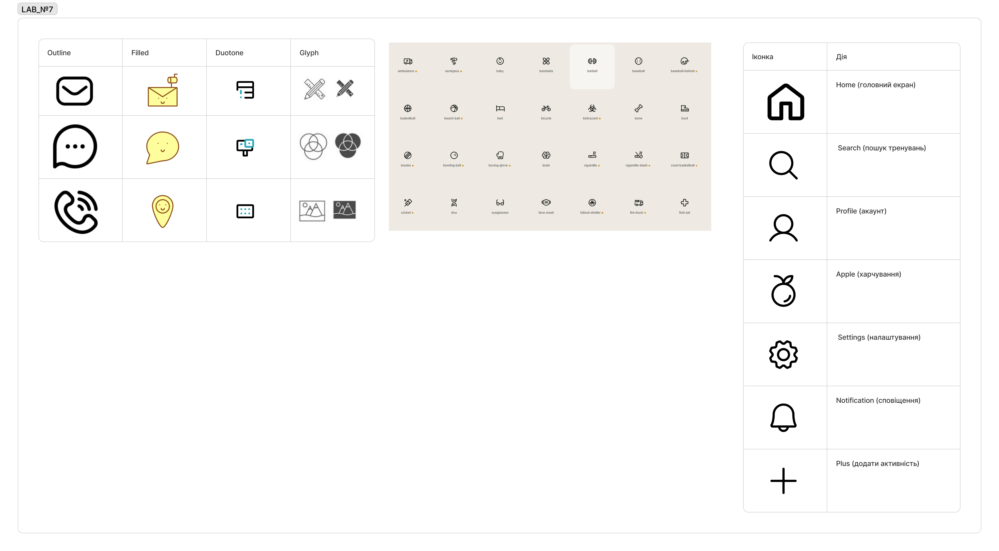
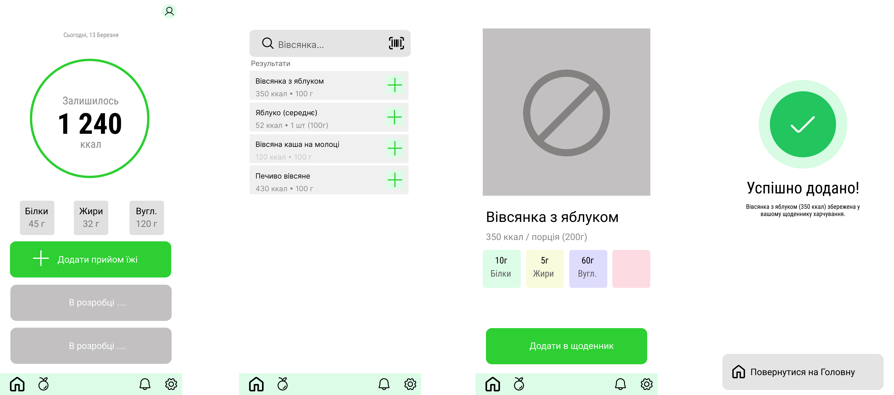

# Лабораторна робота 7
**Дисципліна:** Основи UX/UI дизайну  
**Тема:** Іконографіка в UI-дизайні: підбір, варіативність та створення власних іконок у Figma  
**Студент:** Групи РПЗ-33 Фокін Степан  

---

## Завдання для попередньої підготовки

### 1. Короткий словник базових понять
| Англіською | Українською | Пояснення |
| :--- | :--- | :--- |
| **Iconography** | Іконографіка | Візуальна мова символів в інтерфейсі, що допомагає користувачам орієнтуватися без читання тексту. |
| **Bounding Box** | Обмежувальний контейнер | Квадратний фрейм (наприклад, 24x24 px), всередині якого розміщується іконка для забезпечення єдиного розміру та зручності експорту. |
| **Outline Icon** | Контурна (лінійна) іконка | Стиль іконки, виконаний лише за допомогою ліній (strokes) без внутрішньої заливки. |
| **Glyph / Solid Icon** | Залита (суцільна) іконка | Іконка, що має внутрішню заливку кольором. Часто використовується для позначення активного стану елемента. |
| **Duotone Icon** | Двоколірна іконка | Іконка, в якій використовується два кольори (або два рівні непрозорості одного кольору) для створення акцентів та глибини. |
| **Safe Zone** | Безпечна зона | Внутрішні відступи від країв Bounding Box, які гарантують, що іконка не буде зрізана і візуально виглядатиме узгоджено з іншими. |
| **Optical Alignment** | Оптичне вирівнювання | Візуальне (а не суто математичне) вирівнювання елементів іконки для компенсації оптичних ілюзій та збереження балансу. |

### 2. Відповіді на запитання

**1. Які стилі іконок існують та де вони використовуються?**

* **Outline (лінійні):** Використовуються у сучасних, чистих інтерфейсах для мінімалістичного вигляду. Чудово підходять для неактивних станів меню.
* **Filled / Solid (заповнені):** Забезпечують високу видимість. Часто використовуються для виділення активного стану (наприклад, обраної вкладки в Bottom Navigation) або для кнопок із високим пріоритетом.
* **Duotone:** Використовуються для додавання брендового акценту та унікальності. Добре виглядають у порожніх станах (Empty States) або як ілюстративні іконки.
* **Glyph:** Прості та компактні, використовуються переважно в мобільних застосунках та складних панелях інструментів, де простір обмежений.

**2. * Що таке "Оптичне вирівнювання" іконки та чому воно важливе?**
Оптичне вирівнювання — це коригування положення та розміру елементів з урахуванням особливостей людського зору, а не точних математичних координат. Наприклад, трикутник (іконка Play), математично вирівняний по центру квадрата, візуально здаватиметься зміщеним вліво через різницю мас. Оптичне вирівнювання зсуває його трохи вправо, щоб іконка виглядала гармонійно. Це критично важливо для того, щоб інтерфейс виглядав професійно та збалансовано.

**3. ** Які існують популярні відкриті бібліотеки іконок? (Мінімум 3 приклади)**

1.  **Material Symbols (від Google):** [fonts.google.com/icons](https://fonts.google.com/icons) (Найпопулярніша база з налаштуванням товщини, заливки та оптичного розміру).
2.  **Feather Icons:** [feathericons.com](https://feathericons.com/) (Дуже чистий та мінімалістичний набір лінійних іконок).
3.  **Heroicons (від творців Tailwind CSS):** [heroicons.com](https://heroicons.com/) (Набір красивих іконок у стилях Outline, Solid та Mini).
4.  **Phosphor Icons:** [phosphoricons.com](https://phosphoricons.com/) (Гнучка бібліотека з підтримкою багатьох стилів, включаючи Duotone).

---

## Хід роботи

### Практичне завдання №1. Аналіз і підбір іконок (FigJam)
Під час дослідження було проаналізовано різні набори іконок. Для розроблюваного фітнес-застосунку найбільш доцільним є стиль **Outline**, оскільки він не перевантажує інтерфейс, виглядає сучасно та легко поєднується з насиченими акцентними кольорами бренду.

**Список необхідних іконок для базового функціоналу (9 шт.):**
1.  **Home** — повернення на головний дашборд.
2.  **Search** — пошук тренувань або рецептів.
3.  **Profile (User)** — перехід до налаштувань акаунта.
4.  **Apple / Fork & Knife** — розділ харчування та калорій.
5.  **Settings (Gear)** — налаштування застосунку.
6.  **Notification (Bell)** — сповіщення про активність/нагадування.
7.  **Add (Plus)** — додавання нового тренування або прийому їжі.
8.  **Edit (Pencil)** — редагування профілю чи плану.
9. **Chevron Left (Back)** — навігація на попередній екран.

Рисунок 1 – Аналіз стилів та підбір базових наборів іконок у FigJam

### Практичне завдання №2. Підбір та стилізація іконок (Figma)
Було сформовано базовий набір іконок та адаптовано під UI Kit фітнес-проєкту (з використанням палітри та шрифтів Montserrat, визначених у ЛР №5 та №6). 

* **Варіант А (Default):** Outline (контурні іконки, товщина лінії 1.5px або 2px, колір — нейтральний сірий/чорний).
* **Варіант Б (Active):** Filled (залиті іконки, використовується основний акцентний колір проєкту).

Іконки були інтегровані в Bottom Navigation Bar та картки тренувань. Було дотримано єдиного розміру Bounding Box (24x24 px) та перевірено контрастність.

Рисунок 2 – Інтеграція іконок у стані Default (Outline)

### Практичне завдання №3. Створення власної іконки
>НЕ СТВОРИВ

Рисунок 3 – 

**Посилання на проєкт Figma / FigJam:** [ПОСИЛАННЯ1](https://www.figma.com/design/UUKZ3Ib9nfPfTbNf923gbY/prototipa?m=auto&t=ntj3jAcfuQ1tedgn-6) [ПОСИЛАННЯ2](https://www.figma.com/board/Y6p0MHfP1X8NRyg0iqUdD8/Labs?node-id=0-1)

---

## Контрольні запитання

1.  **Чому важливо використовувати SVG-формат для іконок?**
    SVG (Scalable Vector Graphics) дозволяє масштабувати іконки до будь-якого розміру без втрати якості та пікселізації. Також SVG має значно менший розмір файлу порівняно з растром (PNG) і його можна легко модифікувати за допомогою CSS чи коду (змінювати колір, товщину ліній, анімувати).
2.  **У яких випадках іконки повинні супроводжуватися текстом?**
    Коли метафора іконки може бути неоднозначною або незрозумілою для нових користувачів. Також текст є обов'язковим у головній навігації (Bottom Navigation) та для забезпечення загальної доступності (Accessibility) інтерфейсу.
3.  **Що таке "Safe zone" (безпечна зона) всередині контейнера іконки?**
    Це внутрішні відступи від країв Bounding Box (зазвичай 2-4 px для іконки 24x24). Вона потрібна для того, щоб елементи іконки не зливалися з краями контейнера при експорті та щоб усі іконки в наборі виглядали візуально однакового розміру та маси.
4.  **Чим відрізняється іконка в стилі "Glyph" від іконки "Outline"?**
    Outline іконки складаються з ліній (контурів) і виглядають "прозорими" всередині. Glyph (Solid) іконки є повністю заповненими кольором, вони виглядають важчими і більш акцентними. Outline частіше використовують для неактивних елементів, а Glyph — для активних.
5.  **Як використання ШІ може допомогти у створенні іконок?**
    ШІ є чудовим інструментом для швидкого генерування ідей, пошуку цікавих метафор для нестандартних дій, а також створення базових векторних форм. Це значно прискорює етап брейнштормінгу, залишаючи дизайнеру лише етап фінального доопрацювання вектора під строгу дизайн-систему.
6.  **Які помилки найчастіше допускають при використанні іконок?**
    * Використання іконок з різних наборів в одному інтерфейсі (порушення єдності стилю).
    * Різна товщина ліній в контурних іконках.
    * Складна або неочевидна метафора, яка плутає користувача.
    * Відсутність оптичного вирівнювання всередині контейнера.
    * Ігнорування Bounding Box, через що іконки стрибають при верстці.

---

## Висновки

**[Українською]**
Під час виконання лабораторної роботи я ознайомився з ключовими принципами іконографіки в UI-дизайні. Було практично досліджено різні стилі іконок (Outline, Filled, Duotone) та їх вплив на сприйняття інтерфейсу. Я навчився підбирати іконки так, щоб вони відповідали єдиному стилю розроблюваного застосунку, зберігали консистентність за товщиною ліній та розміром Bounding Box. Найцікавішим етапом стало самостійне створення унікальних векторних іконок за допомогою інструментів Boolean Groups у Figma та інтеграція їх до власного UI Kit. 

**[In English]**
During the laboratory work, I familiarized myself with the key principles of iconography in UI design. Various icon styles (Outline, Filled, Duotone) and their impact on interface perception were practically explored. I learned to select icons that fit the unified style of the application being developed, maintaining consistency in stroke weight and Bounding Box dimensions. The most interesting stage was creating custom vector icons using Boolean Groups in Figma and integrating them into my own UI Kit. 