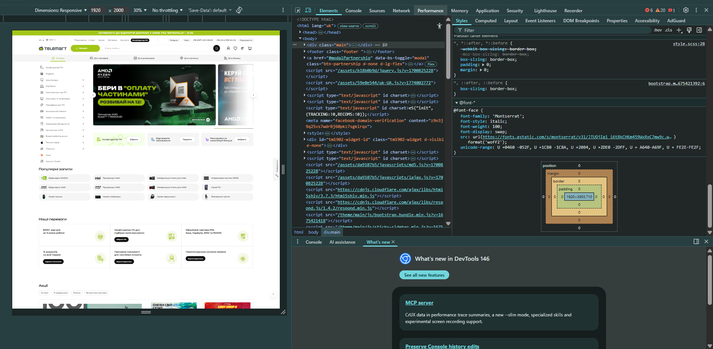
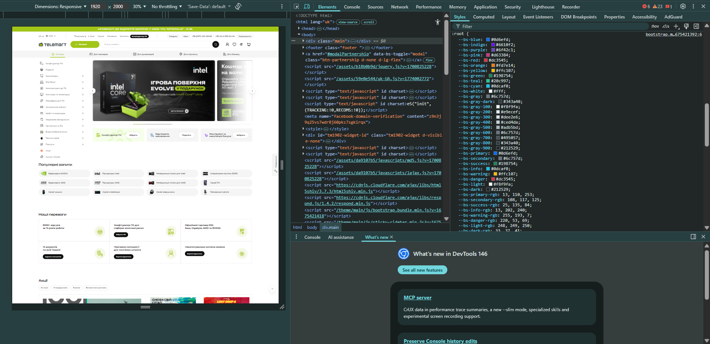

# Звіт з самостійної роботи: Міні-практика (Лекція №5)

**Виконав:** Студент групи РПЗ-33 Фокін Степан
**Викладач:** Вікторія Сушанова
**Дисципліна:** UI/UX дизайн

---

## 1. Обраний онлайн-сервіс

**Назва сервісу:** Інтернет-магазин комп'ютерної техніки TELEMART
**Посилання:** [https://telemart.ua/](https://telemart.ua/)

### Скріншот інтерфейсу

*(Рис. 1. Скріншот інтерфейсу головної сторінки. Файл: assets/Picture1.png)*

---

## 2. Аналіз типографіки та колористики

### Типографіка (Шрифти)

Під час аналізу інтерфейсу було виявлено використання наступної типографічної системи:

* **Основна гарнітура (Typeface):** `Montserrat`. Це сучасний геометричний гротеск (sans-serif), який чудово підходить для вебінтерфейсів.

* **Резервні шрифти (Fallbacks):** `Arial`, `Helvetica Neue`, `sans-serif`.

* **Параметри тексту:** Кегль (font size) основного тексту становить `14px`.

### Колористика (Домінуючі кольори)

Дизайн інтернет-магазину побудований за класичним **правилом 60-30-10** для створення збалансованої композиції:

* **60% (Основний колір / Primary color):** Чистий білий `rgb(255, 255, 255)` / `#FFFFFF`. Використовується для фону та основних візуальних блоків, забезпечуючи «повітря» та нейтральну базу для карток товарів.

* **30% (Додатковий колір / Secondary color):** Майже чорний `rgb(15, 15, 15)` / `#0F0F0F`. Використовується для типографіки (тексту) та другорядних UI-елементів. Забезпечує високий коефіцієнт контрастності (Contrast Ratio) з білим фоном, що відповідає стандартам доступності WCAG (рівень AAA).
* **10% (Акцентний колір / Accent color):** Помаранчевий (змінна `--bs-orange: #fd7e14`). Цей теплий колір привертає увагу та штовхає до дії, тому використовується для кнопок заклику до дії (CTA) — наприклад, «Купити», а також для бейджів іконок.

---

## 3. Використані інструменти

Для визначення показників типографіки та колористики були використані наступні інструменти:

### 1. Визначення типографіки

* **Інструменти:** Універсальний спосіб через інспектор коду браузера (Chrome DevTools). 
* **Опис процесу:** За допомогою правої кнопки миші обрано «Переглянути код» (Inspect). У вкладці `Styles` (та `Computed`) було знайдено властивість `font-family`, яка підтвердила використання гарнітури `Montserrat`.

**Скріншот інструменту (Шрифти):**

*(Рис. 2. Визначення типографіки у панелі Computed Chrome DevTools. Файл: assets/Picture2.png)*

### 2. Визначення колористики

* **Інструменти:** Універсальний спосіб браузера (Chrome DevTools).
* **Опис процесу:** Через інспектор коду перевірено властивості `color` для тексту та `background-color` для фону. Колір кнопок визначено через CSS-змінні фреймворку.

**Скріншот інструменту (Кольори):**

*(Рис. 3. Визначення HEX-коду кольору за допомогою Chrome DevTools. Файл: assets/Picture3.png)*

