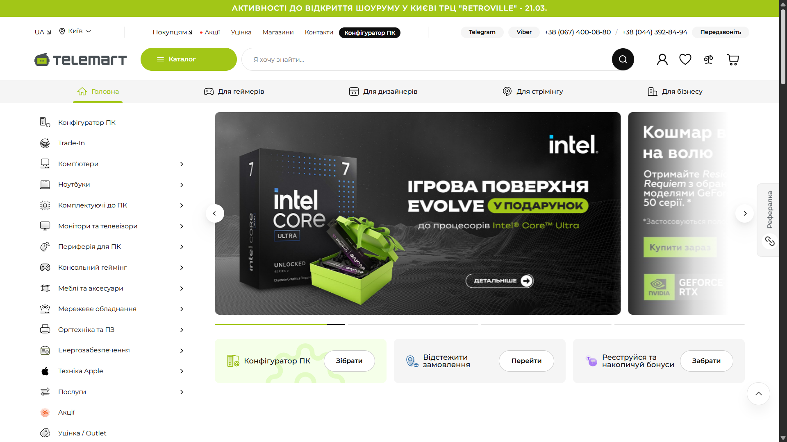
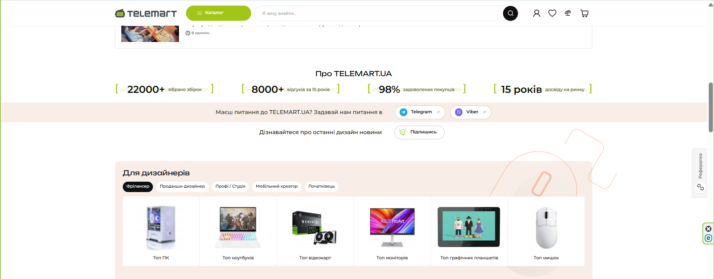
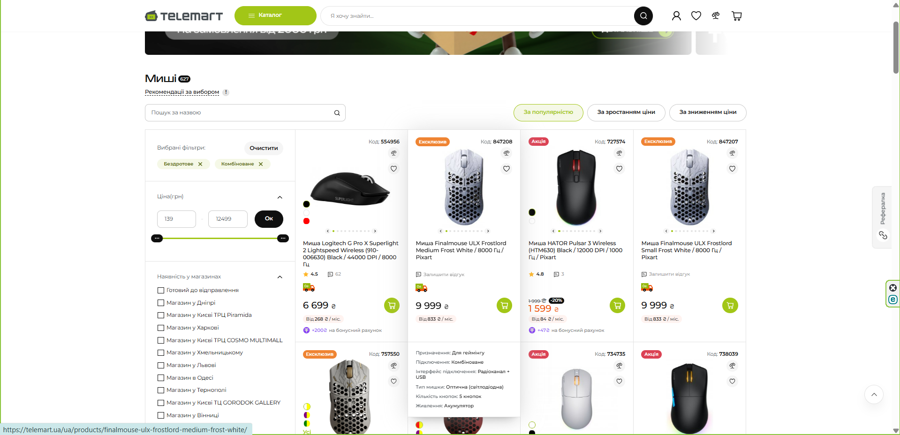
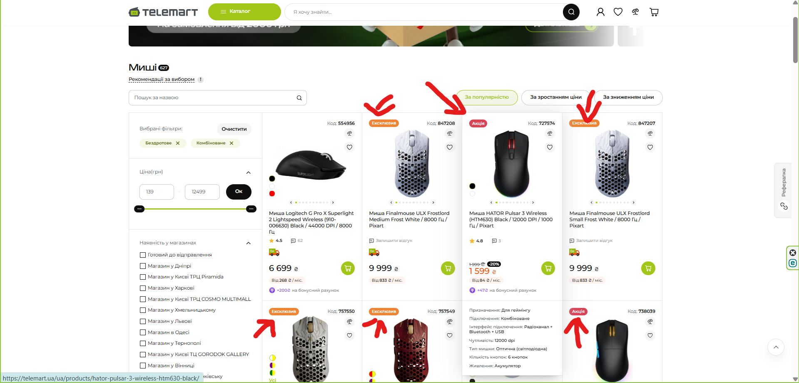

# **Звіт з самостійної роботи: Міні-практика (Лекція №6)**

**Виконав:** Студент групи РПЗ-33 Фокін Степан

**Викладач:** Вікторія Сушанова

**Дисципліна:** UI/UX дизайн

## **1\. Обраний онлайн-сервіс**

**Назва сервісу:** Інтернет-магазин комп'ютерної техніки TELEMART

**Посилання:** [https://telemart.ua/](https://telemart.ua/)

### **Скріншот інтерфейсу**

Рис. 1. Загальний вигляд головної сторінки сервісу.

## **2\. Дослідження типів композиції**

На основі аналізу інтерфейсу головної сторінки та каталогу TELEMART.UA було виявлено наступні типи композиції:

* **Відкрита / Закрита:** Переважно **відкрита композиція**. Дизайн сторінки не має жорстких рамок по краях, які б замикали контент. Каруселі товарів та банери візуально продовжуються за межі екрану, стимулюючи користувача до скролінгу і створюючи відчуття великого простору.  
* **Симетрична / Асиметрична:** Макет є **асиметричним**, що характерно для більшості інтернет-магазинів (наприклад, вузька колонка фільтрів зліва та широка сітка товарів справа). Проте, всередині самої сітки товарів чітко прослідковується **симетрія перенесення (Translational symmetry)** — картки повторюються рівними рядами.  
* **Статична / Динамічна:** Загалом композиція **статична**, оскільки побудована на строгих горизонтальних і вертикальних лініях (прямокутні блоки, чітка сітка), що викликає відчуття стабільності. **Динаміка** додається локально: через яскраві акцентні банери з діагональними лініями або зображеннями товарів у перспективі.

## **3\. Засоби гармонізації композиції**

Для покращення сприйняття та організації контенту в інтерфейсі застосовано ключові засоби гармонізації:

### **3.1. Метр та ритм**

* **Опис:** У блоках каталогу (наприклад, "Хіти продажів") чітко використовується **метр** — регулярна, повторювана структура. Картки товарів мають однакові розміри, відступи (margin/padding) та вирівнювання, що допомагає користувачеві легко сканувати асортимент.  

Рис. 2. Використання метричної композиції (регулярного ритму) у сітці товарів. 

### **3.2. Контраст та нюанс**

* **Опис:** Інтерфейс активно використовує **контраст** для виділення головних цільових дій (CTA) — наприклад, яскраві помаранчеві або зелені кнопки "Купити" на чистому білому фоні карток. **Нюанс** проявляється у мікроінтеракціях: при наведенні курсору (hover) на картку товару з'являється ледь помітна тінь (box-shadow), що м'яко виділяє елемент без зайвої агресії.  
* **Скріншот:**

Рис. 3. Контраст яскравої кнопки цільової дії по відношенню до світлого фону. 

### **3.3. Подоба та відмінність**

* **Опис:** За принципом **подоби** всі картки товарів у каталозі виглядають як частина єдиної системи (однакове розташування фото, ціни, назви). Однак для привернення уваги до конкретних позицій використовується **відмінність** — візуальні акценти у вигляді яскравих стікерів або бейджів (наприклад, "-15%", "Акція", "Топ"), які порушують монотонність і змушують око зупинитися.  

Рис. 4. Використання акцентних бейджів для створення відмінності серед подібних карток.

