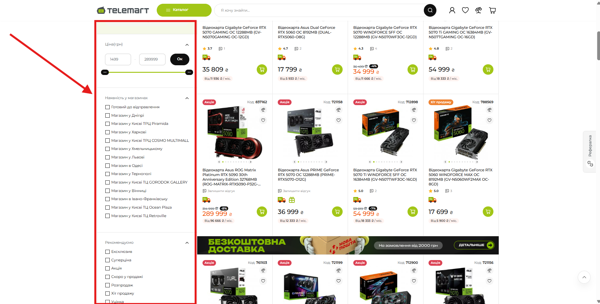
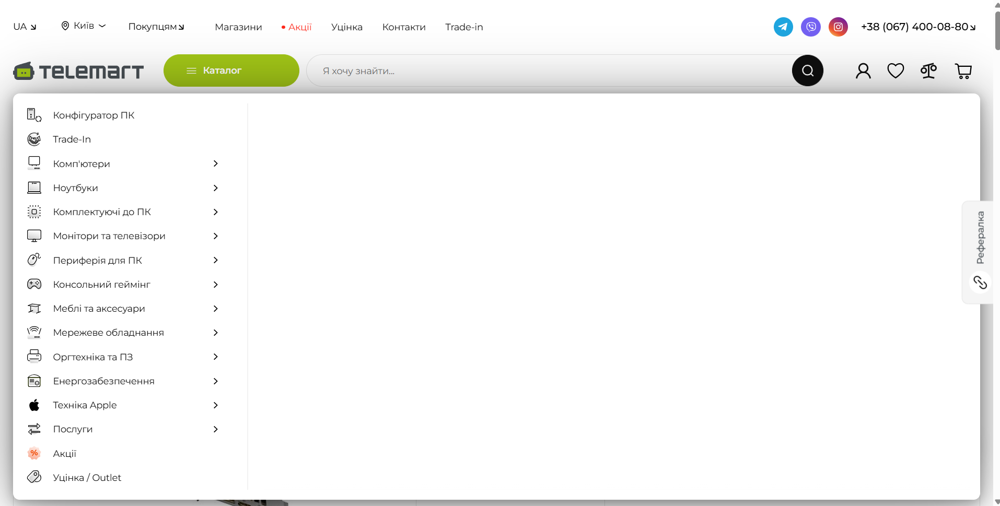

# **Звіт з самостійної роботи: Принципи гештальту та закони UX-дизайну**

**Виконав:** Студент групи РПЗ-33 Фокін Степан

**Викладач:** Вікторія Сушанова

**Дисципліна:** UI/UX дизайн

## **1. Обраний онлайн-сервіс**

**Назва сервісу:** Інтернет-магазин комп'ютерної техніки TELEMART

**Посилання:** [https://telemart.ua/](https://telemart.ua/)

## **2. Дослідження принципів гештальту в дизайні**

### **2.1. Закон близькості (Law of Proximity)**

  * **Опис:** Елементи, розташовані близько один до одного, сприймаються як єдина група або пов'язані між собою. Це пришвидшує сканування сторінки та зменшує когнітивне навантаження.
  * **Як працює на TELEMART:** У каталозі товарів фотографія, назва, ціна та кнопка "Купити" розташовані з мінімальними відступами один від одного, формуючи єдиний логічний блок (картку товару). Відстань між сусідніми товарами значно більша, ніж між елементами всередині самої картки.

Рис. 1. Використання закону близькості у сітці товарів.

### **2.2. Закон подібності (Law of Similarity)**

  * **Опис:** Елементи, які мають спільні візуальні ознаки (колір, форму, розмір), сприймаються як такі, що мають однакове значення або функцію. Це створює передбачуваність інтерфейсу.
  * **Як працює на TELEMART:** Усі кнопки цільової дії (CTA), такі як "Купити", виконані в єдиному яскравому кольорі (найчастіше помаранчевому). Користувач миттєво ідентифікує зону для покупки завдяки сталому кольоровому кодуванню.

Рис. 2. Закон подібності: однакові кнопки цільової дії.

### **2.3. Закон спільної області (Law of Common Region)**

  * **Опис:** Елементи, які знаходяться всередині чітко окресленої області (рамки, фонової плашки), сприймаються як єдина група. Це ефективно запобігає візуальному хаосу.
  * **Як працює на TELEMART:** Блок фільтрів у лівій частині екрана візуально відділений від основної видачі товарів. Він має власну структуру і відокремлений світлим фоном або лініями-розділювачами, що дає мозку чіткий сигнал: "це окрема панель інструментів".

Рис. 3. Виділення блоку фільтрів у спільну область.

## **3. Дослідження основних законів UX-дизайну**

### **3.1. Закон Фіттса (Fitts's Law)**

  * **Опис:** Час, необхідний для досягнення цілі, залежить від відстані до неї та її розміру. Чим важливіша дія, тим більшою та доступнішою має бути кнопка для взаємодії.
  * **Як працює на TELEMART:** На сторінці конкретного товару кнопка "Купити" має найбільший розмір серед усіх інтерактивних елементів на екрані. Вона максимально контрастна і розташована поруч із ціною — у зоні, куди природно падає погляд після вивчення характеристик.

Рис. 4. Розмір та розташування кнопки "Купити" за законом Фіттса.

### **3.2. Закон Хіка (Hick's Law)**

  * **Опис:** Час прийняття рішення збільшується пропорційно кількості та складності варіантів вибору. Щоб не створювати "параліч вибору", масиви даних розбивають на етапи.
  * **Як працює на TELEMART:** Навігаційне мега-меню структурує величезний асортимент за категоріями з використанням іконок (ПК, Ноутбуки, Комплектуючі). Це значно звужує вибір на кожному етапі і пришвидшує пошук потрібної деталі без перевантаження користувача суцільними списками.

Рис. 5. Структуроване мега-меню для зменшення когнітивного навантаження.

### **3.3. Закон Якоба (Jakob's Law)**

  * **Опис:** Користувачі очікують, що ваш сайт працюватиме за тими ж паттернами, до яких вони звикли на інших ресурсах. Відхилення від стандартів змушує людину заново вчитися користуватися інтерфейсом.
  * **Як працює на TELEMART:** Інтерфейс повністю відповідає загальноприйнятим стандартам e-commerce: логотип розміщено зліва зверху (клік веде на головну), помітний рядок пошуку по центру, а іконки профілю, порівняння та кошика — справа.

Рис. 6. Стандартне розташування елементів у шапці сайту (header).
